# System Design Building Blocks & Core Technologies

Based on the 31 system design topics in this repository (which cover the classic Alex Xu System Design curriculum and more), you will encounter recurring architectural patterns, data structures, and technologies. 

To master system design, you should build a strong foundational understanding of the following building blocks:


## Core Concept Notes (Embedded)

<details>
<summary><b>Advanced Data Structures</b> (Click to expand)</summary>

# Advanced Data Structures: Aggregation & Verification

**Sources:**
*   [Merkle Tree with real world examples (Gaurav Sen)](https://www.youtube.com/watch?v=qHMLy5JjbjQ)
*   [Segment Tree (GeeksforGeeks)](https://www.geeksforgeeks.org/dsa/segment-tree-data-structure/)
*   [Fenwick Tree / Binary Indexed Tree (GeeksforGeeks)](https://www.geeksforgeeks.org/dsa/binary-indexed-tree-or-fenwick-tree-2/)
*   [Square Root (Sqrt) Decomposition (GeeksforGeeks)](https://www.geeksforgeeks.org/dsa/square-root-sqrt-decomposition-algorithm/)

**TL;DR:** When dealing with massive datasets, doing a linear $O(N)$ scan for every query or update is too slow, and transferring entire datasets across a network just to check for changes is too expensive. The industry relies on specialized data structures to chunk, aggregate, and hash data to achieve $O(\log N)$ or $O(\sqrt{N})$ performance. 

---

## 1. Merkle Trees (Distributed Data Verification)

*   **What it does:** Allows a system to quickly and securely verify if two large datasets are identical, and if not, pinpoint *exactly* which parts differ without transferring the actual data.
*   **How it works:** A Merkle tree is a "Hash Tree". 
    1. The raw data is chopped into blocks, which form the leaves.
    2. Each leaf is cryptographically hashed (e.g., using SHA-256).
    3. Every parent node is created by concatenating the hashes of its two children and hashing that result: `Parent = Hash(Child_A + Child_B)`.
    4. This bubbles up to a single **Root Hash**.
*   **The Magic:** If a single byte changes anywhere in a 100GB file, the leaf hash changes, causing a domino effect that changes the Root Hash. Two servers can compare their 100GB files just by exchanging the 32-byte Root Hash. If they differ, they exchange the children's hashes to walk down the tree and find the mismatched block in $O(\log N)$ time.
*   **Real-World Examples:**
    *   **DynamoDB & Cassandra (Anti-Entropy):** When replica nodes fall out of sync, they compare Merkle Trees to find missing rows without sending the entire database over the network.
    *   **BitTorrent:** When downloading a movie from untrusted peers, your client uses a Merkle Tree to verify that a downloaded chunk hasn't been tampered with.
    *   **Git & Blockchains:** Used to verify the integrity of commits and transaction blocks.

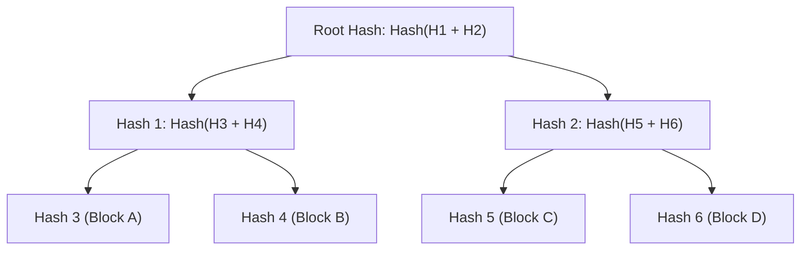

---

## 2. Segment Trees (Range Aggregation)

*   **What it does:** Answers math questions over a specific range of an array (e.g., "What is the sum/min/max of elements from index 2 to 8?") in $O(\log N)$ time, while also allowing elements to be updated in $O(\log N)$ time.
*   **How it works:** It is a perfectly balanced binary tree. The leaf nodes contain the raw array values. Every parent node contains the merged aggregate (sum, min, or max) of its children. 
*   **The Query:** When you query a range, the tree doesn't iterate through the raw leaves. Instead, it combines a few pre-calculated internal parent nodes, instantly skipping massive chunks of the array.
*   **Trade-offs:** Requires $O(N)$ build time and takes up exactly `4 * N` space in memory (usually implemented as a flat array where a node at index `i` has children at `2i` and `2i+1`).

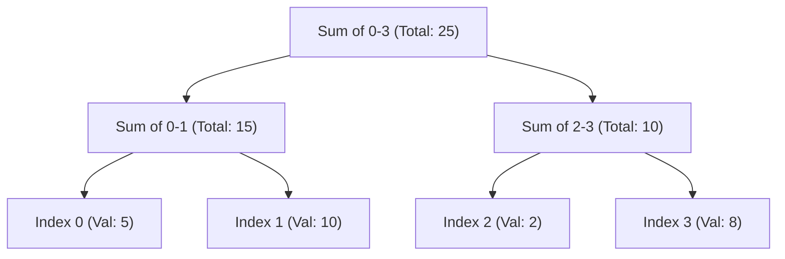

---

## 3. Fenwick Trees / Binary Indexed Trees (BIT)

*   **What it does:** A highly memory-efficient alternative to Segment Trees for calculating prefix sums and updating elements. It achieves the exact same $O(\log N)$ time complexity but is vastly lighter on memory and faster in practice.
*   **How it works:** It is brilliant bitwise wizardry. Instead of a bulky binary tree, a Fenwick Tree uses a single array of the exact same size as the data (`size N`). Each index stores the sum of a specific range of elements, dictated by the lowest set bit of the index's binary representation (extracted using `index & -index`).
*   **The Magic:** To find the sum of the first 13 elements (binary `1101`), the tree instantly breaks the query into:
    *   Sum of the first 8 elements (binary `1000`)
    *   Sum of the next 4 elements (binary `0100`)
    *   Sum of the last 1 element (binary `0001`)
*   **Trade-offs vs Segment Tree:** 
    *   **Pros:** Requires exactly $N$ memory (Segment Trees require $4N$). Incredibly short to code (about 3 lines for an update function). Much smaller constant-time factors (faster in CPU caching).
    *   **Cons:** Extremely difficult to use for non-invertible queries like Range Minimum/Maximum (Segment trees easily handle these).

---

## 4. Square Root (Sqrt) Decomposition

*   **What it does:** An algorithmic technique to break an array of $N$ elements into $\sqrt{N}$ chunks (blocks). It reduces range query time from $O(N)$ down to $O(\sqrt{N})$.
*   **How it works:** 
    1. Divide an array of 10,000 elements into 100 blocks, each containing 100 elements.
    2. Precompute the answer (sum, min, max) for each block.
    3. When querying a range (e.g., from index 150 to 825), you don't iterate through everything.
    4. You iterate through the middle fully-overlapped blocks in $O(1)$ time each. You only do a manual linear scan for the "partial blocks" on the extreme left and right edges.
*   **Trade-offs vs Trees:** 
    *   **Pros:** Incredible flexibility. Trees require the aggregate operation to be strictly associative. Sqrt Decomposition allows you to answer bizarre, complex queries (like finding the most frequent element in a range, commonly paired with **Mo's Algorithm**) because you can manually iterate the partial blocks.
    *   **Cons:** Asymptotically slower than trees ($O(\sqrt{N})$ is much worse than $O(\log N)$ for very large datasets).


*(Read full file: [Advanced Data Structures](./Core%20Concepts/Advanced%20Data%20Structures/README.md))*
</details>
<br>

<details>
<summary><b>Authentication and Authorization</b> (Click to expand)</summary>

# Authentication (AuthN) & Authorization (AuthZ)

**Sources:** 
- [7 Authentication Concepts Every Developer Should Know (Hayk Simonyan)](https://www.youtube.com/watch?v=iX8g4LqF8p8)
- [Authorization Explained: When to Use RBAC, ABAC, ACL & More (Hayk Simonyan)](https://www.youtube.com/watch?v=DT6Zy1X3ytM)

**TL;DR:** 
- **Authentication (AuthN)** proves *who you are* (Identity). 
- **Authorization (AuthZ)** determines *what you are allowed to do* (Permissions). 
You must always authenticate a user before you can authorize them.

---

## 1. Authentication (AuthN) Concepts

How do we securely prove the identity of a client, where is the state stored, and what does the network flow look like?

### 1. Session-Based Authentication (Stateful)
The traditional way of handling web application logins. The server maintains active state for every logged-in user.

* **Request Flow:**
  1. Client sends `POST /login` with `{username, password}`.
  2. Server hashes the password and compares it against the Users database table.
  3. If valid, the server generates a cryptographically random, opaque string called a `Session ID`.
  4. The server stores this mapping (`Session ID -> User ID`) in a centralized cache (like Redis) or a database.
  5. The server responds with a `Set-Cookie: session_id=xyz; HttpOnly; Secure` HTTP header.
  6. On subsequent API calls, the browser automatically attaches the `Cookie`.
  7. The server reads the cookie, queries Redis (`GET session:xyz`), retrieves the User ID, and processes the request.
* **Where it is stored:**
  * **Client-side:** In an `HttpOnly` cookie (immune to XSS attacks via JavaScript).
  * **Server-side:** In memory, a database, or a distributed cache (Redis/Memcached).

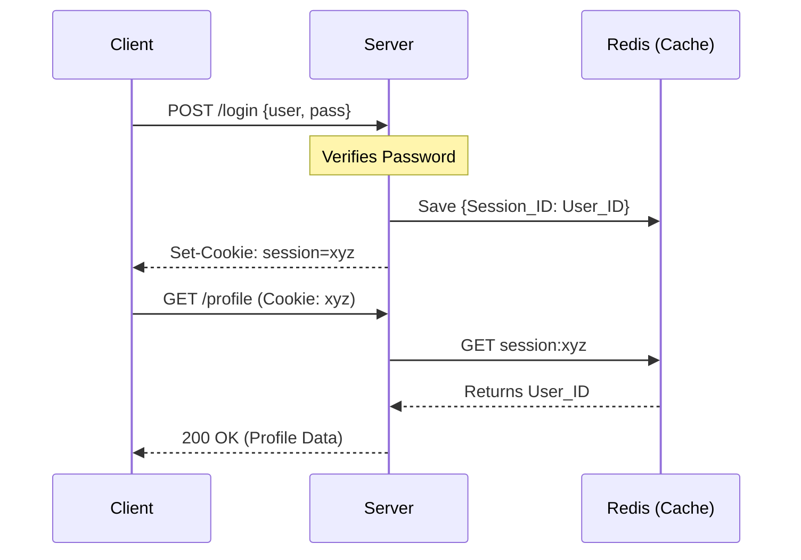

* **Trade-offs:** Secure and allows instant revocation (the server just deletes the key from Redis). However, it requires a database/cache lookup on *every single API request*, which can become a bottleneck at massive scale.

### 2. Token-Based Authentication (Stateless / JWT)
The modern standard for high-scale APIs and microservices, designed to eliminate the database lookup bottleneck.

* **Request Flow:**
  1. Client sends `POST /login` with `{username, password}`.
  2. Server verifies the credentials against the database.
  3. Server generates a JSON Web Token (JWT). It takes a Payload (e.g., `{"user_id": 123}`), and signs it using a cryptographic hashing algorithm (like HMAC SHA-256) and a `SECRET_KEY` that only the server knows.
  4. Server sends the JWT string back to the client. *The server does not save this token anywhere.*
  5. Client stores the token and attaches it to subsequent requests via the `Authorization: Bearer <token>` HTTP header.
  6. Server receives the token, strips the signature, and re-calculates the hash using its own `SECRET_KEY` and the provided Payload. 
  7. If the computed hash matches the token's signature, the server has mathematical proof the token is authentic and hasn't been tampered with. It immediately trusts the `user_id` inside.
* **Where it is stored:**
  * **Client-side:** Either in JavaScript memory (React/Vue state), LocalStorage (vulnerable to XSS), or preferably an `HttpOnly` cookie.
  * **Server-side:** **Nowhere.** It is entirely stateless.

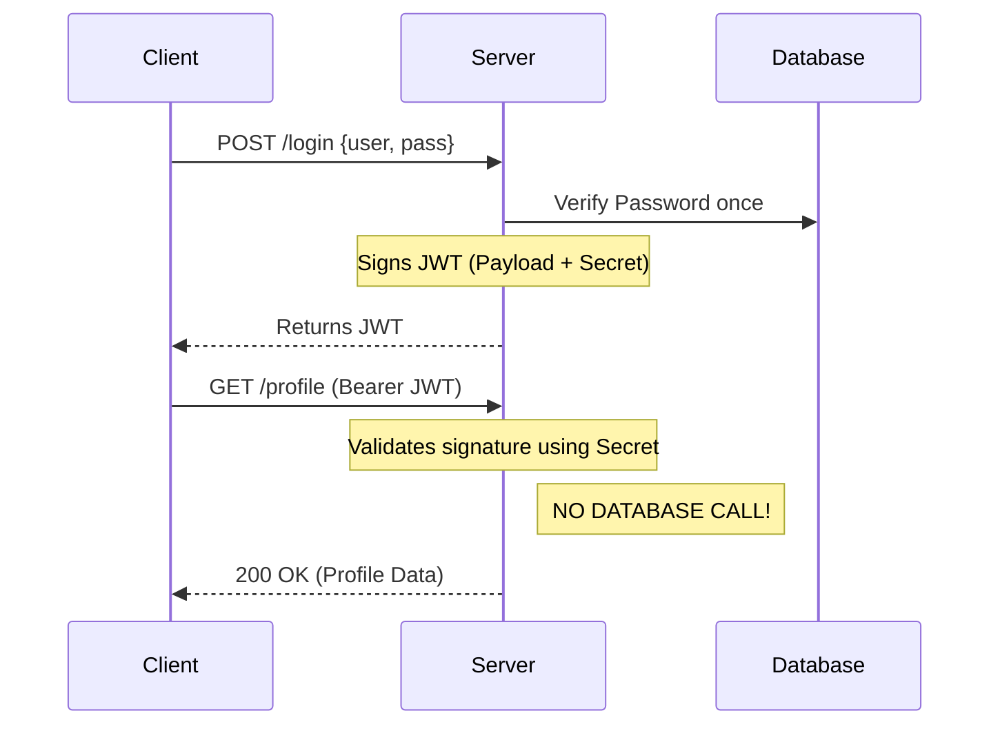

* **Trade-offs:** Immensely scalable and fast, with zero network latency required to verify the user. However, because the server doesn't store the token, it cannot easily revoke it. Once a JWT is issued, it is valid until its expiration time.

### 3. Access Tokens vs Refresh Tokens
To mitigate the inability to revoke stateless JWTs, modern systems use a dual-token architecture.

* **Access Token:** A short-lived JWT (e.g., 15 minutes). Used for all standard API calls.
* **Refresh Token:** A long-lived, opaque string (e.g., valid for 30 days). 
* **Request Flow:**
  1. Upon login, the client receives *both* tokens. 
  2. When the short-lived Access Token expires, API calls return `401 Unauthorized`.
  3. The client hits a specific `/refresh` endpoint, providing the Refresh Token.
  4. The server performs a **stateful database lookup** to verify the Refresh Token hasn't been revoked.
  5. If valid, the server issues a brand new 15-minute Access Token.
* **Where it is stored:**
  * **Client-side:** Refresh tokens *must* be stored securely (e.g., `HttpOnly` cookies or secure mobile enclaves).
  * **Server-side:** Refresh tokens *must* be stored in the database so they can be revoked (e.g., if a user clicks "Log out of all devices", or is banned).

### 4. API Keys (Machine-to-Machine)
If JWTs are so scalable, why do services like AWS or Stripe issue opaque "API Keys"?
* **Use Case:** JWTs are for humans (web/mobile apps). API Keys are for scripts, backend services, or developers.
* **Request Flow:** Client sends the API Key in an `x-api-key` header. The server performs a database or Redis lookup to verify who the key belongs to.
* **Where it is stored:** 
  * **Client-side:** Environment variables (`.env`) or secret managers (AWS Secrets Manager).
  * **Server-side:** Database (often hashed for security) and heavily cached in Redis for speed.
* **Trade-offs:** Machines require strict, instant revocation controls (in case a key is accidentally committed to GitHub). Because machine traffic is generally lower volume and more predictable than millions of human users, the database lookup overhead is an acceptable trade-off for instant revocation.

### 5. OAuth 2.0 vs OpenID Connect (OIDC)
* **OAuth 2.0 (Authorization):** A framework that allows an application to access resources on your behalf (e.g., granting a website access to read your Google Drive files) without giving them your password. It delegates access by issuing an **Access Token**. It does *not* prove your identity.
* **OpenID Connect (Authentication):** An identity layer built on top of OAuth 2.0 (e.g., "Sign in with Google"). During the OAuth flow, OIDC additionally issues an **ID Token** (a JWT containing your user profile, email, etc.), allowing the application to authenticate exactly who you are.

---

## 2. Authorization (AuthZ) Frameworks

Once the server mathematically verifies the JWT (or looks up the Session) and knows *who* you are, how does the codebase and database enforce what you are allowed to access?

### 1. Access Control Lists (ACL)
The most granular approach. A literal database table mapping `User -> Resource -> Permission`.
* **Example:** `User: Alice` has `READ` access to `File: budget.pdf`.
* **Where it is stored:** A many-to-many junction table in an RDBMS (e.g., `user_id`, `file_id`, `permission_type`).
* **Pros:** Extremely precise (file-level or row-level permissions).
* **Cons:** Unmanageable at scale. If you hire 100 new employees, you must insert thousands of rows into the ACL table granting them access to specific files.

### 2. Role-Based Access Control (RBAC)
The industry standard for B2B and SaaS applications. Users are assigned **Roles**, and Roles are assigned **Permissions**.
* **Request Flow:** 
  1. The server extracts the `user_id` from the JWT.
  2. The server queries the DB: `SELECT role FROM users WHERE id = 123` (or the role is simply embedded inside the JWT payload to save a DB call!).
  3. The server checks if the `Manager` role has the `write:financials` permission.
* **Where it is stored:** Usually 3 tables: `Users`, `Roles`, and `Role_Permissions`.

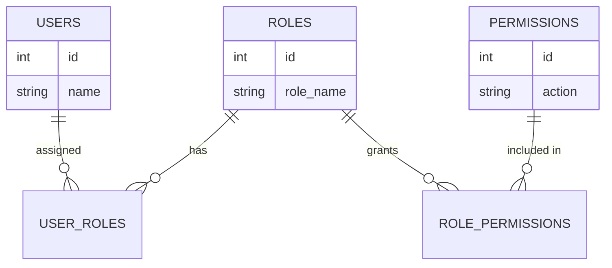

* **Pros:** Highly scalable. When a new employee joins, you just assign them the `Manager` role.
* **Cons:** "Role Explosion." If you need a Manager who can only read financials but not write them, you have to create a new role (`Manager-ReadOnly`). Complex organizations quickly end up with hundreds of hyper-specific roles.

### 3. Attribute-Based Access Control (ABAC)
The most dynamic and complex model. Access is determined by evaluating boolean rules in real-time against the attributes of the User, the Resource, and the Environment.
* **Request Flow:**
  1. User requests access to a file.
  2. A Policy Engine evaluates a rule: `Allow Access IF User.Department == "Finance" AND Resource.Classification == "Confidential" AND Environment.Time < 5:00 PM AND Environment.IP_Address == "Internal_Office"`.
* **Where it is stored:** Policies are often stored as JSON documents or written in specialized policy languages (like Rego for Open Policy Agent / OPA).
* **Pros:** Infinite flexibility. Completely solves the "Role Explosion" problem.
* **Cons:** Complex to engineer, hard to audit (you cannot easily run a SQL query to ask "Who has access to this file?"), and adds latency to every API request because the Policy Engine must dynamically compute multiple rules.


*(Read full file: [Authentication and Authorization](./Core%20Concepts/Authentication%20and%20Authorization/README.md))*
</details>
<br>

<details>
<summary><b>Caching Strategies</b> (Click to expand)</summary>

# Caching Strategies & Interview Patterns

**Source:** [Caching in System Design Interviews w/ Meta Staff Engineer (Hello Interview)](https://www.youtube.com/watch?v=1NngTUYPdpI)

**TL;DR:** Caching is the ultimate tool for scaling read-heavy systems and reducing latency. It trades a bit of storage and complexity for speed by keeping recently used data in a faster layer. In a system design interview, caching should be brought up during the deep dive (non-functional requirements) to address scale and performance. You must be able to discuss **Where to Cache**, **Architectures**, **Eviction Policies**, and **Common Pitfalls**.

---

## 1. The Physics of Caching (Why we do it)
*   **Disk Access (SSD/DB):** ~1 millisecond.
*   **Memory Access (RAM):** ~100 nanoseconds.
*   **The Gap:** Memory is roughly **10,000x faster** than disk. When serving thousands of requests per second, caching takes advantage of this massive difference.

## 2. Where to Cache (The Layers)

1.  **External Caching (Redis / Memcached):** 
    *   The most common in system design interviews. 
    *   Runs on its own server. Multiple application servers share the same global cache, meaning if one server fetches the data, all other servers instantly benefit.
2.  **In-Process Caching (Guava / Local Memory):** 
    *   Stores data directly inside the application server's RAM. 
    *   **Pros:** The absolute fastest caching possible (zero network hops).
    *   **Cons:** State is isolated per server (can lead to inconsistencies and wasted memory). 
    *   **Use Case:** Static config data or lookup tables requiring ultra-low latency.
3.  **CDNs (Content Delivery Networks):** 
    *   Edge caching geographically close to users.
    *   Optimizes for **network latency** rather than disk vs. memory. Drops a global 300ms round-trip down to 20ms.
    *   **Use Case:** Media delivery (images, videos), static assets, public API responses, and HTML.
4.  **Client-Side Caching:** 
    *   Browser HTTP cache, Local Storage, or mobile on-device disk.
    *   **Use Case:** Offline functionality (e.g., Strava syncing runs when offline). You have the least control over data freshness here.

---

## 3. Caching Architectures (How data is updated)

### Cache-Aside (Lazy Loading)
*   **How it works:** The application logic handles everything. On a read, the app checks the cache. If it's a miss, it fetches from the DB, writes it to the cache, and returns it.
*   **Pros:** Resilient (if cache goes down, the app hits the DB). Lean (only requested data gets cached). **This should be your default choice in an interview.**
*   **Cons:** Cache misses have higher latency (3 trips: check cache, query DB, write to cache). 

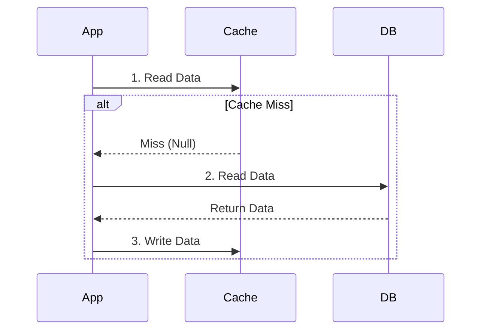

### Write-Through
*   **How it works:** The application only writes to the cache. The caching library then synchronously writes to the database *before* returning success.
*   **Pros:** Strong consistency between Cache and DB.
*   **Cons:** Slower writes. Suffers from the **Dual Write Problem** (if the DB write fails but the cache write succeeds, creating split-brain). Bloats the cache with data that might never be read again.

### Write-Behind (Write-Back)
*   **How it works:** The application writes to the cache and instantly gets a `200 OK`. The cache flushes these updates to the database asynchronously in batches.
*   **Pros:** Blazing fast write throughput (great for metrics/analytics).
*   **Cons:** **Data Loss!** If the cache node crashes before the batch flushes, the data is gone forever. *Interview Tip: Avoid proposing this unless you are highly experienced and can strongly justify the data loss risk.*

### Read-Through
*   **How it works:** Similar to Cache-Aside, but the cache itself transparently orchestrates the DB fallback (the application only ever talks to the Cache). This is exactly how CDNs work.

---

## 4. Eviction Policies (How data is removed)

*   **LRU (Least Recently Used):** Evicts the item that hasn't been read or written in the longest time. (The most common default).
*   **LFU (Least Frequently Used):** Evicts the item with the lowest total access count. Great if access patterns are highly skewed, but can suffer from "historical baggage".
*   **FIFO (First In, First Out):** Evicts the oldest item based strictly on insertion time. Rarely the right choice.
*   **TTL (Time To Live):** Each item has a strict expiration time. Perfect when data freshness matters more than frequency (e.g., session tokens, API responses).

---

## 5. The 3 Major Caching Pitfalls (Interview Traps)

There are two hard problems in computer science: naming things, and cache invalidation. Interviewers will drill into these three edge cases:

### Pitfall 1: Cache Consistency (Stale Data)
If a user updates their profile picture in the database, but the old picture is still in the cache, other users will see stale data.
*   **Solution (Invalidate on Write):** Whenever you write to the DB, explicitly send a `DELETE` command to the cache for that key. The next read will force a fresh pull.
*   **Solution (Eventual Consistency):** If it's a social media feed, set a short TTL (e.g., 5 minutes) and explicitly state: *"Some users will see stale data for 5 minutes, and that is an acceptable business trade-off."*

### Pitfall 2: Cache Stampede (Thundering Herd)
A massively popular key (like a live Super Bowl score) has a TTL of 60 seconds. When it expires, 100,000 concurrent user requests miss the cache and hit the database simultaneously, melting it down.

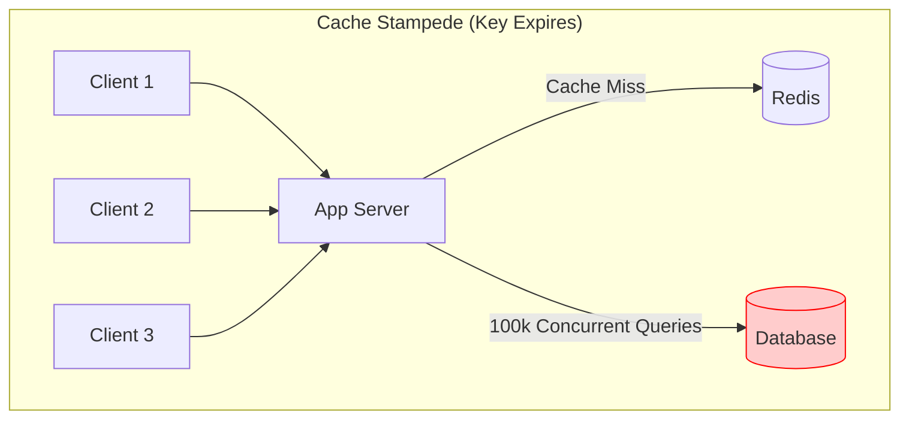

*   **Solution 1: Request Coalescing (Single Flight):** When multiple requests miss the same key, only the *first* request is allowed to query the database. The other 99,999 requests wait for the first one to repopulate the cache.
*   **Solution 2: Cache Warming (Background Refresh):** Instead of letting the key expire, a background worker proactively refreshes the key at the 55-second mark, ensuring it *never* expires while remaining fresh.

### Pitfall 3: Hot Keys (The Celebrity Problem)
If Taylor Swift's profile gets 99% of the traffic, the single cache node holding that specific key will be overwhelmed and crash, leaving the rest of the cluster idle.

*   **Solution 1 (Replication):** Replicate the hot key across *all* cache nodes instead of hashing it to one. The router can then pick any random cache node to serve the data.
*   **Solution 2 (Local In-Memory Cache):** Add a tiny in-process cache (e.g., Guava) directly inside the application servers for the top 10 most popular items to prevent requests from even hitting the Redis cluster.

---

## 6. How to Talk About Caching in Interviews

**Rule #1: NEVER just add a cache for the sake of adding a cache.** 
Dropping a cache into your design without justification is an immediate red flag. Wait for the Deep Dive phase (Non-Functional Requirements) and use this **5-Step Framework**:

1.  **Identify & Quantify the Bottleneck:** Justify the cache. Are you serving 2 billion reads a day? Is computing a newsfeed causing high latency (joins across 5 tables)? Is there a strict 100ms SLA?
2.  **Explicitly Define the Cache Keys:** Do not just say "I'll cache the data." Say exactly what you are caching: *"I will cache the computed newsfeed against the key `feed:{user_id}`."*
3.  **Choose the Architecture:** State your choice (default to Cache-Aside).
4.  **State the Eviction Policy:** Choose LRU or a strict TTL and justify why.
5.  **Address the Downsides:** Proactively bring up how you will handle Consistency, Hot Keys, or Stampedes before the interviewer even asks.


*(Read full file: [Caching Strategies](./Core%20Concepts/Caching%20Strategies/README.md))*
</details>
<br>

<details>
<summary><b>Consistent Hashing</b> (Click to expand)</summary>

# Consistent Hashing

**Sources:**
*   [Consistent Hashing | Algorithms You Should Know #1 (ByteByteGo)](https://www.youtube.com/watch?v=UF9Iqmg94tk)
*   [Consistent Hashing: Easy Explanation for System Design Interviews (Hello Interview)](https://www.youtube.com/watch?v=vccwdhfqIrI)

**TL;DR:** When distributing data across multiple servers, traditional modulo hashing (`hash(key) % N`) causes a massive "rehashing storm" whenever a server is added or removed, forcing almost all data to be migrated. Consistent Hashing solves this by placing both servers and data on a circular "Hash Ring", ensuring that adding or removing a server only affects a tiny fraction of the data. **Virtual Nodes** are used to keep the distribution perfectly balanced.

---

## 1. The Problem: Modulo Hashing & The Rehashing Storm

Imagine we have 4 database servers storing events. We use a simple hash function to assign an event to a server:
`server_index = hash("event_123") % 4` 
Let's say this equals `2`, so the event is stored on Server 2.

**What happens if Server 4 crashes?**
Our pool is now 3 servers. The formula changes to `hash("event_123") % 3`. The math entirely changes, and this might now equal `0`. 

Because the modulo (`N`) changed, almost every single key in the database will hash to a new server. You now have to migrate roughly 75% of your data across the network to its new home. This causes a massive surge in database reads and writes known as a **Rehashing Storm**, which can completely crash your site.

---

## 2. The Solution: The Hash Ring

Consistent hashing fixes this by completely abandoning the modulo operation based on the number of servers.

1.  **The Ring:** Imagine the output range of a hash function (e.g., $0$ to $2^{32} - 1$) arranged in a circle.
2.  **Place the Servers:** Hash the server's IP or name (e.g., `hash("Server A")`) and place it on the ring.
3.  **Place the Keys:** Hash the data key (e.g., `hash("Alice")`) and place it on the ring.
4.  **The Rule (Walking Clockwise):** To find which server a key belongs to, start at the key's position on the ring and walk **clockwise** until you hit a server. 

---

## 3. A Worked Out Example

Let's simplify our hash space to be $0$ to $99$.

**1. Initialize the Ring (Servers)**
*   `Hash("Server A") = 10`
*   `Hash("Server B") = 40`
*   `Hash("Server C") = 70`

**2. Insert Data (Keys)**
*   `Hash("Alice") = 15`. We walk clockwise from 15. The first server we hit is **Server B (40)**.
*   `Hash("Bob") = 55`. We walk clockwise from 55. The first server we hit is **Server C (70)**.
*   `Hash("Charlie") = 85`. We walk clockwise from 85. We pass 99, wrap around to 0, and hit **Server A (10)**.

**3. Scaling Up (Adding a Server)**
The business is booming, so we add **Server D**.
*   `Hash("Server D") = 25`.
*   Let's see what happens to our data:
    *   **Alice (15):** Walk clockwise from 15. The first server is now **Server D (25)**! Alice must be migrated from Server B to Server D.
    *   **Bob (55):** Walk clockwise. Still hits **Server C (70)**. No change.
    *   **Charlie (85):** Walk clockwise. Still hits **Server A (10)**. No change.

**The Result:** By adding a server, we only had to migrate Alice. Bob and Charlie stayed exactly where they were. Instead of moving 75% of the data, we only move $1/N$ of the data!

---

## 4. The Edge Case: Uneven Distribution & Virtual Nodes

Consistent hashing has one major flaw: **Cascading Failures**. 

Imagine **Server A (10)** crashes and is removed from the ring. All the data that used to go to Server A (keys from 71 to 10) now walks clockwise and hits **Server B (40)**. Server B is now absorbing double the traffic. If Server B gets overwhelmed and crashes, its traffic goes to Server C, crashing it too. 

**The Fix: Virtual Nodes (V-Nodes)**
Instead of placing a physical server on the ring exactly *once*, we place it *multiple times* (e.g., 100 times). 
*   `hash("Server A_1")`, `hash("Server A_2")`, `hash("Server A_3")`, etc.

Now, the servers are beautifully interleaved across the ring. If Server A crashes, its 100 virtual nodes disappear. The traffic that was hitting those 100 spots will gracefully fall onto the virtual nodes of Server B, Server C, and Server D evenly. No single server takes the full brunt of the failure.

---

## 5. Pseudocode / Implementation

In code, the "circular ring" is usually implemented as a simple **sorted array**. Walking clockwise is just a **Binary Search** (`O(log N)`) to find the next highest hash value.

```python
import hashlib
import bisect

class ConsistentHashRing:
    def __init__(self, num_virtual_nodes=100):
        self.num_virtual_nodes = num_virtual_nodes
        self.ring = []         # Sorted array of hash values simulating the "ring"
        self.server_map = {}   # Maps a hash value to the physical server IP

    def _hash(self, key):
        # Use MD5 to generate a large, deterministic integer hash
        return int(hashlib.md5(key.encode('utf-8')).hexdigest(), 16)

    def add_server(self, server_ip):
        # Add multiple virtual nodes to the ring for this physical server
        for i in range(self.num_virtual_nodes):
            vnode_key = f"{server_ip}_vnode_{i}"
            hash_val = self._hash(vnode_key)
            
            self.ring.append(hash_val)
            self.server_map[hash_val] = server_ip
            
        # Keep the array sorted to allow binary search (clockwise walking)
        self.ring.sort()

    def remove_server(self, server_ip):
        # Remove all virtual nodes for this physical server
        for i in range(self.num_virtual_nodes):
            vnode_key = f"{server_ip}_vnode_{i}"
            hash_val = self._hash(vnode_key)
            
            self.ring.remove(hash_val)
            del self.server_map[hash_val]

    def get_server(self, data_key):
        if not self.ring:
            return None
            
        hash_val = self._hash(data_key)
        
        # Binary search: find the first server hash >= the data hash
        # This simulates walking "clockwise" around the ring
        index = bisect.bisect_left(self.ring, hash_val)
        
        # If we reached the end of the array, wrap around to the first server (index 0)
        if index == len(self.ring):
            index = 0
            
        return self.server_map[self.ring[index]]

# --- Example Usage ---
# ring = ConsistentHashRing(num_virtual_nodes=3)
# ring.add_server("192.168.1.1")
# ring.add_server("192.168.1.2")
#
# assigned_server = ring.get_server("user_alice_data")
```

---

## 6. The Scatter-Gather Trap: Hash vs Range Partitioning
*Source: [System Design Fight Club - Consistent Hashing Mistake](https://www.youtube.com/watch?v=sLbOz2QBZgc)*

A common mistake in system design interviews is blindly applying Hash Partitioning (like Consistent Hashing) to solve **"Hot Partition"** problems without considering the query access pattern.

**The Scenario:**
Imagine an e-commerce inventory database (Amazon). You have a hot partition because a specific category (e.g., "Electronics") is queried vastly more than others. 
* To "fix" this, you change the partition key to something evenly distributed (like hashing the `product_id`). 
* Result: The electronics are now beautifully scattered across every server in your cluster. For point queries (e.g., `GET /products/123`), the load is perfectly balanced!

**The Trap (Range Queries):**
If the business frequently performs **key-range queries** (e.g., "Get all products in the Electronics category"), Hash Partitioning completely destroys your system. 
* Because "Electronics" products are now randomly hashed across every server, the request router cannot identify a single node to query. 
* It must send the query to **EVERY SINGLE PARTITION** and merge the results. This is called **Scatter-Gather**.
* You "solved" the hot partition by absolutely hosing every partition with every single range request (the video jokes: "It's like communism; if everyone is starving together, nobody *in particular* is starving").

**The Solution:**
If your application relies on Range Queries, you **must use Range Partitioning**, which preserves data locality (keeping related items on the same server). If Range Partitioning creates a hot partition, mitigate it with **Dynamic Partitioning** (where the database detects a hot range and dynamically splits it into two smaller ranges on different servers) rather than destroying locality with Hash Partitioning.

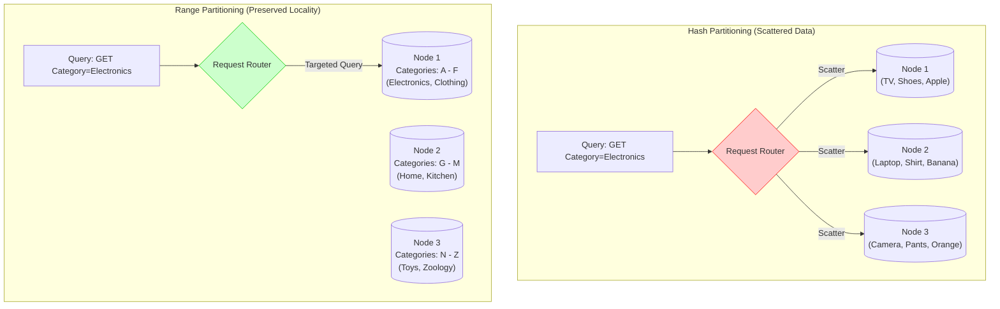


*(Read full file: [Consistent Hashing](./Core%20Concepts/Consistent%20Hashing/README.md))*
</details>
<br>

<details>
<summary><b>DNS and CDN</b> (Click to expand)</summary>

# DNS and CDNs (Content Delivery Networks)

**TL;DR:** 
- **DNS** is the phonebook of the internet; it translates human-readable domain names (like `google.com`) into machine-readable IP addresses.
- **CDNs** are geographically distributed networks of servers that cache static content closer to users, minimizing latency and reducing the load on the origin server. DNS is the mechanism used to route users to the nearest CDN edge server.

---

## 1. Domain Name System (DNS)

Humans remember names (like `amazon.com`), but computers and routers (operating at Layer 3 of the OSI model) only understand IP addresses (like `192.0.2.1`). DNS bridges this gap.

### The Hierarchical Resolution Process
When you type `google.com` into your browser, finding the IP address is not a single database lookup. It is a highly distributed, hierarchical process:

1. **Browser Cache & OS Cache:** The browser checks its own cache. If it misses, it asks the Operating System.
2. **DNS Resolver (ISP):** The OS sends a query to the DNS Resolver (usually provided by your Internet Service Provider, or a public one like Google's `8.8.8.8` or Cloudflare's `1.1.1.1`).
3. **Root Name Server:** If the Resolver doesn't have it cached, it queries the Root Server. The Root Server says, *"I don't know the exact IP, but here is the IP for the `.com` TLD Server."*
4. **TLD (Top-Level Domain) Server:** The Resolver asks the `.com` server. The TLD server says, *"I don't know the exact IP, but here is the Authoritative Server that manages `google.com`."*
5. **Authoritative Name Server:** The Resolver asks the Authoritative Server (often managed by AWS Route53 or Cloudflare). This server holds the actual mapping and returns the exact IP address.
6. **Caching:** The Resolver caches this IP (for a time defined by the TTL - Time To Live) and passes it back to your browser, which also caches it. 

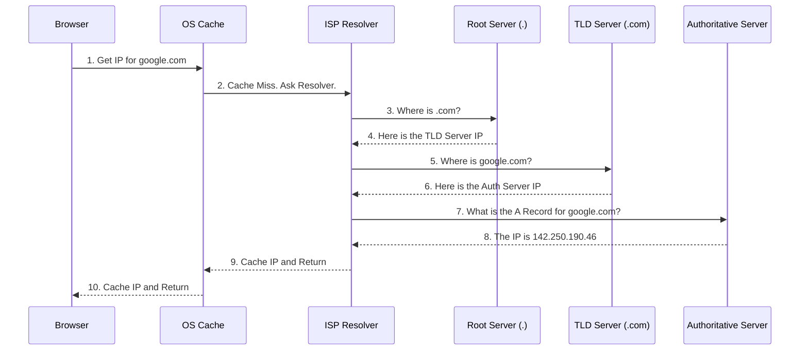

### Common DNS Record Types
*   **A Record:** Maps a domain to an **IPv4** address.
*   **AAAA Record:** Maps a domain to an **IPv6** address.
*   **CNAME (Canonical Name):** Maps a domain to another domain (an alias). For example, mapping `blog.example.com` to `example.wordpress.com`. *Note: You cannot put a CNAME on the root domain (example.com).*
*   **NS (Name Server):** Indicates which Authoritative server manages the domain.
*   **MX (Mail Exchange):** Directs email to a mail server.

### Advanced DNS Routing (Traffic Management)
Authoritative servers don't just return static IPs; they can perform intelligent load balancing:
*   **Weighted Routing:** Send 80% of traffic to Server A, 20% to Server B (great for A/B testing or canary deployments).
*   **Geolocation Routing:** If the user is in Europe, return the IP of the European datacenter.
*   **Latency-Based Routing:** Continuously measure network latency and return the IP of the server that will respond fastest to that specific user.

---

## 2. Content Delivery Networks (CDNs)

If your origin server is in New York, a user in Tokyo will experience high latency (the physical time it takes light to travel through fiber optic cables across the globe). 

### How CDNs Work
A CDN places "Edge Servers" (also called Points of Presence or PoPs) in hundreds of cities worldwide. 
1.  **Caching:** These edge servers cache static assets (HTML, CSS, JavaScript, Images, Videos).
2.  **DNS Routing:** When a user in Tokyo types in your URL, the DNS dynamically resolves to the IP address of the Tokyo Edge Server, not the New York Origin Server.
3.  **Delivery:** The user downloads the image directly from the server in their own city, drastically cutting load times.

```mermaid
flowchart TD
    User([User in Tokyo])
    Edge[CDN Edge Server Tokyo]
    Origin[(Origin Server NY)]

    User -- "1. Request image.jpg" --> Edge
    Edge -- "2. Check Cache" --> Edge
    
    alt Cache Miss
        Edge -- "3. Fetch from Origin" --> Origin
        Origin -- "4. Return image.jpg" --> Edge
        Edge -- "5. Cache it & Serve User" --> User
    else Cache Hit
        Edge -- "3. Serve instantly from Cache" --> User
    end
```

### Push vs. Pull CDNs
*   **Pull CDN (Most Common):** The edge server starts empty. When the first user requests an image, the edge server fetches it from the Origin Server, serves it to the user, and caches it. Subsequent users get the cached version until the TTL expires. *Best for heavy traffic where only a fraction of content is requested frequently.*
*   **Push CDN:** You proactively upload (push) all your content directly to the CDN. The CDN then replicates it to all its edge servers immediately. *Best for smaller datasets where you want 100% cache hits.*

### Why use a CDN?
1.  **Lower Latency:** Physical proximity to the user means faster page loads.
2.  **Reduced Origin Load:** Because the CDN absorbs 90%+ of the traffic for static assets, your application servers and databases don't have to work as hard, saving you compute costs.
3.  **DDoS Protection:** CDN edge networks are massive and can absorb enormous Distributed Denial of Service attacks before they ever reach your origin server. Cloudflare is famous for this capability.
4.  **SSL/TLS Termination:** The edge server handles the expensive cryptographic handshake, freeing up your backend servers.

---

## 3. How DNS and CDNs Work Together
When you set up a CDN (like Cloudflare or AWS CloudFront), you usually change your domain's **Name Servers (NS)** to point to the CDN provider. 

Because the CDN now acts as your Authoritative DNS Server, it can dynamically inspect where a DNS request is coming from and intelligently return the IP address of the CDN Edge Server closest to that specific user.


*(Read full file: [DNS and CDN](./Core%20Concepts/DNS%20and%20CDN/README.md))*
</details>
<br>

<details>
<summary><b>Database Indexes</b> (Click to expand)</summary>

# Database Indexes & The RUM Conjecture

**Source:** [Absolutely Everything That I Know About Database Indexes (System Design Fight Club)](https://www.youtube.com/watch?v=Qhc8gFF2qS8)

**TL;DR:** Adding an index to a database speeds up reads, but fundamentally slows down writes. The foundational concept behind all database tuning is the **RUM Conjecture**, which forces you to trade off between Read speed, Update speed, and Memory overhead. 

---

## 1. The RUM Conjecture

Similar to the CAP theorem for distributed systems, the RUM conjecture governs database indexing. It states that you must trade off between:
*   **R**ead Overhead (How fast can you retrieve data?)
*   **U**pdate Overhead (How fast can you write/update data?)
*   **M**emory Overhead (How much disk/RAM space does the index consume?)

You cannot optimize all three simultaneously. 
*   *Example:* Systems like Cassandra use LSM Trees, which offer blazing-fast **Updates** (writes are just appended to a file), but suffer from high **Memory** overhead (wasted space from duplicate/stale records at the end of files before compaction) and slightly slower **Reads**.

## 2. A Database is a Write-Ahead Log + A Materialized View
To deeply understand databases, consider this mental model: **A database at its core is just a Write-Ahead Log (WAL).** Everything else (including indexes) is just a materialized view built on top of that log.

*   If you just have a WAL and no indexes, your **writes are instantaneous** ($O(1)$ append), but your **reads are terrible** (full $O(N)$ table scan).
*   Adding a B-Tree index speeds up the read to $O(\log N)$, but ruins the $O(1)$ write, because every time a row is inserted, the CPU must also update the B-Tree data structure.

### When to use "No Index"
Because every index slows down writes, the absolute fastest way to ingest data is to use **no index at all**. 
*   **Message Brokers (Kafka):** Apache Kafka handles millions of writes per second explicitly because it has no secondary indexes. It is purely an append-only log.
*   **Data Warehouses (OLAP):** Analytics databases often forgo traditional secondary indexes. Because OLAP queries (like generating a yearly sales report) require scanning millions of rows anyway, indexing individual rows is useless overhead. Instead, they use **Columnar Storage** to rapidly scan massive amounts of data in a single pass.

## 3. The 4 Major Types of Indexes (What DB to use when)

When designing a system, choosing the right index for your primary and secondary keys is critical. Here is a breakdown of the 4 most common indexes and the databases that use them:

### 1. B-Trees (Read-Optimized)
*   **What they do:** Keep data sorted in a balanced tree structure. Excellent for fast lookups and range queries.
*   **The Trade-off:** Optimized for **Reads**. Writes are slower because inserting data requires rebalancing the tree and updating disk pages.
*   **Who uses it:** This is the default index for traditional Relational Databases (**PostgreSQL, MySQL, Oracle**). Use when you have a read-heavy system that needs strong consistency and fast single-record lookups.

### 2. LSM Trees (Write-Optimized)
*   **What they do:** Log-Structured Merge Trees don't modify data in place. Instead, they append writes to an in-memory buffer (MemTable) and periodically flush them to immutable files on disk (SSTables).
*   **The Trade-off:** Optimized for **Updates (Writes)**. Reads are slightly slower because the database might have to search through multiple SSTables on disk to find the most recent version of a record.
*   **Who uses it:** Massive scale distributed databases designed for high-write throughput (**Cassandra, Google Spanner, DynamoDB**). Use when you are ingesting a firehose of data (e.g., IoT sensors, logging, massive social media feeds).

### 3. Inverted Indexes (Full-Text Search)
*   **What they do:** Instead of mapping a record ID to its contents, an inverted index maps the *contents* (words) to the record IDs. (e.g., The word "coffee" maps to `[Tweet_4, Tweet_99, Tweet_102]`).
*   **The Trade-off:** Requires massive memory overhead and expensive write times to tokenize and index every word, but offers unparalleled read speeds for text search.
*   **Who uses it:** Search engines and logging tools (**Elasticsearch, Solr, Lucene**). Use this when building a search bar (like searching Amazon products or Twitter posts by keywords). Note: Postgres *does* support inverted indexes, but Elasticsearch is the industry standard for dedicated search.

### 4. R-Trees (Geospatial / Shape Search)
*   **What they do:** Indexes multi-dimensional data by wrapping shapes in Minimum Bounding Rectangles (MBRs).
*   **The Trade-off:** Complex to update when shapes move or overlap, but incredibly fast at answering "What restaurants are inside this polygon on the map?"
*   **Who uses it:** Spatial databases (**PostGIS / PostgreSQL, Elasticsearch geo-fields**). Use this for location-based services (Uber, Yelp) or querying physical geometries.

## 4. Distributed Primary Keys (UUIDs vs Auto-Increment)
In a standard single-node SQL database, you often use an `AUTO_INCREMENT` integer as your primary key (powered by a B-Tree). 

In a **Distributed Database**, auto-increment fundamentally fails. 
*   To guarantee sequential numbers across 50 different machines, you need **Total Ordering** (requiring massive coordination/locks between nodes). 
*   Because this coordination is too slow, distributed databases dodge the problem entirely by dropping auto-increment and using **UUIDs** (Universally Unique Identifiers) or decentralized ID generators (like Twitter Snowflake).

A Distributed Primary key usually consists of:
1.  **Partition Key:** Determines which physical node the record lives on. (Crucial for query routing. See *Hash vs Range Partitioning*).
2.  **Sort Key (Optional):** Determines how the data is clustered/sorted on disk within that specific node.


*(Read full file: [Database Indexes](./Core%20Concepts/Database%20Indexes/README.md))*
</details>
<br>

<details>
<summary><b>Encryption and TLS</b> (Click to expand)</summary>

# Encryption & Transport Layer Security (TLS)

**Sources:** 
- [Symmetrical vs Asymmetrical Encryption (Hussein Nasser)](https://www.youtube.com/watch?v=Z3FwixsBE94)
- [Transport Layer Security, TLS 1.2 and 1.3 Explained (Hussein Nasser)](https://www.youtube.com/watch?v=AlE5X1NlHgg)

**TL;DR:** Secure web communication (HTTPS) relies on TLS. TLS is a hybrid protocol that uses **Asymmetrical Encryption** to securely establish a connection and exchange a shared key, and then switches to **Symmetrical Encryption** to encrypt the actual data stream for high performance.

---

## 1. The Foundation: Encryption Types

To understand TLS, you must first understand the two primary types of cryptography it relies upon, as each solves the other's weakness.

### Symmetrical Encryption
Both the sender and receiver use the **exact same key** to encrypt and decrypt the message.
*   **How it works:** Alice encrypts a message with "Key A". Bob uses "Key A" to decrypt it.
*   **Common Algorithms:** AES (Advanced Encryption Standard).
*   **Pros:** Extremely fast and computationally cheap. Excellent for encrypting large amounts of data (like streaming video or downloading a file).
*   **Cons:** **The Key Exchange Problem**. How do Alice and Bob agree on "Key A" if they are communicating over the open internet? If a hacker intercepts the key while they are sharing it, the encryption is compromised.

### Asymmetrical Encryption (Public-Key Cryptography)
Every participant generates a **pair of mathematically linked keys**: a Public Key (shared with the world) and a Private Key (kept strictly secret).
*   **How it works:** If Alice wants to send a secure message to Bob, she encrypts it using **Bob's Public Key**. Because of the math involved, that message can now *only* be decrypted by **Bob's Private Key**.
*   **Common Algorithms:** RSA, Elliptic Curve Cryptography (ECC).
*   **Pros:** Solves the key exchange problem. You can openly publish your Public Key on the internet without compromising your security.
*   **Cons:** Extremely slow and computationally expensive. It is not feasible to encrypt a 4GB movie using asymmetrical encryption.

---

## 2. Transport Layer Security (TLS)

TLS (the successor to SSL) is the protocol that secures HTTP (making it HTTPS). It brilliantly combines the strengths of both encryption types.

### The Hybrid Approach
1.  **The Handshake (Asymmetrical):** When your browser connects to a server, they use slow, secure asymmetrical encryption. The server sends its Public Key (embedded in its SSL Certificate). The browser uses this Public Key to securely send a newly generated **"Session Key"** to the server.
2.  **The Data Transfer (Symmetrical):** Because only the server has the Private Key, only the server can decrypt that Session Key. Now, both the browser and server have the exact same Session Key. They discard asymmetrical encryption and use fast, symmetrical encryption (AES) with that Session Key for the rest of the visit. 

---

## 3. The TLS Handshake: 1.2 vs 1.3

Every time you connect to a secure website, a "handshake" must occur before data can be sent. This adds latency (measured in Round Trips or RTT).

### TLS 1.2 (2-RTT Handshake)
In TLS 1.2, establishing a secure connection takes **two full round trips** between the client and server before a single byte of HTTP data is sent.
1.  **Client Hello:** "I want to connect securely. Here are the cipher suites (encryption algorithms) I support."
2.  **Server Hello & Certificate:** "Let's use this cipher suite. Here is my Public Key Certificate."
3.  **Client Key Exchange:** The client generates the symmetrical Session Key, encrypts it with the server's Public Key, and sends it: "Here is the key we will use. I'm finished."
4.  **Server Finished:** The server decrypts the Session Key and acknowledges: "Got it. I'm finished."
5.  *Now HTTP data (like `GET /index.html`) can finally be sent.*

### TLS 1.3 (1-RTT Handshake)
TLS 1.3 was a massive upgrade released in 2018. It optimizes the handshake to just **one round trip**.
1.  **Client Hello + Key Share:** The client essentially *guesses* the encryption algorithm the server will pick (usually a modern one like Elliptic Curve Diffie-Hellman) and sends its part of the mathematical key exchange in the very first message. "I want to connect, I assume we are using this algorithm, so here is my half of the key math."
2.  **Server Hello + Finished:** The server agrees, completes the key math using its own Private Key, and responds: "Agreed, the key is established. I'm finished."
3.  *The client can immediately send HTTP data.*

**Why TLS 1.3 is better:**
*   **Speed:** Halves the connection latency (crucial for mobile networks or high-latency connections).
*   **Security:** Removed support for outdated, vulnerable cryptographic algorithms (like MD5 or SHA-1) that were kept in TLS 1.2 for backwards compatibility.
*   **0-RTT Resumption:** If you have visited a site recently, TLS 1.3 allows the client to use the previous session key to send HTTP data on the very first network packet (Zero Round Trip Time), making reconnections nearly instantaneous.


*(Read full file: [Encryption and TLS](./Core%20Concepts/Encryption%20and%20TLS/README.md))*
</details>
<br>

<details>
<summary><b>Geospatial Indexes</b> (Click to expand)</summary>

# Geospatial Indexes: Proximity Search & Location Databases

**Sources:** 
- [Proximity Search & Geospatial Indexes Explained (Hello Interview)](https://www.youtube.com/watch?v=dQXdSxn7d1g)
- [Designing a location database: QuadTrees and Hilbert Curves (Gaurav Sen)](https://www.youtube.com/watch?v=OcUKFIjhKu0)

**TL;DR:** When building systems like Uber, Yelp, or Tinder, you must query for items "nearby" a user's `(latitude, longitude)`. Standard database indexes (B-Trees) fail at 2D queries. The industry has converged on two solutions: build a **Custom Spatial Tree** (Quad, KD, R-Tree) or map 2D space into 1D integers using **Encoded Keys** (GeoHash, S2, H3) to drop into a standard B-Tree.

---

## 1. The Core Problem: Why Standard Databases Fail
Imagine a SQL table of taxi cabs with `lat` and `lng` columns. You want to find all cabs within a 2km radius. 
If you put a standard B-Tree index on `lat` and `lng`, the 1D sort order completely rips apart 2D closeness. 

Take two cabs parked just five blocks away from each other in Midtown Manhattan. Physically, they are neighbors. But if your 1D database index sorts on longitude alone, every single other cab in the city with a longitude between them (from the Bronx all the way down to Staten Island) gets crammed into the index between those two neighbors. 

**Any naive flattening of 2D into 1D rips apart the spatial relationship we actually care about.** We need data structures designed for space.

---

## 2. Approach A: Custom Spatial Trees (The Evolution)

To solve this, computer scientists spent decades building custom trees designed specifically for spatial coordinates.

### 1. QuadTrees (1974 - Finkel & Bentley)
*   **What it does:** It divides a square map into 4 smaller squares, and recursively shatters them if an area gets too crowded.
*   **How it works:** The split always happens at the **geometric midpoint** of the cell (North/South, East/West). 
*   **The Flaw (Latency & Disk Thrashing):** Because the split is purely geometric and ignores where the data actually sits, a highly dense area like Manhattan gets sliced in half over and over (dozens of levels deep) just to separate the points. This makes query latency unpredictable (a query in rural Vermont is instantly fast, but Manhattan is painfully slow). Furthermore, it is a pointer-based structure; following arbitrary memory pointers causes massive random disk reads (thrashing) when the tree exceeds RAM.

### 2. KD-Trees (1975 - Bentley)
*   **What it does:** A binary tree that alternates splitting the map vertically (X-axis) and horizontally (Y-axis) at every level.
*   **How it works:** Unlike QuadTrees, KD-Trees are data-driven. They split the space at the **median** point of the data, ensuring the binary tree remains perfectly balanced regardless of density.
*   **The Flaw:** It solved the density latency problem, but it still suffered from the same disk-thrashing pointer problem as QuadTrees. It is great in-memory, but painful off of it.

### 3. BKD-Trees (Block-oriented KD-Trees)
*   **What it does:** The modern fix for KD-Trees, specifically designed to live on a physical hard drive rather than RAM.
*   **How it works:** Instead of storing one point per node (which forces the hard drive to spin wildly reading pointers), BKD-Trees pack thousands of points into large "Blocks" that perfectly match the OS disk page size. 
*   **Usage:** Elasticsearch uses BKD trees for its geo-queries today, making it excellent for searching static data (like restaurants), but terrible for live-tracking moving cars (because it is designed for write-once immutable segments).

### 4. R-Trees (1984 - Antonin Guttman)
*   **What it does:** It was the first spatial index designed to handle **shapes** (lines, polygons), not just points. 
*   **How it works:** You can't meaningfully drop a polygon (like the country of France) into a QuadTree cell. Instead, an R-Tree draws a **Minimum Bounding Rectangle (MBR)** tightly around geometric objects. It then groups those rectangles inside larger parent rectangles, forming a balanced tree similar to a B-Tree. 
*   **Usage:** Used by PostgreSQL (PostGIS) to answer complex geometry questions (e.g., "Does this delivery zone polygon intersect with Highway 66?"). 
*   **The Flaw:** Writes are incredibly expensive. When an object moves, the tree has to recalculate bounding boxes to minimize overlap.

---

## 3. Approach B: Encoded Keys (Space-Filling Curves)
Instead of building complex new trees, this approach translates a 2D `(lat, lng)` coordinate into a single 1D integer. You can then drop that integer into a standard, blazingly fast B-Tree (which databases have spent 50 years optimizing).

The goal is to use a **Space-Filling Curve** (like a Hilbert Curve) to draw a continuous line through a 2D grid so that points that are physically close together in 2D space are numerically close together on the 1D line.

### Hilbert Curves (The Math)
*   **How it works:** It uses a recursive 'U' shape to fill a 2D space. At level 1, you have a simple 'U'. At level 2, the grid is subdivided, and you draw 4 smaller, rotated 'U's connected together. You can do this to infinite depth.
*   **The Magic:** Because it is a continuous line, every point in the 2D plane is mapped to an integer position on the line. If two points are physically close in the real world, their 1D integers are almost guaranteed to be very close. 
*   **The Query:** To find nearby drivers, you calculate the user's 1D Hilbert value (e.g., `29`), and do a simple database range query: `SELECT * FROM drivers WHERE hilbert_id BETWEEN 23 AND 35`.

### 1. GeoHash (Redis)
*   **How it works:** Divides a flat 2D map into a grid of squares. Converts coordinates into a 52-bit integer (often represented as a base32 string like `dr5ru`). Points sharing a prefix are geographically close.
*   **The Flaw:** The Earth is a sphere, not a flat rectangle. A GeoHash square at the equator is huge, but a GeoHash square near the North Pole is a tiny sliver.
*   **Usage:** Redis `GEOADD` and `GEORADIUS` use 52-bit GeoHash integers stored in a Sorted Set (a B-Tree variant).

### 2. Google S2 (MongoDB)
*   **How it works:** Solves the GeoHash pole-distortion problem. S2 wraps the spherical Earth in a 3D cube, then projects the surface onto the 6 flat faces of the cube. It then uses a **Hilbert Curve** to assign a 64-bit integer (`S2 Cell ID`) to every point.
*   **Usage:** Powers MongoDB's `2dsphere` index.

### 3. Uber H3
*   **How it works:** Uses **Hexagons** instead of squares. 
*   **The Problem with Squares:** A square has 4 edge neighbors (close) and 4 corner neighbors (further away). This asymmetry makes radius queries and heat maps messy.
*   **The Hexagon Solution:** A hexagon has exactly 6 neighbors, all at the *exact same distance* from the center. H3 tiles the globe in hexagons, assigning a 64-bit ID to each based on a deterministic walk. 
*   **Usage:** Used internally by Uber for dispatch and surge pricing analytics.

---

## 4. The Edge Case: Boundary Artifacts
All Encoded Key approaches (GeoHash, S2, H3) suffer from the **Boundary Problem**.
Two points can be 5 meters apart, but if they straddle the boundary of a massive parent cell (e.g., the Prime Meridian), their 1D integers will be completely different. A naive B-Tree prefix scan will miss them entirely.

**The Fix (The 3x3 Trick):**
When querying, you don't just query the user's cell. You mathematically calculate the 8 neighboring cells around the user, and query all 9 cells. You then post-filter the results to drop the corners that are technically inside the 9 cells but outside your actual target radius.

---

## 5. Summary: What should you use?

| Scenario | Recommendation | Underlying Tech | Writes |
| :--- | :--- | :--- | :--- |
| **Complex Geometries (Polygons, Lines)** | PostgreSQL (PostGIS) | Custom R-Trees | Slow (Rebalancing) |
| **Text Search + Static Locations** | ElasticSearch | Custom BKD-Trees | Write-Once |
| **Massive Scale Live Tracking (Uber)** | Redis / Custom DB | GeoHash / H3 (B-Tree) | Blazing Fast |


*(Read full file: [Geospatial Indexes](./Core%20Concepts/Geospatial%20Indexes/README.md))*
</details>
<br>

<details>
<summary><b>Message Brokers and Consistency</b> (Click to expand)</summary>

# Message Brokers & Strong Consistency

**Source:** [When NOT to use a message broker? (System Design Fight Club)](https://www.youtube.com/watch?v=eWpOlIBxB_U)

**TL;DR:** While message brokers (Kafka, SQS, RabbitMQ) are fantastic for decoupling systems and increasing availability, they fundamentally **kill strong consistency**. If your system requires immediate, strong consistency (e.g., Financial Trading, Wallets, Payment Gateways), you should *not* place an asynchronous message broker in the critical path between your API and the database.

---

## 1. The Traditional Setup (Strong Consistency)
In a standard CRUD application without a broker, the flow looks like this:
1. Client sends a Write request.
2. The API synchronously writes to the Data Store (e.g., PostgreSQL).
3. The Data Store confirms the write.
4. The API returns `200 OK` to the Client.

Because the write is synchronous, the moment the client receives the `200 OK`, any subsequent Read request is guaranteed to see the new data. This is **Strong Consistency**.

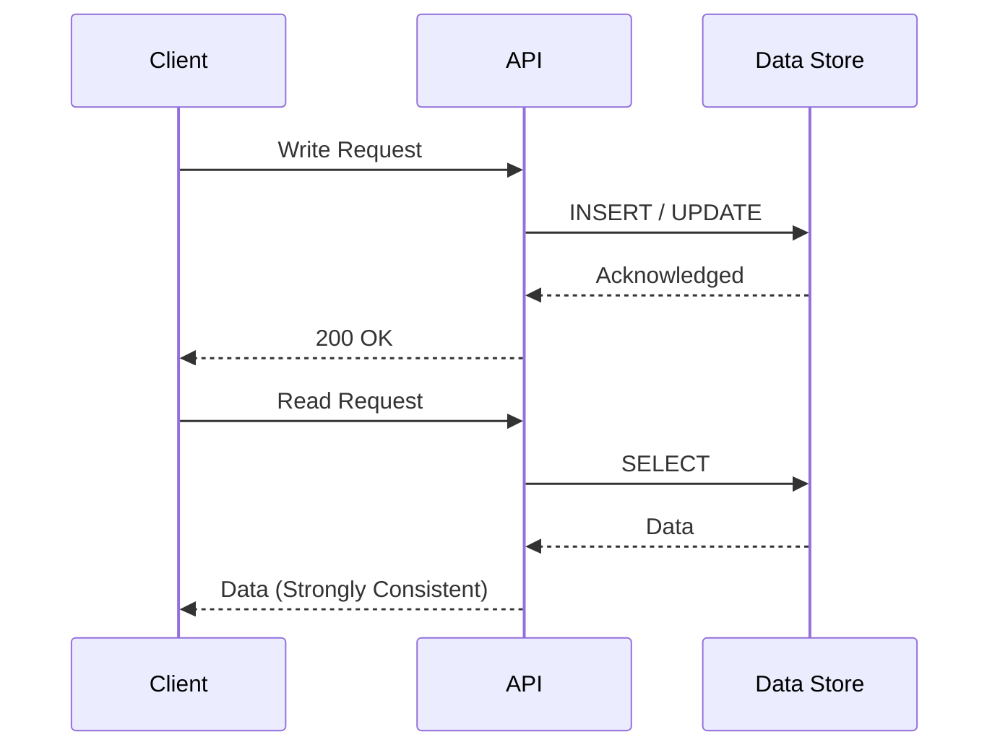

## 2. The Message Broker Setup (Eventual Consistency)
When you introduce a message broker to increase availability and handle traffic spikes, the flow changes:
1. Client sends a Write request.
2. The API writes the event to the Message Broker (Kafka/SQS) and *immediately* returns `200 OK`.
3. In the background, a Task Runner asynchronously pulls the event from the broker and writes it to the Data Store.

**The Problem (Stale Reads):**
Because the API returned `200 OK` before the data actually reached the database, a client might immediately issue a Read request and get **stale data** (or a 404 Not Found). The data is safely persisted in the highly-available message queue, but it is not yet visible to readers. 

If the database or task runners experience an outage, the delay between the `200 OK` and the data becoming readable could stretch from milliseconds to hours. This is **Eventual Consistency**.

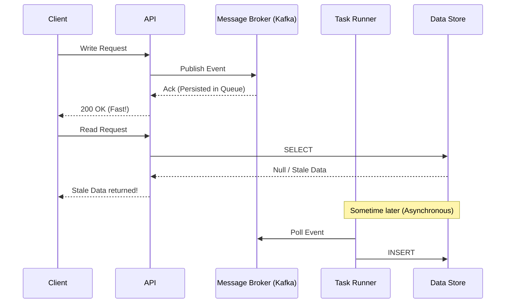

## 3. The CAP Theorem Trade-off
Why do this if it ruins consistency? **Availability.**

Databases often go down or get overwhelmed under massive load. Message brokers are explicitly designed to almost *never* go down. By placing a broker in front of a database, you transform a **Push** (which can overload the DB) into a **Pull** (where the DB consumes at its own safe pace). 

You are actively trading Consistency (C) for Availability (A) under the CAP Theorem.

## 4. When NOT to use a Broker
Do not use an asynchronous message broker in the critical path if:
*   **Financial Transactions:** A stock exchange or crypto wallet cannot tolerate a user seeing a stale balance after a deposit.
*   **Inventory Claims:** If a user buys the last concert ticket, subsequent reads *must* instantly reflect that the ticket is gone to prevent double-booking. 

For these systems, you must stick to synchronous database writes and Distributed Transactions (like Two-Phase Commit), accepting lower availability (if the DB is down, the system rejects the write) to guarantee absolute correctness.


*(Read full file: [Message Brokers and Consistency](./Core%20Concepts/Message%20Brokers%20and%20Consistency/README.md))*
</details>
<br>

<details>
<summary><b>Networking Foundations</b> (Click to expand)</summary>

# Networking Foundations: OSI, NAT, Proxies, and Load Balancing

**Sources (Hussein Nasser Crash Courses):** 
- [The OSI Model - Explained by Example](https://www.youtube.com/watch?v=7IS7gigunyI)
- [Network Address Translation - NAT Explained](https://www.youtube.com/watch?v=RG97rvw1eUo)
- [Proxy vs. Reverse Proxy (Explained by Example)](https://www.youtube.com/watch?v=ozhe__GdWC8)
- [Load balancing in Layer 4 vs Layer 7 with HAPROXY Examples](https://www.youtube.com/watch?v=aKMLgFVxZYk)

---

## 1. The OSI Model (How Data Moves)
The OSI (Open Systems Interconnection) model is a conceptual framework defining how data travels from an application on one computer across a network to an application on another. 

While there are 7 layers, system design heavily focuses on three:
*   **Layer 3 (Network Layer):** Deals with **IP Addresses**. It routes packets of data between different networks. It knows *which machine* the data is going to, but not what to do with it once it gets there.
*   **Layer 4 (Transport Layer):** Deals with **TCP and UDP Ports**. It ensures data arrives reliably (TCP) or quickly (UDP). It routes the packet to a specific *process* (like a web server listening on Port 80) on the destination machine.
*   **Layer 7 (Application Layer):** Deals with the actual content of the message (**HTTP, WebSockets, gRPC**). It understands headers, JSON payloads, and URL paths (like `/api/users`).

---

## 2. NAT (Network Address Translation)
We ran out of IPv4 addresses a long time ago. NAT is the clever hack that saved the internet by allowing multiple devices to share a single Public IP address.

### The Problem
If you have 10 devices in your house, they all have "Private IPs" (e.g., `192.168.1.5`), which are unroutable on the public internet. If your laptop requests a web page from Google, how does Google know where to send the response back?

### How NAT Works (The NAT Table)
1.  Your laptop (`192.168.1.5:4000`) sends an HTTP request to your Router.
2.  The Router intercepts the packet. It strips out your Private IP and replaces it with the Router's **Single Public IP** (e.g., `98.24.12.1`) and assigns a random source port (e.g., `8080`).
3.  The Router records this swap in its **NAT Table**: `[192.168.1.5:4000 <--> 98.24.12.1:8080]`.
4.  The request goes to Google. Google sees the request coming from `98.24.12.1:8080` and sends the response back there.
5.  When the Router receives the response, it looks up `Port 8080` in the NAT Table, finds your laptop's Private IP, rewrites the packet, and forwards it to you. Google never knew your laptop existed.

---

## 3. Forward Proxies vs Reverse Proxies
A proxy is a middleman server that intercepts requests. The difference depends entirely on **who the proxy is protecting**.

### Forward Proxy (Protects the Client)
*   **Use Case:** VPNs, Corporate Firewalls, Tor network.
*   **Mechanism:** Sits in front of the **Client**. When you try to access a website, your request goes to the Forward Proxy first. The proxy fetches the website on your behalf and returns it to you.
*   **Result:** The destination server only sees the IP address of the Proxy. It has no idea who the real Client is.

### Reverse Proxy (Protects the Server)
*   **Use Case:** NGINX, HAProxy, AWS Application Load Balancer.
*   **Mechanism:** Sits in front of the **Backend Servers**. When a client accesses a website, they are actually connecting to the Reverse Proxy. The proxy then forwards the request to the internal servers.
*   **Result:** The Client has no idea how many backend servers exist or what their internal IP addresses are. Used for Load Balancing, SSL Termination, and Caching.

---

## 4. Layer 4 vs Layer 7 Load Balancing
When setting up a Reverse Proxy (like HAProxy) to load balance traffic across your backend servers, you must choose what "Layer" of the OSI model the proxy operates on.

### Layer 4 Load Balancing (Transport)
*   **How it works:** The Load Balancer only looks at the **IP and Port** (e.g., traffic coming to Port 443). It does not decrypt the traffic or look at the HTTP payload. It simply forwards the raw TCP stream to a backend server.
*   **Pros:** **Extremely fast** and consumes very little CPU. It only takes a single TCP connection from the client straight through to the backend.
*   **Cons:** "Dumb" routing. It cannot route traffic based on the URL. If you want `/api/users` to go to Server A, and `/api/payments` to go to Server B, Layer 4 cannot do this because it cannot read the URL.

### Layer 7 Load Balancing (Application)
*   **How it works:** The Load Balancer terminates the TCP connection, decrypts the TLS certificate, and reads the actual **HTTP headers and URL path**. It then establishes a *second, brand new TCP connection* to the chosen backend server.
*   **Pros:** "Smart" routing. Can route based on URL path, HTTP headers, or even cookies (Sticky Sessions).
*   **Cons:** **Slower and CPU intensive**. Maintaining two separate TCP connections (Client <-> Proxy, and Proxy <-> Backend) and decrypting traffic adds latency and server overhead.


*(Read full file: [Networking Foundations](./Core%20Concepts/Networking%20Foundations/README.md))*
</details>
<br>

<details>
<summary><b>Partial Failures</b> (Click to expand)</summary>

# Partial Failures & Idempotency

**Source:** [A Crucial Topic for Sr SWE Interviews - Partial Failures (System Design Fight Club)](https://www.youtube.com/watch?v=QHYy5H5LWEQ)

**TL;DR:** Junior engineers design for the "happy path"; senior engineers design for the apocalypse. In a distributed system, an operation spanning multiple services will inevitably fail halfway through (a "partial failure"). You have three choices to handle this: Let it fail (accept garbage), Retry with Idempotency (eventual consistency), or use Distributed Transactions (strong consistency).

---

## 1. Scenario 1: Let It Fail (Acceptable Garbage)

Sometimes, a partial failure doesn't break the system, and rolling back is more effort than it's worth.

**Example:** TinyURL Link Generation.
1. The user requests a short link.
2. The API writes the long/short URL mapping to the durable Database.
3. The API attempts to write it to the Redis Cache.
4. **Failure!** The cache node is down.

**Result:** The API returns a `500 Error` to the user ("Failed to generate link"). The user simply clicks "Try Again". 
The Database now has an orphaned, unused link mapping (garbage). This is perfectly acceptable. The storage cost of a few orphaned strings is negligible compared to the massive engineering complexity of distributed rollbacks.

---

## 2. Scenario 2: Message Brokers & Idempotent Retries

If the task *must* complete, but doesn't need to be instantaneous, you can use a Message Broker and continuous retries. However, your operations must be **Idempotent** (doing it twice has the exact same result as doing it once).

**Example:**
1. A Write Request comes in. The API immediately dumps it onto a Message Broker (Kafka/SQS) and returns `200 OK`.
2. A Task Runner pulls the message.
3. The Runner successfully writes to the Database.
4. The Runner tries to write to the Cache.
5. **Failure!** The Runner crashes before updating the Cache and before acknowledging the message to the broker.

**The Recovery:**
Because the message was never acknowledged, the Broker hands it to a *new* Task Runner. 
1. The new runner tries to write to the Database again.
2. Because the DB write is **idempotent**, the database simply says "I already have this data, no worries," without throwing a duplicate error or creating two records.
3. The runner successfully writes to the Cache.
4. The runner acknowledges and deletes the message from the broker.

*Note: This guarantees the operation completes, but it sacrifices Strong Consistency (readers might see stale data while the retries are happening).*

---

## 3. Scenario 3: Distributed Transactions (Two-Phase Commit)

Sometimes you cannot accept eventual consistency, and you absolutely cannot blindly retry. 

**Example:** A Wallet Service / Payment Gateway.
You need to deduct \$100 from Alice's wallet, and add \$100 to Bob's wallet. If you deduct from Alice, but the system crashes before adding to Bob, you cannot just say "Oh well, let it fail." That's illegal. You also can't easily rely on async retries without heavy risk of double-charging or race conditions.

You must ensure both databases commit, or neither commits. The naive approach to this is **Two-Phase Commit (2PC)**:

1. **Phase 1 (Prepare):** A central coordinator asks both the Alice DB and the Bob DB to "prepare" the transaction. Both databases place a hard **Lock** on the relevant rows so no other requests can touch them, and reply "Prepared."
2. **Phase 2 (Commit):** If both say "Prepared", the coordinator says "Commit!" and the transaction is finalized on both ends.

**Handling the Partial Failure:**
If the Alice DB says "Prepared", but the Bob DB says "Error" (or times out) during Phase 1, the coordinator immediately sends an "Abort" message to the Alice DB, which unlocks the rows and rolls back. The transaction never happens.

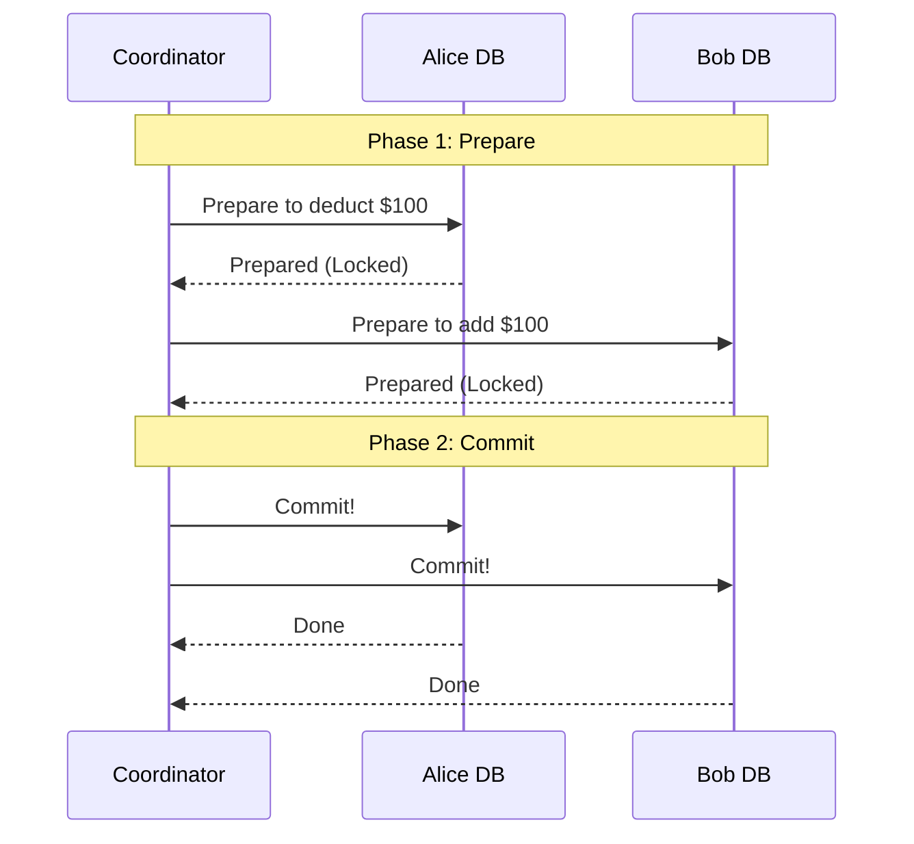

*Trade-offs:* 2PC is notoriously slow and blocking. If the coordinator crashes mid-transaction, the databases can be left with locked rows indefinitely. Modern microservices often prefer **Sagas** over strict 2PC for better performance, relying on compensatory actions (refunds) instead of locks.


*(Read full file: [Partial Failures](./Core%20Concepts/Partial%20Failures/README.md))*
</details>
<br>

<details>
<summary><b>WebSockets</b> (Click to expand)</summary>

# WebSockets Crash Course

**Source:** [WebSockets Crash Course - Handshake, Use-cases, Pros & Cons and more](https://www.youtube.com/watch?v=2Nt-ZrNP22A) by *Hussein Nasser*

**TL;DR:** WebSockets provide a persistent, bi-directional, full-duplex communication channel between a client and a server over a single TCP connection, fully compatible with HTTP ports (80/443).

---

## 1. Introduction & Motivation (Why WebSockets?)

Before WebSockets (standardized in 2011), the web operated almost exclusively on the **HTTP protocol**.
HTTP is strictly a **request-response** protocol. The client (browser) must initiate the request, and the server responds. 

### The Problem: Server Push
If a server has new data (like a new chat message or a live sports score), it cannot push it to the client because HTTP doesn't allow the server to initiate communication.

**Historical Workarounds:**
1. **Short Polling:** The client repeatedly asks the server every few seconds: *"Do you have new data?"*.
   - *Problem:* Wastes bandwidth and server CPU (empty responses).
2. **Long Polling:** The client sends a request. The server holds the connection open until it has data to send. Once data is sent, the connection closes, and the client immediately opens a new one.
   - *Problem:* High overhead of establishing new TCP connections constantly, and HTTP headers are heavy.

**The Solution:** A persistent connection where both client and server can send messages to each other at any time (Bi-directional, Full-Duplex).

---

## 2. How WebSockets Work

### The Handshake (HTTP Upgrade)
WebSockets do not re-invent the wheel for connection establishment; they piggyback on HTTP.

1. The client sends a standard HTTP `GET` request to the server.
2. It includes specific headers to request an upgrade:
   ```http
   Connection: Upgrade
   Upgrade: websocket
   Sec-WebSocket-Key: <base64_string>
   ```
3. If the server supports WebSockets, it responds with an `HTTP 101 Switching Protocols` status code.
4. **The Magic:** After the 101 response, the HTTP protocol is discarded. The underlying TCP connection is kept alive, and both parties switch to using the WebSocket binary protocol over that exact same TCP connection.

### Characteristics
* **Stateful:** The server knows exactly which clients are connected at any given time.
* **Low Overhead:** After the handshake, data frames are very lightweight (just a few bytes of overhead), unlike HTTP which sends hundreds of bytes of headers with every request.
* **Ports:** Uses standard HTTP (80) and HTTPS (443) ports, making it firewall-friendly.

---

## 3. Use Cases

You should use WebSockets when your application requires **real-time, low-latency, bi-directional communication**:
* **Chat Applications:** WhatsApp, Slack, Discord.
* **Multiplayer Gaming:** Sending player movements and game state rapidly.
* **Live Feeds / Tickers:** Stock market tickers, live sports updates.
* **Collaborative Editing:** Google Docs (multiple people typing simultaneously).
* **Live Location Tracking:** Uber, food delivery apps.

---

## 4. Pros & Cons

### Pros ✅
* **True Full-Duplex:** Client and server can talk simultaneously.
* **Low Latency & Low Bandwidth:** Eliminates the heavy HTTP headers for subsequent messages.
* **Standardized:** Supported by all modern browsers and load balancers.

### Cons ❌
* **Stateful Architecture:** Scaling WebSockets is hard. If you have 1 million concurrent users, your server must hold 1 million open TCP connections. 
* **Load Balancing is Complex:** Standard HTTP load balancing (Round Robin) doesn't work well because connections are persistent. You must ensure connections aren't dropped and that messages meant for a specific client are routed to the specific backend server holding their TCP connection (often requiring a Pub/Sub system like Redis).
* **Timeouts & Proxies:** Some corporate firewalls, proxies, or older load balancers aggressively kill idle TCP connections, forcing the client to reconnect frequently.

---

## 5. Comparison: WebSockets vs Server-Sent Events (SSE)

| Feature | WebSockets | Server-Sent Events (SSE) | Long Polling |
| :--- | :--- | :--- | :--- |
| **Direction** | Bi-directional (Client ↔ Server) | Uni-directional (Server → Client) | Uni-directional (Server → Client) |
| **Protocol** | WS / WSS (over TCP) | HTTP | HTTP |
| **Data Format** | Binary or Text | Text only (UTF-8) | Any |
| **Best For** | Chat, Gaming, Live Collab | Stock tickers, News feeds, Notifications | Legacy fallbacks |
| **Complexity** | High (Stateful scaling) | Low (Standard HTTP) | Low |

*(Note: If you only need the server to push data to the client—like live score updates—SSE is often a simpler and better choice than WebSockets because it relies on standard HTTP).*


*(Read full file: [WebSockets](./Core%20Concepts/WebSockets/README.md))*
</details>
<br>

<details>
<summary><b>gRPC</b> (Click to expand)</summary>

# gRPC (Google Remote Procedure Call)

**Source:** [gRPC Crash Course - Modes, Examples, Pros & Cons](https://www.youtube.com/watch?v=Yw4rkaTc0f8) by *Hussein Nasser*

**TL;DR:** gRPC is a modern, high-performance RPC (Remote Procedure Call) framework created by Google. It replaces standard REST/JSON HTTP APIs by using **HTTP/2** as the transport layer and **Protocol Buffers (Protobuf)** as the data format. It is heavily used for internal microservice-to-microservice communication.

---

## 1. Introduction & Motivation

### What is RPC?
In traditional programming, you execute a function locally (e.g., `calculateSum(a, b)`). A **Remote Procedure Call (RPC)** aims to make executing a function on a *different machine over the network* look exactly like calling a local function.

### The Problem with REST / JSON
While REST over HTTP/1.1 with JSON payloads is the undisputed standard for web APIs, it has limitations at massive scale:
1.  **JSON is slow and bulky:** JSON is a text-based format. Computers must spend CPU cycles parsing text into memory objects. Strings take up a lot of bandwidth.
2.  **HTTP/1.1 is inefficient:** It suffers from Head-of-Line blocking (you have to wait for one request to finish before sending the next on the same TCP connection) and sends bulky, uncompressed text headers with every request.
3.  **Weakly Typed:** In REST, there is no strict contract. A server might expect an `integer` but the client sends a `string`, causing runtime errors.

**The Solution:** gRPC solves these by using **Protocol Buffers** and **HTTP/2**.

---

## 2. Core Technologies Behind gRPC

### Protocol Buffers (Protobuf)
Protobuf is a language-neutral, binary serialization format.
*   **The Contract:** You define your API and data structures in a `.proto` file (a strict schema).
*   **Code Generation:** You compile this `.proto` file. The compiler automatically generates the client and server code in almost any language (Go, Python, Java, Node.js).
*   **Binary format:** Because both the client and server already know the exact schema, the data sent over the wire is purely binary (0s and 1s). No field names (like `"user_id":`) are sent over the network, making the payloads incredibly small and blazingly fast to parse.

### HTTP/2
gRPC forces the use of HTTP/2 under the hood, which brings massive performance wins:
*   **Multiplexing:** You can send thousands of concurrent requests over a **single TCP connection** simultaneously, eliminating the latency of opening new connections.
*   **Header Compression (HPACK):** HTTP/2 compresses headers, saving significant bandwidth.
*   **Binary Framing:** HTTP/2 inherently breaks data down into binary frames rather than plain text.

---

## 3. The 4 Modes of gRPC (Request Flows & Diagrams)

Because gRPC leverages HTTP/2, it isn't restricted to simple Request-Response patterns. It supports four distinct modes of communication. Below are the exact request flows and sequence diagrams for each.

### 1. Unary (Standard)
The traditional model, functionally identical to a standard REST API call.
*   **Request Flow:**
    1. Client initiates a single HTTP/2 request with a binary payload.
    2. Server processes the request.
    3. Server replies with a single binary response.
    4. The stream is closed.

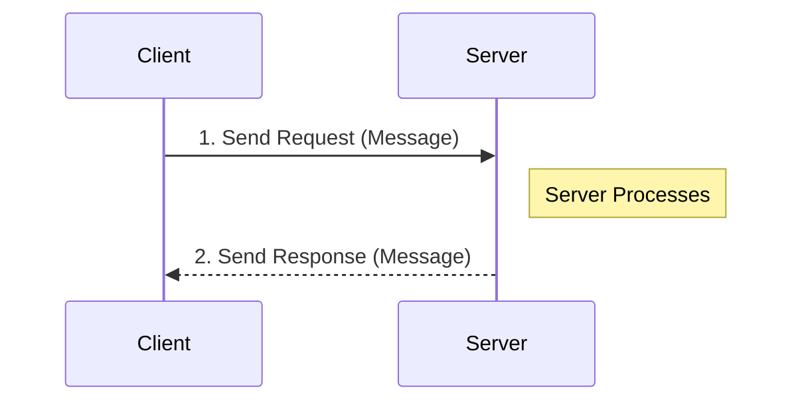

### 2. Server Streaming
The client asks for data once, and the server pushes multiple messages back over time.
*   **Request Flow:**
    1. Client initiates a single HTTP/2 request.
    2. Server processes the request and begins sending multiple binary frames (messages) back to the client over the same connection.
    3. The client reads messages as they arrive.
    4. The server sends a final trailer indicating the stream is finished.
*   **Example Use Case:** You send a request for a large video file, and the server streams the chunks back one by one, or subscribing to a live stock ticker.

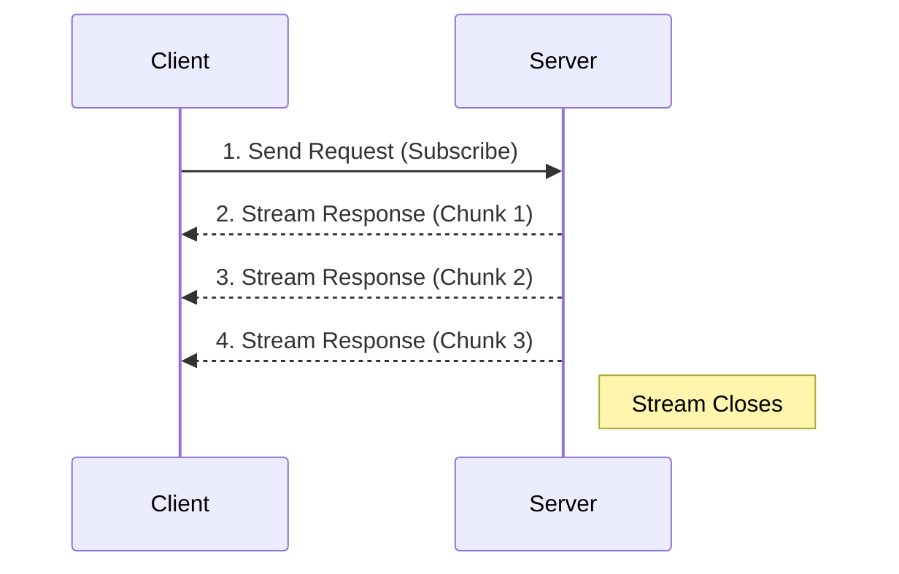

### 3. Client Streaming
The client pushes multiple messages to the server, and the server waits until the client is done before replying.
*   **Request Flow:**
    1. Client opens a stream and sends multiple binary frames to the server over time.
    2. The server receives and processes the chunks as they arrive.
    3. The client signals that it has finished sending data.
    4. The server sends a single response back acknowledging the entire batch.
*   **Example Use Case:** Uploading a large file from a mobile app. The client streams the chunks, and the server replies with `{"status": "upload_complete"}`.

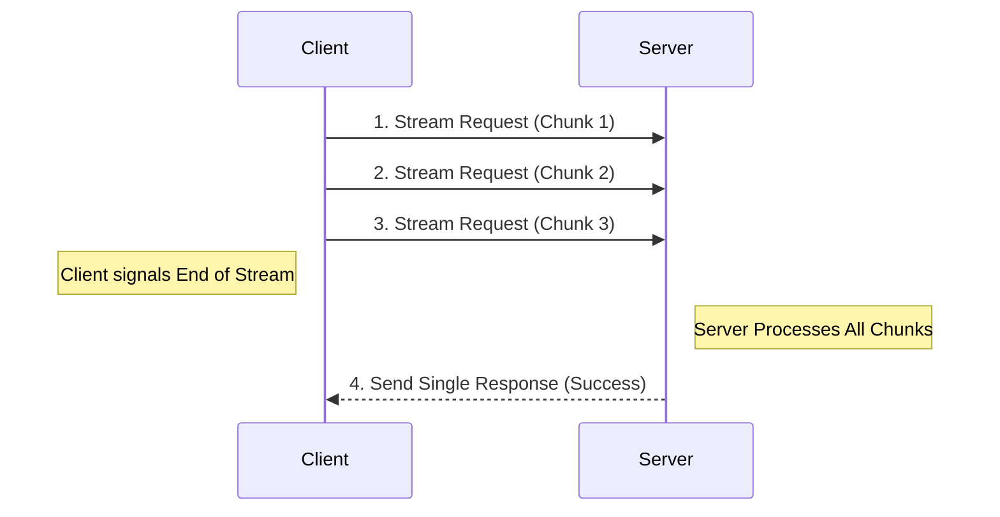

### 4. Bidirectional Streaming
Both the client and the server can send a stream of messages to each other simultaneously and independently over the same connection.
*   **Request Flow:**
    1. Client opens an HTTP/2 stream.
    2. Client and Server begin sending binary frames to each other completely asynchronously. The server does not have to wait for the client to finish, and vice-versa.
    3. The connection remains open until either party explicitly closes it.
*   **Example Use Case:** Real-time multiplayer gaming or a chat application where messages are flying in both directions instantly.

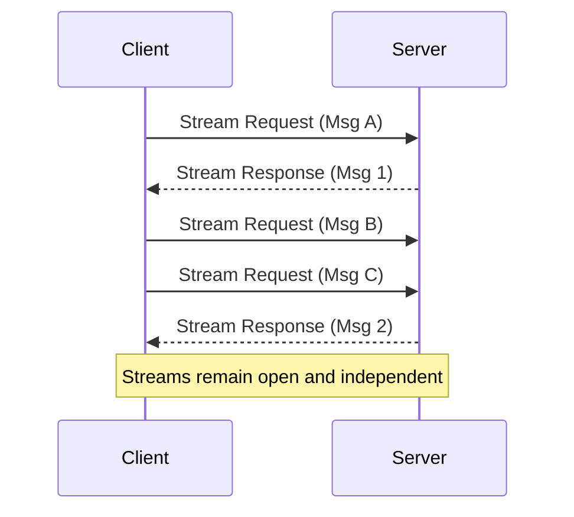

---

## 4. Pros & Cons

### Pros ✅
*   **High Performance:** Binary serialization and HTTP/2 make it vastly faster and more CPU/bandwidth efficient than REST/JSON.
*   **Strict Contracts:** The `.proto` file acts as the ultimate source of truth. If the backend changes a data type, the client code will fail to compile, preventing runtime bugs.
*   **Built-in Code Generation:** You never have to manually write HTTP `fetch` requests or parse responses again. The generated SDK handles all networking.
*   **Excellent for Microservices:** Perfect for backend-to-backend communication where speed is critical.

### Cons ❌
*   **Not Browser Friendly:** You cannot natively call a gRPC endpoint from a web browser (JavaScript) because browsers do not expose low-level control over HTTP/2 framing. You must use a translation layer like `gRPC-Web` or an API Gateway (like Envoy) to translate REST to gRPC.
*   **Hard to Debug:** Because the traffic is binary, you cannot just open the Chrome Network Tab or use `curl` to read the payload. You need specialized tools (like `grpcurl` or Postman) that have access to the `.proto` schema to decrypt the binary.
*   **Steep Learning Curve:** Requires managing `.proto` files, compiling them in CI/CD pipelines, and distributing the generated code to different teams.

---

## Summary: When to use it?
*   **Use gRPC:** For backend microservice-to-microservice communication where you control both ends, and latency/bandwidth are top priorities.
*   **Use REST:** For public-facing APIs or communication with web browsers/mobile apps where simplicity and human readability are more important.


*(Read full file: [gRPC](./Core%20Concepts/gRPC/README.md))*
</details>
<br>

## 1. Core Data Structures & Algorithms
Before jumping into infrastructure, many system design problems rely heavily on specific data structures:
- [ ] **Trie (Prefix Tree):** Used for Search Autocomplete (Ch 13).
- [x] **Quadtrees & Geohashes:** Essential for spatial indexing in Proximity Services, Nearby Friends, and Google Maps (Ch 16, 17, 18).
- [x] **Consistent Hashing (Hash Rings):** Distributes data evenly across a cluster, minimizing reorganization when nodes are added/removed (Ch 5).
- [ ] **Bloom Filters:** Probabilistic data structure to quickly test if an element is present. Used in Web Crawlers (Ch 9) and Databases (Ch 6) to avoid disk reads.
- [x] **Merkle Trees:** Tree of hashes used to detect inconsistencies in distributed data quickly, heavily used in Object Storage, Google Drive, and Dynamo (Ch 6, 15, 24).
- [x] **LSM-Trees (Log-Structured Merge-Tree) & SSTables:** The core storage engine behind high-write databases like Cassandra, RocksDB, and LevelDB (Ch 6).
- [ ] **Token Bucket / Leaky Bucket / Sliding Window:** Algorithms used for Rate Limiting (Ch 4, 30).
- [ ] **Base62 Encoding:** URL shortening and Unique ID generation (Ch 8, 7).
- [ ] **Skip Lists:** The underlying data structure for Redis Sorted Sets, used in Leaderboards (Ch 25).
- [x] **Interval Trees & Segment Trees:** Used for managing overlapping time windows (e.g., booking systems) and efficiently querying aggregate data over a specific range in `O(log N)` time.
- [ ] **DAGs (Directed Acyclic Graphs):** Used for modelling dependencies in Distributed Job Schedulers and Video Transcoding pipelines (Ch 14, 31).

### 📚 Learning Resources:
- [x] **Consistent Hashing:** [ByteByteGo - Consistent Hashing | Algorithms You Should Know](https://www.youtube.com/watch?v=UF9Iqmg94tk)
- [ ] **Bloom Filters:** [Gaurav Sen - What are Bloom Filters?](https://www.youtube.com/watch?v=bgzUdBVr5tE)
- [ ] **LSM-Trees:** [Hussein Nasser - LSM Trees Explained: Powering Cassandra, RocksDB](https://www.youtube.com/watch?v=ciGAVER_erw)
- [x] **Spatial/Geohashes:** [Hussein Nasser - Spatial Queries in PostgreSQL/PostGIS](https://www.youtube.com/watch?v=-qNSXK7s7_w)
- [ ] **Rate Limiting:** [ByteByteGo - 4 Rate Limit Algorithms](https://www.youtube.com/watch?v=YXkOdWBwqaA)

## 2. Databases & Storage Engines
Understanding *which* database to pick is a crucial skill. You need to know their capacity limits, internal workings, and trade-offs (SQL vs. NoSQL, CAP theorem).
- [x] **Relational Databases (RDBMS):** PostgreSQL, MySQL. Understand ACID properties, B-Tree indexes, sharding, and master-slave replication. Used in almost every system for structured, highly consistent data.
- [ ] **Wide-Column Stores:** Cassandra, DynamoDB. Highly available, massive write throughput, eventual consistency.
- [x] **Key-Value Caches & Stores:** Redis, Memcached. In-memory, ultra-fast. Learn about cache invalidation strategies, Redis Pub/Sub, and Redis Sorted Sets.
- [ ] **Time-Series Databases (TSDB):** InfluxDB, Prometheus. Optimized for appending and querying time-stamped data (Ch 20).
- [ ] **Graph Databases:** Neo4j, Amazon Neptune. Used for recommendations and News Feeds (Ch 11).
- [ ] **Blob / Object Storage:** Amazon S3. For unstructured data like images and videos.

### 📚 Learning Resources:
- [ ] **General DB Internals:** The book *Designing Data-Intensive Applications (DDIA)* by Martin Kleppmann (The absolute gold standard).
- [ ] **Database Architecture:** [Hussein Nasser's Database Engineering Course/Playlist](https://www.youtube.com/playlist?list=PLQnljOFTspQXjD0HOzN7P2tgzu7scWpl2)
- [ ] **Caching:** [ByteByteGo - Top 5 Redis Use Cases](https://www.youtube.com/watch?v=a4yX7RUgTxI)
- [ ] **Dynamo (Wide Column):** [Amazon Dynamo Paper summary by System Design Interview](https://www.youtube.com/watch?v=gV-1E-7nhR8)

## 3. Distributed System Concepts
How do multiple machines coordinate and agree on the state of the system?
- [ ] **Replication & Consistency:** Quorum consensus (W + R > N), Leader/Follower vs. Leaderless replication, Eventual vs. Strong consistency.
- [ ] **CAP Theorem & PACELC:** Trade-offs between Consistency, Availability, Partition tolerance, and Latency.
- [ ] **Vector Clocks:** Resolving conflicts in masterless databases (Ch 6).
- [ ] **Gossip Protocol:** How decentralized nodes discover each other and share cluster state (Ch 6).
- [ ] **CRDTs (Conflict-Free Replicated Data Types):** Data structures that can be replicated across nodes and merged without conflicts (Rate Limiter - Ch 30).
- [ ] **Distributed Locks & Coordination:** ZooKeeper, etcd. Used for electing leaders, managing configuration, and ensuring mutually exclusive access to resources (Ch 7, 31).

### 📚 Learning Resources:
- [ ] **CRDTs:** [Martin Kleppmann - CRDTs: The Hard Parts](https://www.youtube.com/watch?v=x7drE24geUw)
- [ ] **Distributed Locks & Zookeeper:** [Hussein Nasser - What is Apache Zookeeper?](https://www.youtube.com/watch?v=R873BlNVUB4)
- [ ] **CAP Theorem:** [IBM Technology - CAP Theorem Explained](https://www.youtube.com/watch?v=HTaKhMv_ZYU)
- [ ] **MIT Distributed Systems:** [MIT 6.824 Distributed Systems Class (Full Playlist)](https://www.youtube.com/playlist?list=PLrw6a1wE39_tb2fErI4-WkMbsvGQk9_UB) (For a deep academic understanding)

## 4. Communication Protocols & Web Technologies
How do clients and servers, or internal microservices, talk to each other?
- [ ] **HTTP/REST & GraphQL:** Standard stateless communication.
- [x] **WebSockets & Server-Sent Events (SSE):** Persistent, bi-directional connections for Real-time Chat and News Feeds (Ch 12, 11).
- [ ] **Long Polling:** The fallback for older clients that don't support WebSockets.
- [x] **gRPC / Protocol Buffers (Protobuf):** Highly efficient, binary RPC frameworks used for internal microservice-to-microservice communication.
- [ ] **UDP vs. TCP:** UDP for low-latency where packet loss is acceptable (Video Streaming, early layers of Stock Exchanges - Ch 28).
- [x] **Load Balancing & TLS:** Understanding L4 vs L7 routing, proxying, and secure transport (TLS/SSL).
- [x] **DNS & CDNs:** Resolving domains to IPs and globally caching static content.
- [x] **Authentication & Authorization:** Securely verifying user identity (Session, JWT, OAuth) and verifying access control (RBAC, ABAC).

### 📚 Learning Resources:
- [ ] **HTTP Crash Course:** [Hussein Nasser - HTTP 1.0, 1.1, HTTP/2, HTTP/3](https://www.youtube.com/watch?v=0OrmKCB0UrQ)
- [x] **TLS 1.2 & 1.3:** [Hussein Nasser - Transport Layer Security](https://www.youtube.com/watch?v=AlE5X1NlHgg)
- [x] **Load Balancing:** [Hussein Nasser - Load balancing in Layer 4 vs Layer 7](https://www.youtube.com/watch?v=aKMLgFVxZYk)
- [x] **WebSockets/SSE/Polling:** [Hussein Nasser - Push Technology Crash Course (WebSockets, SSE, Polling)](https://www.youtube.com/watch?v=2Nt-ZrNP22A)
- [x] **gRPC vs REST:** [Hussein Nasser - gRPC Crash Course](https://www.youtube.com/watch?v=Yw4rkaTc0f8)

## 5. Messaging & Streaming (Decoupling)
Asynchronous communication is vital for scaling and fault tolerance.
- [x] **Message Queues:** RabbitMQ, Amazon SQS. Used for task decoupling (Email Service, Transcoding).
- [ ] **Event Streaming:** Apache Kafka, Amazon Kinesis. Immutable, append-only logs for high-throughput, ordered event processing (Ad Click Aggregation, Payment Systems).
- [ ] **Stream Processing Frameworks:** Apache Flink, Spark Streaming. For aggregating real-time data over windows (Ch 21).

### 📚 Learning Resources:
- [ ] **Kafka vs RabbitMQ:** [ByteByteGo - Kafka vs RabbitMQ](https://www.youtube.com/watch?v=x4k1XEjNzYQ)
- [ ] **Kafka Internals:** [Confluent - Apache Kafka in 100 Seconds](https://www.youtube.com/watch?v=uvb00oaa3k8) (and the rest of the Confluent channel)
- [ ] **Stream Processing:** [Gaurav Sen - Event Driven Architecture / Stream Processing](https://www.youtube.com/watch?v=rJHTK2TfZ1I)

## 6. Architecture Patterns
- [ ] **Event Sourcing & CQRS:** Storing state as a sequence of immutable events rather than overwriting data. Critical for Payment Systems, Wallets, and Stock Exchanges (Ch 26, 27, 28) for auditing and reproducibility.
- [x] **Distributed Transactions & Sagas:** How to maintain consistency across multiple microservices without locking up the system (Hotel Reservations, Payments - Ch 22, 26).
- [x] **Idempotency:** Ensuring that retrying an operation (like a payment) doesn't result in duplicate side effects (Payment & Wallet - Ch 26, 27).
- [ ] **Fan-out:** Pushing data to many followers. News Feed uses "Fan-out on write" vs "Fan-out on read" (Ch 11).
- [ ] **Lambda vs. Kappa Architecture:** Big data processing paradigms (Ad Click Aggregation - Ch 21).

### 📚 Learning Resources:
- [ ] **CQRS and Event Sourcing:** [Greg Young - CQRS and Event Sourcing](https://www.youtube.com/watch?v=JHGkaShoyNs)
- [ ] **Sagas & Distributed Transactions:** [Couchbase - Distributed Transactions & Saga Pattern](https://www.youtube.com/watch?v=D2R_NBu8Arw) (Also check out Chris Richardson's Microservices.io resources)
- [x] **Idempotency:** [ByteByteGo - What is Idempotency?](https://www.youtube.com/watch?v=XAccGbtl3Z8)

## Recommended Learning Path (Where to start?)
If you are feeling overwhelmed, here is the order you should learn these concepts:
- [x] **Network & Proxies:** HTTP, Load Balancers, DNS, CDNs.
- [ ] **Databases:** Relational vs NoSQL trade-offs, Sharding, Replication, Indexing. *(Read DDIA by Martin Kleppmann)*
- [x] **Caching:** Memcached/Redis, Cache eviction policies.
- [ ] **Asynchronous Processing:** Message Queues (RabbitMQ) vs. Event Streams (Kafka).
- [x] **Specialized Data Structures:** Consistent Hashing, Bloom Filters, Quadtrees.
- [ ] **Advanced Distributed Concepts:** Distributed locks (ZooKeeper), Consensus, CRDTs, Event Sourcing.
