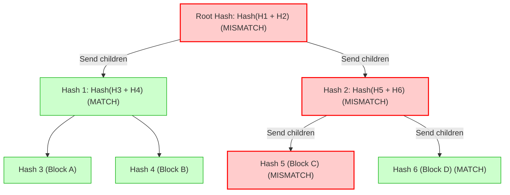
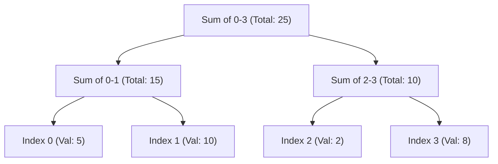

# Advanced Data Structures: Aggregation & Verification

**Sources:**
*   [Merkle Tree with real world examples (Gaurav Sen)](https://www.youtube.com/watch?v=qHMLy5JjbjQ)
*   [Segment Tree (GeeksforGeeks)](https://www.geeksforgeeks.org/dsa/segment-tree-data-structure/)
*   [Fenwick Tree / Binary Indexed Tree (GeeksforGeeks)](https://www.geeksforgeeks.org/dsa/binary-indexed-tree-or-fenwick-tree-2/)
*   [Square Root (Sqrt) Decomposition (GeeksforGeeks)](https://www.geeksforgeeks.org/dsa/square-root-sqrt-decomposition-algorithm/)

**TL;DR:** When dealing with massive datasets, doing a linear $O(N)$ scan for every query or update is too slow, and transferring entire datasets across a network just to check for changes is too expensive. The industry relies on specialized data structures to chunk, aggregate, and hash data to achieve $O(\log N)$ or $O(\sqrt{N})$ performance. 

---

## 1. Merkle Trees (Distributed Data Verification)

*   **The Problem (Data Verification across Networks):** Imagine two distributed database nodes (e.g., in Cassandra or DynamoDB) need to check if their 100GB replica files are perfectly in sync. 
    *   *Naive Approach 1 (Send everything):* Sending the entire 100GB over the network just to check for a 1-byte difference is absurdly expensive in terms of bandwidth.
    *   *Naive Approach 2 (Hash the whole file):* If we hash the entire 100GB file into a single 32-byte SHA-256 hash and exchange it, we know *if* a change occurred, but we don't know *where*. We'd still have to send the whole 100GB to fix it.
    *   *Naive Approach 3 (Linear Chunk Hashing):* Divide the 100GB file into 1MB chunks (100,000 chunks). Hash each chunk and send all 100,000 hashes. We can identify the exact 1MB chunk that differs, but sending 100,000 hashes over the network every time we run a check is still too expensive ($O(N)$ bandwidth).

*   **The Solution: Merkle Tree (Hash Tree):**
    A Merkle tree dramatically optimizes Naive Approach 3 by structuring the hashes into a binary tree, reducing the bandwidth required to find a mismatch from $O(N)$ to $O(\log N)$.

### Mechanical Details: Under the Hood

**1. Building the Tree:**
*   The raw data (e.g., the 100GB file) is deterministically chopped into fixed-size blocks (e.g., 1MB chunks).
*   Each block is independently hashed (using a cryptographic hash function like SHA-256, MD5, or MurmurHash depending on security needs). These form the **leaf nodes** of the tree.
*   Pairs of leaf hashes are concatenated together (`Hash_A + Hash_B`) and hashed again to form a **parent node**. 
*   This pairwise concatenation and hashing process repeats recursively upwards until only a single hash remains: the **Root Hash** (or Merkle Root).

**2. The Comparison Protocol (Finding the Difference):**
When Node A and Node B want to sync, they execute a precise recursive network protocol:
1.  **Root Exchange:** Node A sends its 32-byte Root Hash to Node B. If it matches Node B's Root Hash, the files are 100% identical. The check finishes in $O(1)$ time and $O(1)$ bandwidth.
2.  **Traversing the Mismatch:** If the Root Hashes differ, Node A sends the hashes of the root's two children (`Hash L` and `Hash R`).
3.  Node B compares `Hash L` and `Hash R` against its own children. It discovers that `Hash L` matches, but `Hash R` differs.
4.  They now *ignore the entire left half of the file*. Node A sends the children of `Hash R`. 
5.  This ping-pong process continues recursively down the tree, following only the mismatched branches, until they reach the specific leaf node (the 1MB chunk) that differs.
6.  Finally, only the differing 1MB chunk is transferred over the network.

**Result:** Instead of transferring $N$ hashes, they only transfer $2 \times \log_2(N)$ hashes.

### Real-World Applications
*   **Anti-Entropy in Distributed Databases (Cassandra, DynamoDB, Riak):** When a replica node comes back online after a network partition, it builds a Merkle Tree of its token ranges and compares it with a healthy replica. This instantly isolates the missing/updated rows, syncing them without thrashing the network.
*   **BitTorrent (Peer-to-Peer Downloading):** When you download a 10GB movie from untrusted peers, you receive the verified Merkle Root from a trusted tracker. As you download individual chunks from random peers, you request their "Merkle Path" (the sibling hashes all the way to the root). You re-hash them locally; if the final result matches your trusted Root Hash, you know the peer didn't send you malware.
*   **Git & Blockchains (Bitcoin/Ethereum):** In Bitcoin, a block header contains the Merkle Root of all transactions in that block. "Light clients" (SPV nodes) can verify a specific transaction is in a block just by downloading the $\log N$ Merkle path, without downloading the entire blockchain.

### 💡 Interview Tips, Trade-offs & Preferences
*   **The Chunk Size Trade-off (Crucial for Interviews):** 
    *   *If chunks are too large (e.g., 1GB):* The tree is shallow (saving memory), but when a mismatch is found, you have to re-transmit a massive 1GB chunk over the network.
    *   *If chunks are too small (e.g., 1KB):* Re-transmitting the mismatch is cheap, but a 100GB file will generate $100,000,000$ leaves. Storing all these hashes in memory becomes a massive overhead, and building the tree takes significant CPU time. Finding the optimal chunk size is a classic system design balancing act between memory/CPU constraints and network bandwidth.
*   **Cryptographic vs Non-Cryptographic Hashes:** In systems guarding against malicious actors (Bitcoin, BitTorrent), you *must* use cryptographic hashes (SHA-256) to prevent preimage attacks. In internal trusted systems (Cassandra anti-entropy), you can often use faster, non-cryptographic hashes to save CPU cycles, as long as collision resistance is adequate.
*   **Tree Arity:** While usually a binary tree, Merkle trees can technically be $K$-ary (combining $K$ children per parent). However, binary is overwhelmingly the standard due to simplicity in path verification.

*(Diagram: Node B discovers the root differs. It compares H1 and H2. H1 matches perfectly, so Block A and B are ignored. H2 differs, so it descends to H5 and H6. H6 matches, H5 differs. Only Block C needs to be re-transmitted.)*

---

## 2. Segment Trees (Range Aggregation)

*   **What it does:** Answers math questions over a specific range of an array (e.g., "What is the sum/min/max of elements from index 2 to 8?") in $O(\log N)$ time, while also allowing elements to be updated in $O(\log N)$ time.
*   **How it works:** It is a perfectly balanced binary tree. The leaf nodes contain the raw array values. Every parent node contains the merged aggregate (sum, min, or max) of its children. 
*   **The Query:** When you query a range, the tree doesn't iterate through the raw leaves. Instead, it combines a few pre-calculated internal parent nodes, instantly skipping massive chunks of the array.
*   **Trade-offs:** Requires $O(N)$ build time and takes up exactly `4 * N` space in memory (usually implemented as a flat array where a node at index `i` has children at `2i` and `2i+1`).

---

## 3. Fenwick Trees / Binary Indexed Trees (BIT)

*   **What it does:** A highly memory-efficient alternative to Segment Trees for calculating prefix sums and updating elements. It achieves the exact same $O(\log N)$ time complexity but is vastly lighter on memory and faster in practice.
*   **How it works:** It is brilliant bitwise wizardry. Instead of a bulky binary tree, a Fenwick Tree uses a single array of the exact same size as the data (`size N`). Each index stores the sum of a specific range of elements, dictated by the lowest set bit of the index's binary representation (extracted using `index & -index`).
*   **The Magic:** To find the sum of the first 13 elements (binary `1101`), the tree instantly breaks the query into:
    *   Sum of the first 8 elements (binary `1000`)
    *   Sum of the next 4 elements (binary `0100`)
    *   Sum of the last 1 element (binary `0001`)
*   **Trade-offs vs Segment Tree:** 
    *   **Pros:** Requires exactly $N$ memory (Segment Trees require $4N$). Incredibly short to code (about 3 lines for an update function). Much smaller constant-time factors (faster in CPU caching).
    *   **Cons:** Extremely difficult to use for non-invertible queries like Range Minimum/Maximum (Segment trees easily handle these).

---

## 4. Square Root (Sqrt) Decomposition

*   **What it does:** An algorithmic technique to break an array of $N$ elements into $\sqrt{N}$ chunks (blocks). It reduces range query time from $O(N)$ down to $O(\sqrt{N})$.
*   **How it works:** 
    1. Divide an array of 10,000 elements into 100 blocks, each containing 100 elements.
    2. Precompute the answer (sum, min, max) for each block.
    3. When querying a range (e.g., from index 150 to 825), you don't iterate through everything.
    4. You iterate through the middle fully-overlapped blocks in $O(1)$ time each. You only do a manual linear scan for the "partial blocks" on the extreme left and right edges.
*   **Trade-offs vs Trees:** 
    *   **Pros:** Incredible flexibility. Trees require the aggregate operation to be strictly associative. Sqrt Decomposition allows you to answer bizarre, complex queries (like finding the most frequent element in a range, commonly paired with **Mo's Algorithm**) because you can manually iterate the partial blocks.
    *   **Cons:** Asymptotically slower than trees ($O(\sqrt{N})$ is much worse than $O(\log N)$ for very large datasets).
