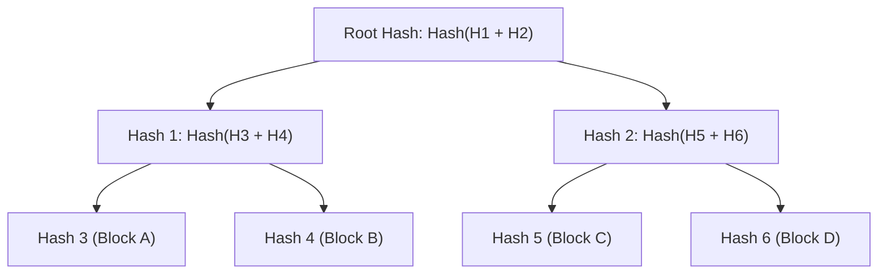
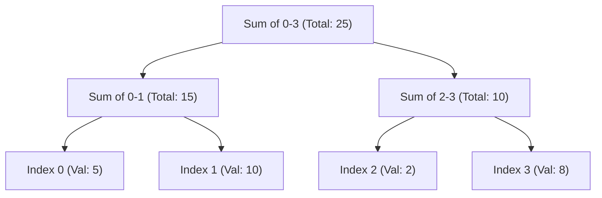

# Advanced Data Structures: Aggregation & Verification

**Sources:**
*   [Merkle Tree with real world examples (Gaurav Sen)](https://www.youtube.com/watch?v=qHMLy5JjbjQ)
*   [Segment Tree (GeeksforGeeks)](https://www.geeksforgeeks.org/dsa/segment-tree-data-structure/)
*   [Fenwick Tree / Binary Indexed Tree (GeeksforGeeks)](https://www.geeksforgeeks.org/dsa/binary-indexed-tree-or-fenwick-tree-2/)
*   [Square Root (Sqrt) Decomposition (GeeksforGeeks)](https://www.geeksforgeeks.org/dsa/square-root-sqrt-decomposition-algorithm/)

**TL;DR:** When dealing with massive datasets, doing a linear $O(N)$ scan for every query or update is too slow, and transferring entire datasets across a network just to check for changes is too expensive. The industry relies on specialized data structures to chunk, aggregate, and hash data to achieve $O(\log N)$ or $O(\sqrt{N})$ performance. 

---

## 1. Merkle Trees (Distributed Data Verification)

*   **What it does:** Allows a system to quickly and securely verify if two large datasets are identical, and if not, pinpoint *exactly* which parts differ without transferring the actual data.
*   **How it works:** A Merkle tree is a "Hash Tree". 
    1. The raw data is chopped into blocks, which form the leaves.
    2. Each leaf is cryptographically hashed (e.g., using SHA-256).
    3. Every parent node is created by concatenating the hashes of its two children and hashing that result: `Parent = Hash(Child_A + Child_B)`.
    4. This bubbles up to a single **Root Hash**.
*   **The Magic:** If a single byte changes anywhere in a 100GB file, the leaf hash changes, causing a domino effect that changes the Root Hash. Two servers can compare their 100GB files just by exchanging the 32-byte Root Hash. If they differ, they exchange the children's hashes to walk down the tree and find the mismatched block in $O(\log N)$ time.
*   **Real-World Examples:**
    *   **DynamoDB & Cassandra (Anti-Entropy):** When replica nodes fall out of sync, they compare Merkle Trees to find missing rows without sending the entire database over the network.
    *   **BitTorrent:** When downloading a movie from untrusted peers, your client uses a Merkle Tree to verify that a downloaded chunk hasn't been tampered with.
    *   **Git & Blockchains:** Used to verify the integrity of commits and transaction blocks.

---

## 2. Segment Trees (Range Aggregation)

*   **What it does:** Answers math questions over a specific range of an array (e.g., "What is the sum/min/max of elements from index 2 to 8?") in $O(\log N)$ time, while also allowing elements to be updated in $O(\log N)$ time.
*   **How it works:** It is a perfectly balanced binary tree. The leaf nodes contain the raw array values. Every parent node contains the merged aggregate (sum, min, or max) of its children. 
*   **The Query:** When you query a range, the tree doesn't iterate through the raw leaves. Instead, it combines a few pre-calculated internal parent nodes, instantly skipping massive chunks of the array.
*   **Trade-offs:** Requires $O(N)$ build time and takes up exactly `4 * N` space in memory (usually implemented as a flat array where a node at index `i` has children at `2i` and `2i+1`).

---

## 3. Fenwick Trees / Binary Indexed Trees (BIT)

*   **What it does:** A highly memory-efficient alternative to Segment Trees for calculating prefix sums and updating elements. It achieves the exact same $O(\log N)$ time complexity but is vastly lighter on memory and faster in practice.
*   **How it works:** It is brilliant bitwise wizardry. Instead of a bulky binary tree, a Fenwick Tree uses a single array of the exact same size as the data (`size N`). Each index stores the sum of a specific range of elements, dictated by the lowest set bit of the index's binary representation (extracted using `index & -index`).
*   **The Magic:** To find the sum of the first 13 elements (binary `1101`), the tree instantly breaks the query into:
    *   Sum of the first 8 elements (binary `1000`)
    *   Sum of the next 4 elements (binary `0100`)
    *   Sum of the last 1 element (binary `0001`)
*   **Trade-offs vs Segment Tree:** 
    *   **Pros:** Requires exactly $N$ memory (Segment Trees require $4N$). Incredibly short to code (about 3 lines for an update function). Much smaller constant-time factors (faster in CPU caching).
    *   **Cons:** Extremely difficult to use for non-invertible queries like Range Minimum/Maximum (Segment trees easily handle these).

---

## 4. Square Root (Sqrt) Decomposition

*   **What it does:** An algorithmic technique to break an array of $N$ elements into $\sqrt{N}$ chunks (blocks). It reduces range query time from $O(N)$ down to $O(\sqrt{N})$.
*   **How it works:** 
    1. Divide an array of 10,000 elements into 100 blocks, each containing 100 elements.
    2. Precompute the answer (sum, min, max) for each block.
    3. When querying a range (e.g., from index 150 to 825), you don't iterate through everything.
    4. You iterate through the middle fully-overlapped blocks in $O(1)$ time each. You only do a manual linear scan for the "partial blocks" on the extreme left and right edges.
*   **Trade-offs vs Trees:** 
    *   **Pros:** Incredible flexibility. Trees require the aggregate operation to be strictly associative. Sqrt Decomposition allows you to answer bizarre, complex queries (like finding the most frequent element in a range, commonly paired with **Mo's Algorithm**) because you can manually iterate the partial blocks.
    *   **Cons:** Asymptotically slower than trees ($O(\sqrt{N})$ is much worse than $O(\log N)$ for very large datasets).
