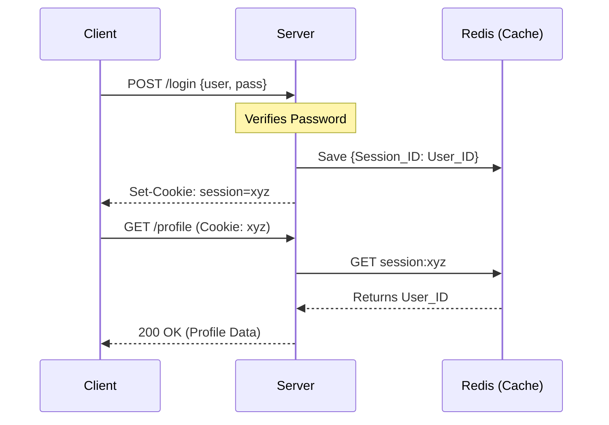
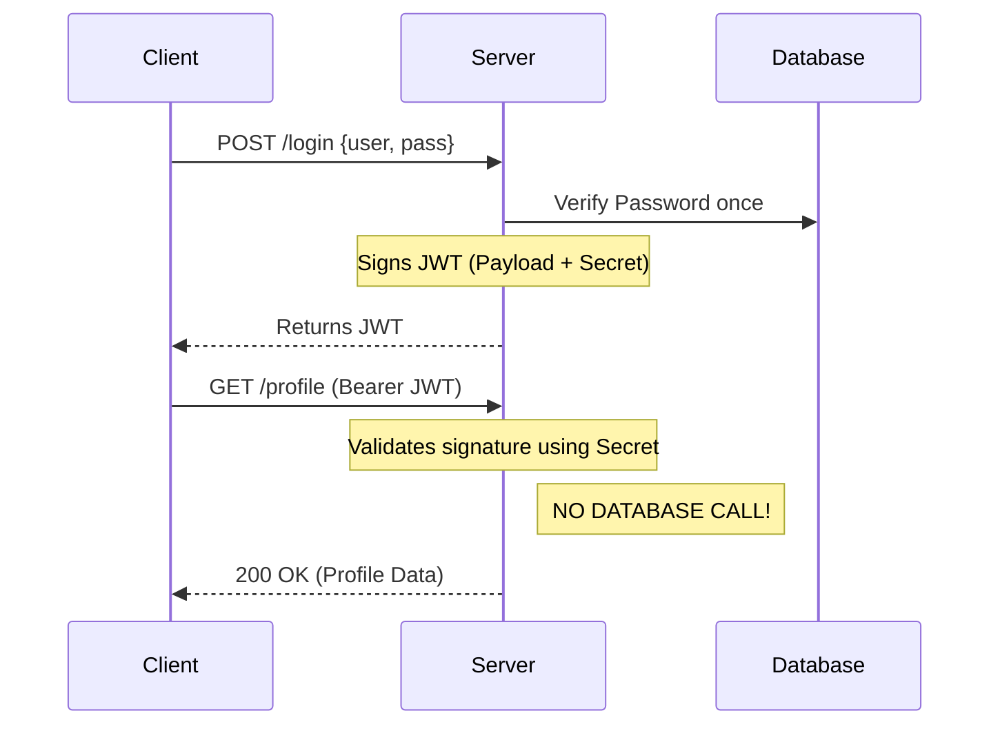
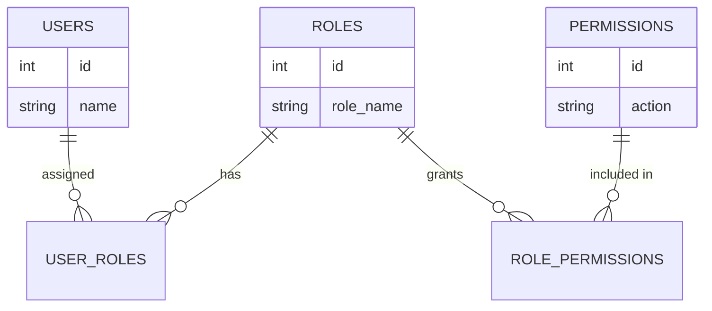

# Authentication (AuthN) & Authorization (AuthZ)

**Sources:** 
- [7 Authentication Concepts Every Developer Should Know (Hayk Simonyan)](https://www.youtube.com/watch?v=iX8g4LqF8p8)
- [Authorization Explained: When to Use RBAC, ABAC, ACL & More (Hayk Simonyan)](https://www.youtube.com/watch?v=DT6Zy1X3ytM)

**TL;DR:** 
- **Authentication (AuthN)** proves *who you are* (Identity). 
- **Authorization (AuthZ)** determines *what you are allowed to do* (Permissions). 
You must always authenticate a user before you can authorize them.

---

## 1. Authentication (AuthN) Concepts

How do we securely prove the identity of a client, where is the state stored, and what does the network flow look like?

### 1. Session-Based Authentication (Stateful)
The traditional way of handling web application logins. The server maintains active state for every logged-in user.

* **Request Flow:**
  1. Client sends `POST /login` with `{username, password}`.
  2. Server hashes the password and compares it against the Users database table.
  3. If valid, the server generates a cryptographically random, opaque string called a `Session ID`.
  4. The server stores this mapping (`Session ID -> User ID`) in a centralized cache (like Redis) or a database.
  5. The server responds with a `Set-Cookie: session_id=xyz; HttpOnly; Secure` HTTP header.
  6. On subsequent API calls, the browser automatically attaches the `Cookie`.
  7. The server reads the cookie, queries Redis (`GET session:xyz`), retrieves the User ID, and processes the request.
* **Where it is stored:**
  * **Client-side:** In an `HttpOnly` cookie (immune to XSS attacks via JavaScript).
  * **Server-side:** In memory, a database, or a distributed cache (Redis/Memcached).

* **Trade-offs:** Secure and allows instant revocation (the server just deletes the key from Redis). However, it requires a database/cache lookup on *every single API request*, which can become a bottleneck at massive scale.

### 2. Token-Based Authentication (Stateless / JWT)
The modern standard for high-scale APIs and microservices, designed to eliminate the database lookup bottleneck.

* **Request Flow:**
  1. Client sends `POST /login` with `{username, password}`.
  2. Server verifies the credentials against the database.
  3. Server generates a JSON Web Token (JWT). It takes a Payload (e.g., `{"user_id": 123}`), and signs it using a cryptographic hashing algorithm (like HMAC SHA-256) and a `SECRET_KEY` that only the server knows.
  4. Server sends the JWT string back to the client. *The server does not save this token anywhere.*
  5. Client stores the token and attaches it to subsequent requests via the `Authorization: Bearer <token>` HTTP header.
  6. Server receives the token, strips the signature, and re-calculates the hash using its own `SECRET_KEY` and the provided Payload. 
  7. If the computed hash matches the token's signature, the server has mathematical proof the token is authentic and hasn't been tampered with. It immediately trusts the `user_id` inside.
* **Where it is stored:**
  * **Client-side:** Either in JavaScript memory (React/Vue state), LocalStorage (vulnerable to XSS), or preferably an `HttpOnly` cookie.
  * **Server-side:** **Nowhere.** It is entirely stateless.

* **Trade-offs:** Immensely scalable and fast, with zero network latency required to verify the user. However, because the server doesn't store the token, it cannot easily revoke it. Once a JWT is issued, it is valid until its expiration time.

### 3. Access Tokens vs Refresh Tokens
To mitigate the inability to revoke stateless JWTs, modern systems use a dual-token architecture.

* **Access Token:** A short-lived JWT (e.g., 15 minutes). Used for all standard API calls.
* **Refresh Token:** A long-lived, opaque string (e.g., valid for 30 days). 
* **Request Flow:**
  1. Upon login, the client receives *both* tokens. 
  2. When the short-lived Access Token expires, API calls return `401 Unauthorized`.
  3. The client hits a specific `/refresh` endpoint, providing the Refresh Token.
  4. The server performs a **stateful database lookup** to verify the Refresh Token hasn't been revoked.
  5. If valid, the server issues a brand new 15-minute Access Token.
* **Where it is stored:**
  * **Client-side:** Refresh tokens *must* be stored securely (e.g., `HttpOnly` cookies or secure mobile enclaves).
  * **Server-side:** Refresh tokens *must* be stored in the database so they can be revoked (e.g., if a user clicks "Log out of all devices", or is banned).

### 4. API Keys (Machine-to-Machine)
If JWTs are so scalable, why do services like AWS or Stripe issue opaque "API Keys"?
* **Use Case:** JWTs are for humans (web/mobile apps). API Keys are for scripts, backend services, or developers.
* **Request Flow:** Client sends the API Key in an `x-api-key` header. The server performs a database or Redis lookup to verify who the key belongs to.
* **Where it is stored:** 
  * **Client-side:** Environment variables (`.env`) or secret managers (AWS Secrets Manager).
  * **Server-side:** Database (often hashed for security) and heavily cached in Redis for speed.
* **Trade-offs:** Machines require strict, instant revocation controls (in case a key is accidentally committed to GitHub). Because machine traffic is generally lower volume and more predictable than millions of human users, the database lookup overhead is an acceptable trade-off for instant revocation.

### 5. OAuth 2.0 vs OpenID Connect (OIDC)
* **OAuth 2.0 (Authorization):** A framework that allows an application to access resources on your behalf (e.g., granting a website access to read your Google Drive files) without giving them your password. It delegates access by issuing an **Access Token**. It does *not* prove your identity.
* **OpenID Connect (Authentication):** An identity layer built on top of OAuth 2.0 (e.g., "Sign in with Google"). During the OAuth flow, OIDC additionally issues an **ID Token** (a JWT containing your user profile, email, etc.), allowing the application to authenticate exactly who you are.

---

## 2. Authorization (AuthZ) Frameworks

Once the server mathematically verifies the JWT (or looks up the Session) and knows *who* you are, how does the codebase and database enforce what you are allowed to access?

### 1. Access Control Lists (ACL)
The most granular approach. A literal database table mapping `User -> Resource -> Permission`.
* **Example:** `User: Alice` has `READ` access to `File: budget.pdf`.
* **Where it is stored:** A many-to-many junction table in an RDBMS (e.g., `user_id`, `file_id`, `permission_type`).
* **Pros:** Extremely precise (file-level or row-level permissions).
* **Cons:** Unmanageable at scale. If you hire 100 new employees, you must insert thousands of rows into the ACL table granting them access to specific files.

### 2. Role-Based Access Control (RBAC)
The industry standard for B2B and SaaS applications. Users are assigned **Roles**, and Roles are assigned **Permissions**.
* **Request Flow:** 
  1. The server extracts the `user_id` from the JWT.
  2. The server queries the DB: `SELECT role FROM users WHERE id = 123` (or the role is simply embedded inside the JWT payload to save a DB call!).
  3. The server checks if the `Manager` role has the `write:financials` permission.
* **Where it is stored:** Usually 3 tables: `Users`, `Roles`, and `Role_Permissions`.

* **Pros:** Highly scalable. When a new employee joins, you just assign them the `Manager` role.
* **Cons:** "Role Explosion." If you need a Manager who can only read financials but not write them, you have to create a new role (`Manager-ReadOnly`). Complex organizations quickly end up with hundreds of hyper-specific roles.

### 3. Attribute-Based Access Control (ABAC)
The most dynamic and complex model. Access is determined by evaluating boolean rules in real-time against the attributes of the User, the Resource, and the Environment.
* **Request Flow:**
  1. User requests access to a file.
  2. A Policy Engine evaluates a rule: `Allow Access IF User.Department == "Finance" AND Resource.Classification == "Confidential" AND Environment.Time < 5:00 PM AND Environment.IP_Address == "Internal_Office"`.
* **Where it is stored:** Policies are often stored as JSON documents or written in specialized policy languages (like Rego for Open Policy Agent / OPA).
* **Pros:** Infinite flexibility. Completely solves the "Role Explosion" problem.
* **Cons:** Complex to engineer, hard to audit (you cannot easily run a SQL query to ask "Who has access to this file?"), and adds latency to every API request because the Policy Engine must dynamically compute multiple rules.
