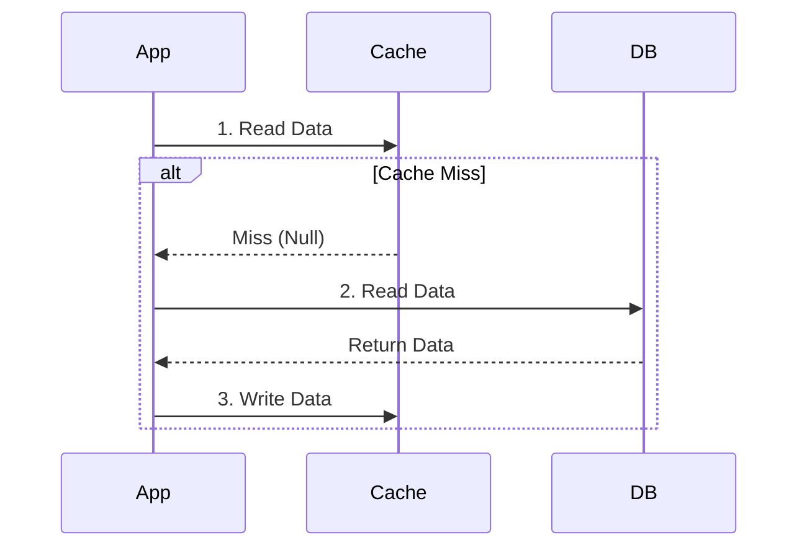
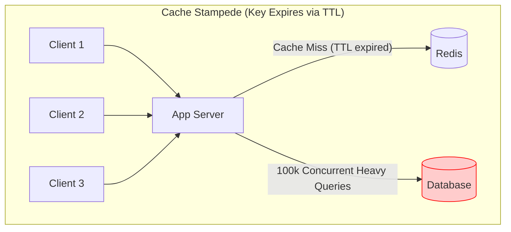

# Caching Strategies & Interview Patterns

**Source:** [Caching in System Design Interviews w/ Meta Staff Engineer (Hello Interview)](https://www.youtube.com/watch?v=1NngTUYPdpI)

**TL;DR:** Caching is the ultimate tool for scaling read-heavy systems and reducing latency. It trades a bit of storage and complexity for speed by keeping recently used data in a faster layer. In a system design interview, caching should be brought up during the deep dive (non-functional requirements) to address scale and performance. You must be able to discuss **Where to Cache**, **Architectures**, **Eviction Policies vs TTL**, and **Common Pitfalls**.

---

## 1. The Physics of Caching (Why we do it)
*   **Disk Access (SSD/DB):** ~1 millisecond.
*   **Memory Access (RAM):** ~100 nanoseconds.
*   **The Gap:** Memory is roughly **10,000x faster** than disk. When serving thousands of requests per second, caching takes advantage of this massive difference.

## 2. Where to Cache (The Layers)

1.  **External Caching (Redis / Memcached):** 
    *   The most common in system design interviews. 
    *   Runs on its own server. Multiple application servers share the same global cache, meaning if one server fetches the data, all other servers instantly benefit.
2.  **In-Process Caching (Guava / Local Memory):** 
    *   Stores data directly inside the application server's RAM. 
    *   **Pros:** The absolute fastest caching possible (zero network hops).
    *   **Cons:** State is isolated per server (can lead to inconsistencies and wasted memory). 
    *   **Use Case:** Static config data or lookup tables requiring ultra-low latency.
3.  **CDNs (Content Delivery Networks):** 
    *   Edge caching geographically close to users.
    *   Optimizes for **network latency** rather than disk vs. memory. Drops a global 300ms round-trip down to 20ms.
    *   **Use Case:** Media delivery (images, videos), static assets, public API responses, and HTML.
4.  **Client-Side Caching:** 
    *   Browser HTTP cache, Local Storage, or mobile on-device disk.
    *   **Use Case:** Offline functionality (e.g., Strava syncing runs when offline). You have the least control over data freshness here.

---

## 3. Caching Architectures (How data is updated)

### Cache-Aside (Lazy Loading)
*   **How it works:** The application logic handles everything. On a read, the app checks the cache. If it's a miss, it fetches from the DB, writes it to the cache, and returns it.
*   **Pros:** Resilient (if cache goes down, the app hits the DB). Lean (only requested data gets cached). **This should be your default choice in an interview.**
*   **Cons:** Cache misses have higher latency (3 trips: check cache, query DB, write to cache). 

### Write-Through
*   **How it works:** The application only writes to the cache. The caching library then synchronously writes to the database *before* returning success.
*   **Pros:** Strong consistency between Cache and DB.
*   **Cons:** Slower writes. Suffers from the **Dual Write Problem** (if the DB write fails but the cache write succeeds, creating split-brain). Bloats the cache with data that might never be read again.

### Write-Behind (Write-Back)
*   **How it works:** The application writes to the cache and instantly gets a `200 OK`. The cache flushes these updates to the database asynchronously in batches.
*   **Pros:** Blazing fast write throughput (great for metrics/analytics).
*   **Cons:** **Data Loss!** If the cache node crashes before the batch flushes, the data is gone forever. *Interview Tip: Avoid proposing this unless you are highly experienced and can strongly justify the data loss risk.*

### Read-Through
*   **How it works:** Similar to Cache-Aside, but the cache itself transparently orchestrates the DB fallback (the application only ever talks to the Cache). This is exactly how CDNs work.

---

## 4. Cache Eviction vs. Cache Expiration (TTL)

Because memory is expensive and limited, caches must delete old data. There are two entirely different concepts that control data removal: **Eviction** (running out of space) and **Expiration / TTL** (data becoming stale).

### Eviction Policies (When the cache is FULL)
*   **LRU (Least Recently Used):** Evicts the item that hasn't been read or written in the longest time. **This is the most common default in interviews.**
*   **LFU (Least Frequently Used):** Evicts the item with the lowest total access count. Great if access patterns are highly skewed, but can suffer from "historical baggage" (an item was wildly popular a month ago and never gets evicted despite not being read anymore).
*   **FIFO (First In, First Out):** Evicts the oldest item based strictly on insertion time. Rarely the right choice.

### Time To Live (TTL) / Expiration
*   **How it works:** Each cached item has a strict expiration time (e.g., 60 seconds). Once that time passes, the cache automatically deletes it.
*   **When to use it:** Perfect for when **freshness matters more than frequency**. Use it for data that naturally goes stale: user sessions, social media feeds, API responses, or profile images.
*   *Interview Tip:* Be ready to combine these! You can use an LRU cache with a 5-minute TTL, meaning data dies naturally after 5 minutes, but might be evicted sooner if the cache fills up.

---

## 5. The 3 Major Caching Pitfalls (Interview Traps)

There are two hard problems in computer science: naming things, and cache invalidation. Interviewers will drill into these three edge cases:

### Pitfall 1: Cache Consistency (Stale Data)
If a user updates their profile picture in the database, but the old picture is still in the cache, other users will see stale data.
*   **Solution 1 (Invalidate on Write):** Whenever you write to the DB, explicitly send a `DELETE` command to the cache for that key. The next read will force a fresh pull.
*   **Solution 2 (Short TTL / Eventual Consistency):** If it's a social media feed, set a short TTL (e.g., 5 minutes) and explicitly state: *"Some users will see stale data for 5 minutes, and that is an acceptable business trade-off because it's not a critical financial transaction."*

### Pitfall 2: Cache Stampede (Thundering Herd)
A massively popular key (like a homepage feed) has a TTL of 60 seconds. When it expires, 100,000 concurrent user requests suddenly miss the cache and all try to rebuild the cache at the exact same time. This turns 1 query into 100,000 database queries instantly, causing cascading failures and melting down the database.

*   **Solution 1: Request Coalescing (Single Flight):** When multiple requests miss the same key, only the *first* request is allowed to go to the database. The other 99,999 requests are forced to wait (usually via a lock or polling mechanism) for the first request to repopulate the cache, and then they all read from the newly refreshed cache.
*   **Solution 2: Cache Warming (Proactive Background Refresh):** Instead of waiting for the popular key to expire at 60 seconds, a background worker proactively refreshes the key at the **55-second mark**. This means the key *never actually expires*, and the cache stampede is physically impossible.

### Pitfall 3: Hot Keys (The Celebrity Problem)
Even if your cache hit rate is perfect, if Taylor Swift's profile gets 99% of the traffic, the single cache shard holding that specific key will be overwhelmed by network bandwidth and crash, leaving the rest of the cluster idle.

*   **Solution 1 (Replication):** Replicate the hot key across *all* cache nodes instead of hashing it to one. The router can then pick any random cache node to serve the data.
*   **Solution 2 (Local In-Memory Cache):** Add a tiny in-process cache (e.g., Guava) directly inside the application servers for the top 10 most popular items to prevent requests from even hitting the Redis cluster.

---

## 6. How to Talk About Caching in Interviews

**Rule #1: NEVER just add a cache for the sake of adding a cache.** 
Dropping a cache into your design without justification is an immediate red flag. Wait for the Deep Dive phase (Non-Functional Requirements) and use this **5-Step Framework**:

1.  **Identify & Quantify the Bottleneck:** Justify the cache. Are you serving 2 billion reads a day? Is computing a newsfeed causing high latency (joins across 5 tables)? Is there a strict 100ms SLA?
2.  **Explicitly Define the Cache Keys:** Do not just say "I'll cache the data." Say exactly what you are caching: *"I will cache the computed newsfeed against the key `feed:{user_id}`."*
3.  **Choose the Architecture:** State your choice (default to Cache-Aside).
4.  **State the Eviction Policy:** Choose LRU or a strict TTL and justify why.
5.  **Address the Downsides:** Proactively bring up how you will handle Consistency, Hot Keys, or Stampedes before the interviewer even asks.
