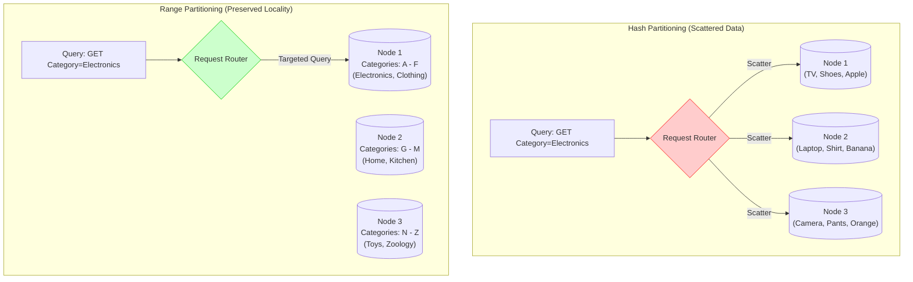

# Consistent Hashing

**Sources:**
*   [Consistent Hashing | Algorithms You Should Know #1 (ByteByteGo)](https://www.youtube.com/watch?v=UF9Iqmg94tk)
*   [Consistent Hashing: Easy Explanation for System Design Interviews (Hello Interview)](https://www.youtube.com/watch?v=vccwdhfqIrI)

**TL;DR:** When distributing data across multiple servers, traditional modulo hashing (`hash(key) % N`) causes a massive "rehashing storm" whenever a server is added or removed, forcing almost all data to be migrated. Consistent Hashing solves this by placing both servers and data on a circular "Hash Ring", ensuring that adding or removing a server only affects a tiny fraction of the data. **Virtual Nodes** are used to keep the distribution perfectly balanced.

---

## 1. The Problem: Modulo Hashing & The Rehashing Storm

Imagine we have 4 database servers storing events. We use a simple hash function to assign an event to a server:
`server_index = hash("event_123") % 4` 
Let's say this equals `2`, so the event is stored on Server 2.

**What happens if Server 4 crashes?**
Our pool is now 3 servers. The formula changes to `hash("event_123") % 3`. The math entirely changes, and this might now equal `0`. 

Because the modulo (`N`) changed, almost every single key in the database will hash to a new server. You now have to migrate roughly 75% of your data across the network to its new home. This causes a massive surge in database reads and writes known as a **Rehashing Storm**, which can completely crash your site.

---

## 2. The Solution: The Hash Ring

Consistent hashing fixes this by completely abandoning the modulo operation based on the number of servers.

1.  **The Ring:** Imagine the output range of a hash function (e.g., $0$ to $2^{32} - 1$) arranged in a circle.
2.  **Place the Servers:** Hash the server's IP or name (e.g., `hash("Server A")`) and place it on the ring.
3.  **Place the Keys:** Hash the data key (e.g., `hash("Alice")`) and place it on the ring.
4.  **The Rule (Walking Clockwise):** To find which server a key belongs to, start at the key's position on the ring and walk **clockwise** until you hit a server. 

---

## 3. A Worked Out Example

Let's simplify our hash space to be $0$ to $99$.

**1. Initialize the Ring (Servers)**
*   `Hash("Server A") = 10`
*   `Hash("Server B") = 40`
*   `Hash("Server C") = 70`

**2. Insert Data (Keys)**
*   `Hash("Alice") = 15`. We walk clockwise from 15. The first server we hit is **Server B (40)**.
*   `Hash("Bob") = 55`. We walk clockwise from 55. The first server we hit is **Server C (70)**.
*   `Hash("Charlie") = 85`. We walk clockwise from 85. We pass 99, wrap around to 0, and hit **Server A (10)**.

**3. Scaling Up (Adding a Server)**
The business is booming, so we add **Server D**.
*   `Hash("Server D") = 25`.
*   Let's see what happens to our data:
    *   **Alice (15):** Walk clockwise from 15. The first server is now **Server D (25)**! Alice must be migrated from Server B to Server D.
    *   **Bob (55):** Walk clockwise. Still hits **Server C (70)**. No change.
    *   **Charlie (85):** Walk clockwise. Still hits **Server A (10)**. No change.

**The Result:** By adding a server, we only had to migrate Alice. Bob and Charlie stayed exactly where they were. Instead of moving 75% of the data, we only move $1/N$ of the data!

---

## 4. The Edge Case: Uneven Distribution & Virtual Nodes

Consistent hashing has one major flaw: **Cascading Failures**. 

Imagine **Server A (10)** crashes and is removed from the ring. All the data that used to go to Server A (keys from 71 to 10) now walks clockwise and hits **Server B (40)**. Server B is now absorbing double the traffic. If Server B gets overwhelmed and crashes, its traffic goes to Server C, crashing it too. 

**The Fix: Virtual Nodes (V-Nodes)**
Instead of placing a physical server on the ring exactly *once*, we place it *multiple times* (e.g., 100 times). 
*   `hash("Server A_1")`, `hash("Server A_2")`, `hash("Server A_3")`, etc.

Now, the servers are beautifully interleaved across the ring. If Server A crashes, its 100 virtual nodes disappear. The traffic that was hitting those 100 spots will gracefully fall onto the virtual nodes of Server B, Server C, and Server D evenly. No single server takes the full brunt of the failure.

---

## 5. Pseudocode / Implementation

In code, the "circular ring" is usually implemented as a simple **sorted array**. Walking clockwise is just a **Binary Search** (`O(log N)`) to find the next highest hash value.

```python
import hashlib
import bisect

class ConsistentHashRing:
    def __init__(self, num_virtual_nodes=100):
        self.num_virtual_nodes = num_virtual_nodes
        self.ring = []         # Sorted array of hash values simulating the "ring"
        self.server_map = {}   # Maps a hash value to the physical server IP

    def _hash(self, key):
        # Use MD5 to generate a large, deterministic integer hash
        return int(hashlib.md5(key.encode('utf-8')).hexdigest(), 16)

    def add_server(self, server_ip):
        # Add multiple virtual nodes to the ring for this physical server
        for i in range(self.num_virtual_nodes):
            vnode_key = f"{server_ip}_vnode_{i}"
            hash_val = self._hash(vnode_key)
            
            self.ring.append(hash_val)
            self.server_map[hash_val] = server_ip
            
        # Keep the array sorted to allow binary search (clockwise walking)
        self.ring.sort()

    def remove_server(self, server_ip):
        # Remove all virtual nodes for this physical server
        for i in range(self.num_virtual_nodes):
            vnode_key = f"{server_ip}_vnode_{i}"
            hash_val = self._hash(vnode_key)
            
            self.ring.remove(hash_val)
            del self.server_map[hash_val]

    def get_server(self, data_key):
        if not self.ring:
            return None
            
        hash_val = self._hash(data_key)
        
        # Binary search: find the first server hash >= the data hash
        # This simulates walking "clockwise" around the ring
        index = bisect.bisect_left(self.ring, hash_val)
        
        # If we reached the end of the array, wrap around to the first server (index 0)
        if index == len(self.ring):
            index = 0
            
        return self.server_map[self.ring[index]]

# --- Example Usage ---
# ring = ConsistentHashRing(num_virtual_nodes=3)
# ring.add_server("192.168.1.1")
# ring.add_server("192.168.1.2")
#
# assigned_server = ring.get_server("user_alice_data")
```

---

## 6. The Scatter-Gather Trap: Hash vs Range Partitioning
*Source: [System Design Fight Club - Consistent Hashing Mistake](https://www.youtube.com/watch?v=sLbOz2QBZgc)*

A common mistake in system design interviews is blindly applying Hash Partitioning (like Consistent Hashing) to solve **"Hot Partition"** problems without considering the query access pattern.

**The Scenario:**
Imagine an e-commerce inventory database (Amazon). You have a hot partition because a specific category (e.g., "Electronics") is queried vastly more than others. 
* To "fix" this, you change the partition key to something evenly distributed (like hashing the `product_id`). 
* Result: The electronics are now beautifully scattered across every server in your cluster. For point queries (e.g., `GET /products/123`), the load is perfectly balanced!

**The Trap (Range Queries):**
If the business frequently performs **key-range queries** (e.g., "Get all products in the Electronics category"), Hash Partitioning completely destroys your system. 
* Because "Electronics" products are now randomly hashed across every server, the request router cannot identify a single node to query. 
* It must send the query to **EVERY SINGLE PARTITION** and merge the results. This is called **Scatter-Gather**.
* You "solved" the hot partition by absolutely hosing every partition with every single range request (the video jokes: "It's like communism; if everyone is starving together, nobody *in particular* is starving").

**The Solution:**
If your application relies on Range Queries, you **must use Range Partitioning**, which preserves data locality (keeping related items on the same server). If Range Partitioning creates a hot partition, mitigate it with **Dynamic Partitioning** (where the database detects a hot range and dynamically splits it into two smaller ranges on different servers) rather than destroying locality with Hash Partitioning.


