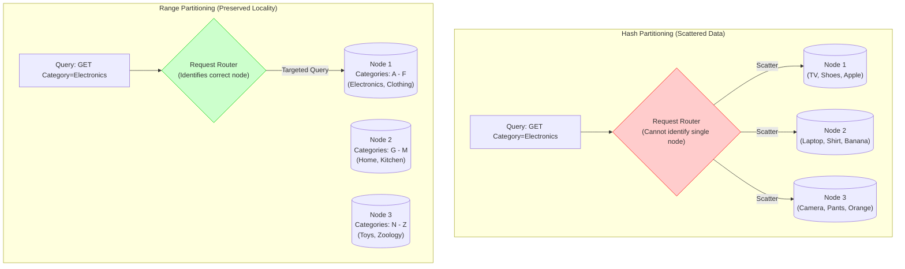

# Consistent Hashing

**Sources:**
*   [Consistent Hashing | Algorithms You Should Know #1 (ByteByteGo)](https://www.youtube.com/watch?v=UF9Iqmg94tk)
*   [Consistent Hashing: Easy Explanation for System Design Interviews (Hello Interview)](https://www.youtube.com/watch?v=vccwdhfqIrI)
*   [Consistent Hashing - A Common Mistake in Choosing Partitioning Keys (System Design Fight Club)](https://www.youtube.com/watch?v=sLbOz2QBZgc)

**TL;DR:** When distributing data across multiple servers, traditional modulo hashing (`hash(key) % N`) causes a massive "rehashing storm" whenever a server is added or removed, forcing almost all data to be migrated. Consistent Hashing solves this by placing both servers and data on a circular "Hash Ring" (typically an array in code), ensuring that adding or removing a server only affects a tiny fraction of the data ($1/N$). **Virtual Nodes** are used to keep the distribution perfectly balanced.

---

## 1. Interview Tip: When to Mention Consistent Hashing
According to *Hello Interview*, while many of your favorite services use consistent hashing behind the scenes, you should calibrate how deeply you discuss it:
*   **Standard App Design:** You might give a quick "nod" to consistent hashing if you are simply introducing technologies like Redis, Cassandra, or a CDN.
*   **Deep Dive:** You only need to explain the mechanics of the hash ring algorithm if you are explicitly asked to design a **single scaled backend component** (e.g., "Design a Distributed Cache", "Design a Distributed Database", or "Design a Distributed Message Queue").

---

## 2. Real-World Use Cases
Consistent hashing is ubiquitous in horizontal scaling. Real-world examples include:
*   **NoSQL Databases (DynamoDB, Apache Cassandra):** Used for data partitioning. It minimizes data movement during rebalancing when nodes are added or fail.
*   **Content Delivery Networks (Akamai CDN):** Distributes web content evenly across edge servers.
*   **Load Balancers (Google Load Balancers):** Distributes persistent connections evenly across backend servers. If a server goes down, only the connections to that specific server need to be reestablished.
*   **Messaging Apps (Discord):** Used for routing and session management.

---

## 3. The Problem: Modulo Hashing & The Rehashing Storm

Imagine we host an events website (like TicketMaster) and need to scale from 1 database to 3. We use a simple hash function (like MD5 or MurmurHash) to assign an event to a server:
`server_index = hash("event_1234") % 3` 
Let's say this equals `2`, so the event is stored on Database 2.

**What happens if we add a 4th database?**
Our pool is now 4 servers. The formula changes to `hash("event_1234") % 4`. The math entirely changes, and this might now equal `3`. 

Because the modulo (`N`) changed, almost every single key in the database will hash to a new server. You now have to migrate roughly 75% of your data across the network to its new home. This causes a massive surge in database reads and writes known as a **Rehashing Storm**, which can severely slow down or completely crash your site. The same issue occurs if a database is removed.

---

## 4. The Solution: The Hash Ring

Consistent hashing fixes this by completely abandoning the modulo operation based on the number of servers.

### The Mechanics Under the Hood
1.  **The Hash Space:** The hash function maps inputs to a massive, fixed range of numerical values (e.g., $0$ to $2^{32} - 1$ for a 32-bit hash).
2.  **The Ring:** Imagine connecting both ends of this hash space to form a continuous circle or ring. In code, this is not a literal circle; it is a **mathematical construct**, typically implemented as a **sorted array**.
3.  **Place the Servers:** Hash the server's IP address or name (e.g., `hash("192.168.1.1")`) and place it on the ring.
4.  **Place the Keys:** Hash the data key (e.g., `hash("event_1234")`) using the **exact same hash function** and place it on the ring.
5.  **The Rule (Walking Clockwise):** To find which server a key belongs to, start at the key's position on the ring and walk **clockwise** until you hit a server. In an array implementation, this is a binary search (`O(log N)`) to find the next highest hash value.

### Why It Works (Scaling Up/Down)
If you add a new database to the ring, it simply intercepts keys that would have gone to the next database in the clockwise direction. Only the keys strictly between the new server and the preceding server need to be moved. All other keys stay exactly where they are. Adding or removing a server only requires redistributing a fraction ($1/N$) of the keys!

---

## 5. The Edge Case: Uneven Distribution & Virtual Nodes (V-Nodes)

Consistent hashing has a flaw: **Cascading Failures due to Uneven Distribution**. 

If we pick random points on the ring for our servers, we are very unlikely to get a perfect partition into equally sized segments. Furthermore, if **Server 2** crashes and is removed, all of its data walks clockwise and hits **Server 3**. Server 3 suddenly absorbs 2x the traffic (the segments of Server 2 + its own). If Server 3 gets overwhelmed and crashes, its traffic goes to Server 4, crashing it too. 

### The Fix: Virtual Nodes (V-Nodes)
Instead of placing a physical server on the ring exactly *once*, we place it *multiple times* (e.g., 100 times). 
*   `hash("Server_A_vnode_0")`, `hash("Server_A_vnode_1")`, ..., `hash("Server_A_vnode_99")`

Now, the servers are beautifully interleaved across the ring. If Server A crashes, its 100 virtual nodes disappear. The traffic that was hitting those 100 spots will gracefully fall onto the adjacent virtual nodes belonging to all the other servers evenly. No single physical server takes the full brunt of the failure.

**The Trade-off:** Having more virtual nodes means a perfectly balanced distribution, but it takes more memory space to store the metadata mapping all those virtual nodes back to their physical servers. This is a tunable parameter based on your system requirements.

---

## 6. Pseudocode Implementation

```python
import hashlib
import bisect

class ConsistentHashRing:
    def __init__(self, num_virtual_nodes=100):
        # Trade-off: Higher num_virtual_nodes = better distribution but more memory for metadata
        self.num_virtual_nodes = num_virtual_nodes
        self.ring = []         # Sorted array simulating the "ring"
        self.server_map = {}   # Maps a virtual node hash value back to the physical server IP

    def _hash(self, key):
        # MD5 or MurmurHash provides a massive integer hash space
        return int(hashlib.md5(key.encode('utf-8')).hexdigest(), 16)

    def add_server(self, server_ip):
        # Add multiple virtual nodes to the ring for this physical server
        for i in range(self.num_virtual_nodes):
            vnode_key = f"{server_ip}_vnode_{i}"
            hash_val = self._hash(vnode_key)
            
            self.ring.append(hash_val)
            self.server_map[hash_val] = server_ip
            
        # Keep the array sorted to allow binary search (clockwise walking)
        self.ring.sort()

    def remove_server(self, server_ip):
        # Remove all virtual nodes for this physical server
        for i in range(self.num_virtual_nodes):
            vnode_key = f"{server_ip}_vnode_{i}"
            hash_val = self._hash(vnode_key)
            
            self.ring.remove(hash_val)
            del self.server_map[hash_val]

    def get_server(self, data_key):
        if not self.ring:
            return None
            
        hash_val = self._hash(data_key)
        
        # Binary search: find the first server hash >= the data hash
        # This simulates walking "clockwise" around the ring
        index = bisect.bisect_left(self.ring, hash_val)
        
        # If we reached the end of the array, wrap around to the first server (index 0)
        if index == len(self.ring):
            index = 0
            
        return self.server_map[self.ring[index]]
```

---

## 7. The Scatter-Gather Trap: Hash vs Range Partitioning

A common mistake in system design interviews is blindly applying **Hash Partitioning** (like Consistent Hashing) to solve a **"Hot Partition"** problem without analyzing the query access pattern.

### The Scenario: E-Commerce Inventory (e.g., Amazon)
Imagine a database where the primary key is `Category + Product_ID`, partitioned by `Category`.
You have a hot partition because a "celebrity attribute" (e.g., the "Electronics" category) is queried vastly more than others. 

To "fix" this uneven distribution, you decide to switch the partition key to something evenly distributed (e.g., hashing the `Product_ID`). 
*   **Result:** The electronics are now beautifully scattered across every server in your cluster.

### The Difference: Key-Value vs Key-Range Queries

**1. Key-Value Access Pattern (Hash Partitioning Works!)**
If the application only does point queries (`GET /products/123`), Hash Partitioning solves the hot partition brilliantly. The load is perfectly balanced across all nodes.

**2. Key-Range Access Pattern (The Trap!)**
If the business frequently performs **key-range queries** (e.g., "Get all products in the Electronics category"), Hash Partitioning completely destroys your system. 
*   Because "Electronics" products are now randomly hashed across every server, the request router cannot uniquely identify a single node to query. 
*   It must send the query to **EVERY SINGLE PARTITION** and merge the results. This is called **Scatter-Gather**.
*   You "solved" the hot partition by absolutely hosing every partition with every single range request. As the System Design Fight Club video jokes: *"It's like communism; if everyone is starving together, nobody in particular is starving."*

### The Solution: Dynamic Partitioning
If your application relies on Range Queries, you **must use Range Partitioning**, which preserves data locality (keeping related items on the same server). 

If Range Partitioning creates a hot partition, mitigate it with **Dynamic Partitioning** (where the database detects a hot range and dynamically splits it into two smaller ranges on different servers) rather than destroying locality with Hash Partitioning. While not all databases support dynamic partitioning out of the box, it is the more acceptable solution for range queries.


