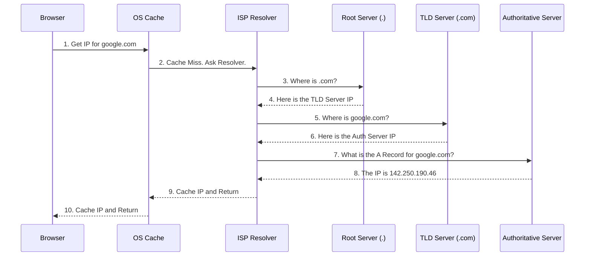

# DNS and CDNs (Content Delivery Networks)

**TL;DR:** 
- **DNS** is the phonebook of the internet; it translates human-readable domain names (like `google.com`) into machine-readable IP addresses.
- **CDNs** are geographically distributed networks of servers that cache static content closer to users, minimizing latency and reducing the load on the origin server. DNS is the mechanism used to route users to the nearest CDN edge server.

---

## 1. Domain Name System (DNS)

Humans remember names (like `amazon.com`), but computers and routers (operating at Layer 3 of the OSI model) only understand IP addresses (like `192.0.2.1`). DNS bridges this gap.

### The Hierarchical Resolution Process
When you type `google.com` into your browser, finding the IP address is not a single database lookup. It is a highly distributed, hierarchical process:

1. **Browser Cache & OS Cache:** The browser checks its own cache. If it misses, it asks the Operating System.
2. **DNS Resolver (ISP):** The OS sends a query to the DNS Resolver (usually provided by your Internet Service Provider, or a public one like Google's `8.8.8.8` or Cloudflare's `1.1.1.1`).
3. **Root Name Server:** If the Resolver doesn't have it cached, it queries the Root Server. The Root Server says, *"I don't know the exact IP, but here is the IP for the `.com` TLD Server."*
4. **TLD (Top-Level Domain) Server:** The Resolver asks the `.com` server. The TLD server says, *"I don't know the exact IP, but here is the Authoritative Server that manages `google.com`."*
5. **Authoritative Name Server:** The Resolver asks the Authoritative Server (often managed by AWS Route53 or Cloudflare). This server holds the actual mapping and returns the exact IP address.
6. **Caching:** The Resolver caches this IP (for a time defined by the TTL - Time To Live) and passes it back to your browser, which also caches it. 



### Common DNS Record Types
*   **A Record:** Maps a domain to an **IPv4** address.
*   **AAAA Record:** Maps a domain to an **IPv6** address.
*   **CNAME (Canonical Name):** Maps a domain to another domain (an alias). For example, mapping `blog.example.com` to `example.wordpress.com`. *Note: You cannot put a CNAME on the root domain (example.com).*
*   **NS (Name Server):** Indicates which Authoritative server manages the domain.
*   **MX (Mail Exchange):** Directs email to a mail server.

### Advanced DNS Routing (Traffic Management)
Authoritative servers don't just return static IPs; they can perform intelligent load balancing:
*   **Weighted Routing:** Send 80% of traffic to Server A, 20% to Server B (great for A/B testing or canary deployments).
*   **Geolocation Routing:** If the user is in Europe, return the IP of the European datacenter.
*   **Latency-Based Routing:** Continuously measure network latency and return the IP of the server that will respond fastest to that specific user.

---

## 2. Content Delivery Networks (CDNs)

If your origin server is in New York, a user in Tokyo will experience high latency (the physical time it takes light to travel through fiber optic cables across the globe). 

### How CDNs Work
A CDN places "Edge Servers" (also called Points of Presence or PoPs) in hundreds of cities worldwide. 
1.  **Caching:** These edge servers cache static assets (HTML, CSS, JavaScript, Images, Videos).
2.  **DNS Routing:** When a user in Tokyo types in your URL, the DNS dynamically resolves to the IP address of the Tokyo Edge Server, not the New York Origin Server.
3.  **Delivery:** The user downloads the image directly from the server in their own city, drastically cutting load times.

```mermaid
flowchart TD
    User([User in Tokyo])
    Edge[CDN Edge Server Tokyo]
    Origin[(Origin Server NY)]

    User -- "1. Request image.jpg" --> Edge
    Edge -- "2. Check Cache" --> Edge
    
    alt Cache Miss
        Edge -- "3. Fetch from Origin" --> Origin
        Origin -- "4. Return image.jpg" --> Edge
        Edge -- "5. Cache it & Serve User" --> User
    else Cache Hit
        Edge -- "3. Serve instantly from Cache" --> User
    end
```

### Push vs. Pull CDNs
*   **Pull CDN (Most Common):** The edge server starts empty. When the first user requests an image, the edge server fetches it from the Origin Server, serves it to the user, and caches it. Subsequent users get the cached version until the TTL expires. *Best for heavy traffic where only a fraction of content is requested frequently.*
*   **Push CDN:** You proactively upload (push) all your content directly to the CDN. The CDN then replicates it to all its edge servers immediately. *Best for smaller datasets where you want 100% cache hits.*

### Why use a CDN?
1.  **Lower Latency:** Physical proximity to the user means faster page loads.
2.  **Reduced Origin Load:** Because the CDN absorbs 90%+ of the traffic for static assets, your application servers and databases don't have to work as hard, saving you compute costs.
3.  **DDoS Protection:** CDN edge networks are massive and can absorb enormous Distributed Denial of Service attacks before they ever reach your origin server. Cloudflare is famous for this capability.
4.  **SSL/TLS Termination:** The edge server handles the expensive cryptographic handshake, freeing up your backend servers.

---

## 3. How DNS and CDNs Work Together
When you set up a CDN (like Cloudflare or AWS CloudFront), you usually change your domain's **Name Servers (NS)** to point to the CDN provider. 

Because the CDN now acts as your Authoritative DNS Server, it can dynamically inspect where a DNS request is coming from and intelligently return the IP address of the CDN Edge Server closest to that specific user.
