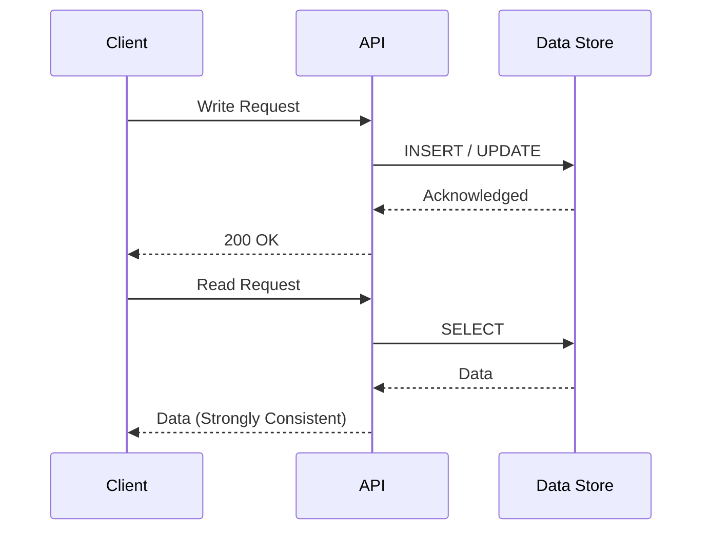
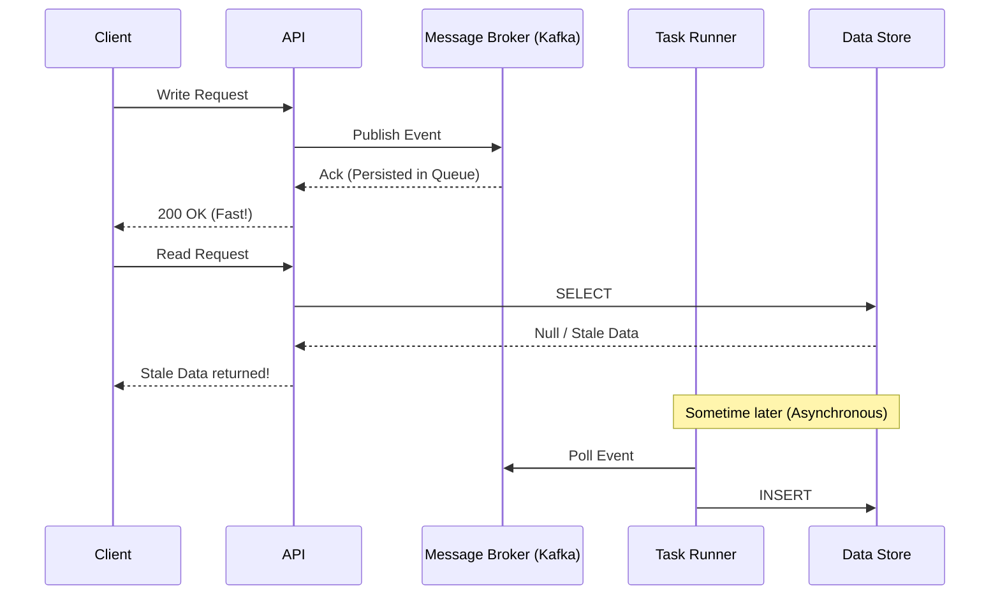

# Message Brokers & Strong Consistency

**Source:** [When NOT to use a message broker? (System Design Fight Club)](https://www.youtube.com/watch?v=eWpOlIBxB_U)

**TL;DR:** While message brokers (Kafka, SQS, RabbitMQ) are fantastic for decoupling systems and increasing availability, they fundamentally **kill strong consistency**. If your system requires immediate, strong consistency (e.g., Financial Trading, Wallets, Payment Gateways), you should *not* place an asynchronous message broker in the critical path between your API and the database.

---

## 1. The Traditional Setup (Strong Consistency)
In a standard CRUD application without a broker, the flow looks like this:
1. Client sends a Write request.
2. The API synchronously writes to the Data Store (e.g., PostgreSQL).
3. The Data Store confirms the write.
4. The API returns `200 OK` to the Client.

Because the write is synchronous, the moment the client receives the `200 OK`, any subsequent Read request is guaranteed to see the new data. This is **Strong Consistency**.

## 2. The Message Broker Setup (Eventual Consistency)
When you introduce a message broker to increase availability and handle traffic spikes, the flow changes:
1. Client sends a Write request.
2. The API writes the event to the Message Broker (Kafka/SQS) and *immediately* returns `200 OK`.
3. In the background, a Task Runner asynchronously pulls the event from the broker and writes it to the Data Store.

**The Problem (Stale Reads):**
Because the API returned `200 OK` before the data actually reached the database, a client might immediately issue a Read request and get **stale data** (or a 404 Not Found). The data is safely persisted in the highly-available message queue, but it is not yet visible to readers. 

If the database or task runners experience an outage, the delay between the `200 OK` and the data becoming readable could stretch from milliseconds to hours. This is **Eventual Consistency**.

## 3. The CAP Theorem Trade-off
Why do this if it ruins consistency? **Availability.**

Databases often go down or get overwhelmed under massive load. Message brokers are explicitly designed to almost *never* go down. By placing a broker in front of a database, you transform a **Push** (which can overload the DB) into a **Pull** (where the DB consumes at its own safe pace). 

You are actively trading Consistency (C) for Availability (A) under the CAP Theorem.

## 4. When NOT to use a Broker
Do not use an asynchronous message broker in the critical path if:
*   **Financial Transactions:** A stock exchange or crypto wallet cannot tolerate a user seeing a stale balance after a deposit.
*   **Inventory Claims:** If a user buys the last concert ticket, subsequent reads *must* instantly reflect that the ticket is gone to prevent double-booking. 

For these systems, you must stick to synchronous database writes and Distributed Transactions (like Two-Phase Commit), accepting lower availability (if the DB is down, the system rejects the write) to guarantee absolute correctness.
