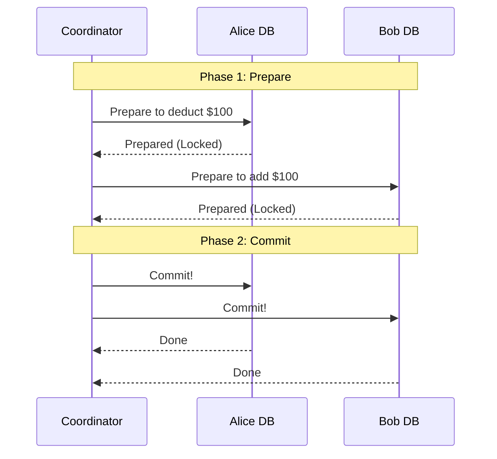

# Partial Failures & Idempotency

**Source:** [A Crucial Topic for Sr SWE Interviews - Partial Failures (System Design Fight Club)](https://www.youtube.com/watch?v=QHYy5H5LWEQ)

**TL;DR:** Junior engineers design for the "happy path"; senior engineers design for the apocalypse. In a distributed system, an operation spanning multiple services will inevitably fail halfway through (a "partial failure"). You have three choices to handle this: Let it fail (accept garbage), Retry with Idempotency (eventual consistency), or use Distributed Transactions (strong consistency).

---

## 1. Scenario 1: Let It Fail (Acceptable Garbage)

Sometimes, a partial failure doesn't break the system, and rolling back is more effort than it's worth.

**Example:** TinyURL Link Generation.
1. The user requests a short link.
2. The API writes the long/short URL mapping to the durable Database.
3. The API attempts to write it to the Redis Cache.
4. **Failure!** The cache node is down.

**Result:** The API returns a `500 Error` to the user ("Failed to generate link"). The user simply clicks "Try Again". 
The Database now has an orphaned, unused link mapping (garbage). This is perfectly acceptable. The storage cost of a few orphaned strings is negligible compared to the massive engineering complexity of distributed rollbacks.

---

## 2. Scenario 2: Message Brokers & Idempotent Retries

If the task *must* complete, but doesn't need to be instantaneous, you can use a Message Broker and continuous retries. However, your operations must be **Idempotent** (doing it twice has the exact same result as doing it once).

**Example:**
1. A Write Request comes in. The API immediately dumps it onto a Message Broker (Kafka/SQS) and returns `200 OK`.
2. A Task Runner pulls the message.
3. The Runner successfully writes to the Database.
4. The Runner tries to write to the Cache.
5. **Failure!** The Runner crashes before updating the Cache and before acknowledging the message to the broker.

**The Recovery:**
Because the message was never acknowledged, the Broker hands it to a *new* Task Runner. 
1. The new runner tries to write to the Database again.
2. Because the DB write is **idempotent**, the database simply says "I already have this data, no worries," without throwing a duplicate error or creating two records.
3. The runner successfully writes to the Cache.
4. The runner acknowledges and deletes the message from the broker.

*Note: This guarantees the operation completes, but it sacrifices Strong Consistency (readers might see stale data while the retries are happening).*

---

## 3. Scenario 3: Distributed Transactions (Two-Phase Commit)

Sometimes you cannot accept eventual consistency, and you absolutely cannot blindly retry. 

**Example:** A Wallet Service / Payment Gateway.
You need to deduct \$100 from Alice's wallet, and add \$100 to Bob's wallet. If you deduct from Alice, but the system crashes before adding to Bob, you cannot just say "Oh well, let it fail." That's illegal. You also can't easily rely on async retries without heavy risk of double-charging or race conditions.

You must ensure both databases commit, or neither commits. The naive approach to this is **Two-Phase Commit (2PC)**:

1. **Phase 1 (Prepare):** A central coordinator asks both the Alice DB and the Bob DB to "prepare" the transaction. Both databases place a hard **Lock** on the relevant rows so no other requests can touch them, and reply "Prepared."
2. **Phase 2 (Commit):** If both say "Prepared", the coordinator says "Commit!" and the transaction is finalized on both ends.

**Handling the Partial Failure:**
If the Alice DB says "Prepared", but the Bob DB says "Error" (or times out) during Phase 1, the coordinator immediately sends an "Abort" message to the Alice DB, which unlocks the rows and rolls back. The transaction never happens.

*Trade-offs:* 2PC is notoriously slow and blocking. If the coordinator crashes mid-transaction, the databases can be left with locked rows indefinitely. Modern microservices often prefer **Sagas** over strict 2PC for better performance, relying on compensatory actions (refunds) instead of locks.
