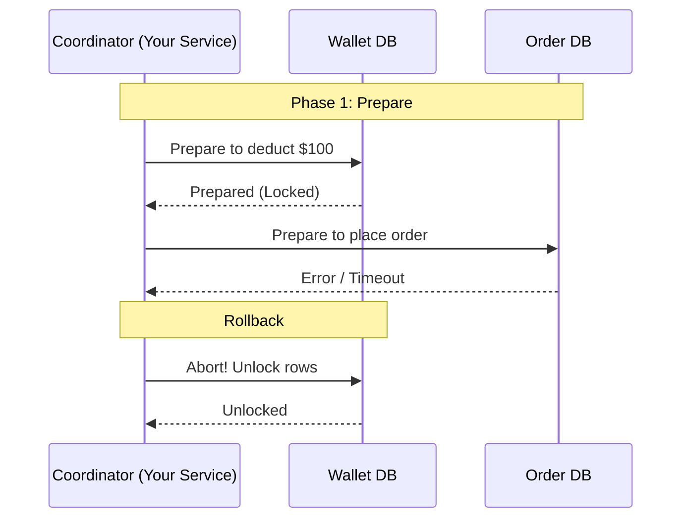
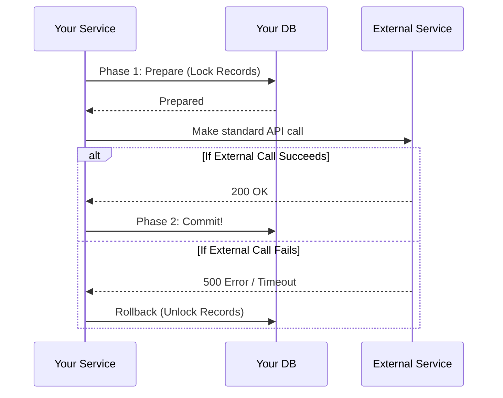

# Partial Failures & Idempotency

**Source:** [A Crucial Topic for Sr SWE Interviews - Partial Failures (System Design Fight Club)](https://www.youtube.com/watch?v=QHYy5H5LWEQ)

**Interview Tip:** Junior and mid-level engineers design for the "happy path", while senior engineers design for outages and "the end of the world." Handling partial failures—when an operation spanning multiple services fails halfway through—is a critical topic in senior SWE interviews.

In distributed systems, you generally have four scenarios/strategies to handle partial failures:

---

## 1. Scenario 1: Let It Fail (Acceptable Garbage)

Sometimes, a partial failure doesn't break the system, and rolling back is more effort than it's worth.

**Example:** TinyURL Link Generation.
1. The user requests a short link.
2. The API writes the long/short URL mapping to the durable Database.
3. The API attempts to write it to the Redis Cache.
4. **Failure!** The cache node is down, or the network request times out before returning success to the user.

**Result:** The API returns a `500 Error` to the user ("Failed to generate link"). The client simply retries their request. 
The Database now has an orphaned, unused link mapping (garbage). This is perfectly acceptable. The storage cost of a few orphaned strings is negligible compared to the massive engineering complexity of distributed rollbacks.

---

## 2. Scenario 2: Message Brokers & Idempotent Retries

If the task *must* complete, but doesn't need to be instantaneous, you can use a Message Broker and continuous retries. However, your database operations must be **Idempotent** (doing it twice has the exact same result as doing it once).

**Example:**
1. A Write Request comes in. The API immediately dumps it onto a Message Broker (e.g., SQS, Kafka, RabbitMQ) and returns `200 OK` to the client.
2. A Task Runner pulls the message.
3. The Runner successfully writes to the durable Database.
4. The Runner tries to write to the Cache.
5. **Failure!** The Runner crashes before updating the Cache and before marking the message as completed.

**The Recovery:**
Because the message was never marked as complete, the Broker hands it to a *new* Task Runner. 
1. The new runner pulls the message again.
2. It retries the write to the Database. Because the DB write is **idempotent**, the database simply says "I already have this data, no worries," without throwing a duplicate error or creating two records.
3. The runner successfully writes to the Cache.
4. The runner marks the message as successfully processed. 
   - **Mechanical Detail:** For SQS or RabbitMQ, it deletes the message. For Kafka or Kinesis, it updates the stream offset.

*Trade-offs:* This guarantees the operation completes, but it sacrifices Strong Consistency (readers might see stale data while the retries are happening) in favor of Eventual Consistency.

---

## 3. Scenario 3: Distributed Transactions (Two-Phase Commit vs. Consensus)

Sometimes you cannot accept eventual consistency, and you absolutely cannot blindly retry. 

**Example:** A Wallet Service / Payment Gateway (or placing an order).
You need to deduct \$100 from a wallet DB, and place an order in an Order DB. If you deduct the money but the system crashes before placing the order, you cannot just say "Oh well, let it fail." You also can't easily rely on async retries without heavy risk of double-charging. You need an "all-or-nothing" transaction across heterogeneous technologies (e.g., Cassandra and DynamoDB).

### Approach A: The Naive Two-Phase Commit (2PC)

The code for handling 2PC lives inside your service, acting as the coordinator between the databases.

1. **Phase 1 (Prepare):** Your service asks both the Order DB and the Wallet DB to "prepare" the transaction. Both databases place a hard **Lock** on the relevant rows so no other requests can touch them, and reply "Prepared."
2. **Phase 2 (Commit):** If both say "Prepared", your service says "Commit!" and the transaction is finalized on both ends.

**Handling the Partial Failure:**
If the Wallet DB says "Prepared", but the Order DB says "Error" (or times out) during Phase 1, the coordinator immediately sends a rollback/unlock message to the Wallet DB. The transaction never happens.

*Trade-offs:* 2PC is notoriously slow and blocking. If the coordinator crashes mid-transaction, the databases can be left with locked rows indefinitely. Despite this, 2PC is still heavily used in industry (e.g., at Amazon) because it is simpler than the alternative.

### Approach B: Distributed Consensus (Paxos / Raft / ZAB)

**Trap Warning:** Do NOT roll your own Paxos or Raft implementation. It is like rolling your own crypto algorithm—leave it to the experts, or you will completely screw up the implementation.

Instead of your service acting as the 2PC coordinator, you outsource the transaction coordination to specialized software like **ZooKeeper** (which uses the ZAB consensus algorithm).
1. The request comes into your service.
2. Your service makes a call to ZooKeeper.
3. ZooKeeper securely coordinates the distributed transaction across your databases on your behalf.
4. ZooKeeper returns success or failure to your service.

---

## 4. Scenario 4: The "Sandwich" 2PC (Working with External Teams)

**Interview Tip (The "Stunt"):** In the real world, you rarely have direct database access to another team's service. Using a database as a communication channel is an anti-pattern. Furthermore, external teams will rarely do the massive amount of work required to expose dedicated "Prepare" and "Commit" API endpoints for your 2PC coordinator to call.

How do you guarantee an "all-or-nothing" transaction when calling a non-collaborative external team's API? **Sandwich the external call between your own Phase 1 and Phase 2.**

1. **Phase 1 (Prepare):** Your service prepares the transaction on *your* database (e.g., locks the relevant records).
2. **External Call:** You make the standard REST/gRPC API call to the external team's service.
3. **Phase 2 (Commit/Rollback):** 
   - If the external call **succeeds**, you Commit the transaction on your database.
   - If the external call **fails**, you Abort/Rollback on your database (unlocking the records).

This trick allows you to achieve two-phase commit safety without the full cooperation of the other team, completely avoiding the need for them to write custom 2PC API endpoints.
