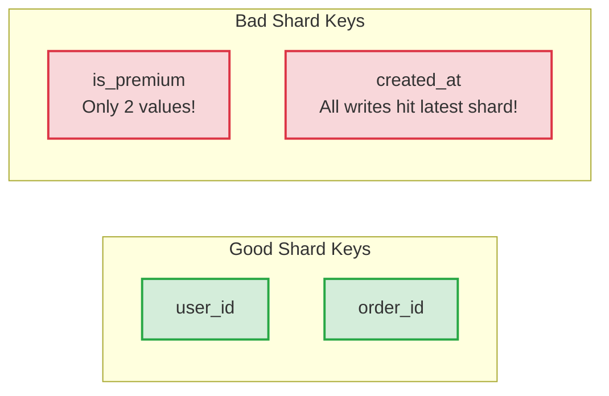
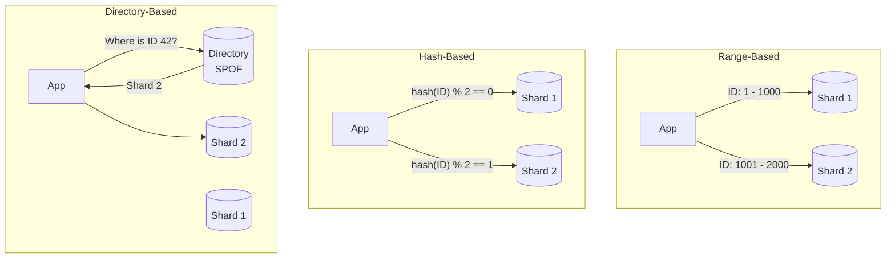
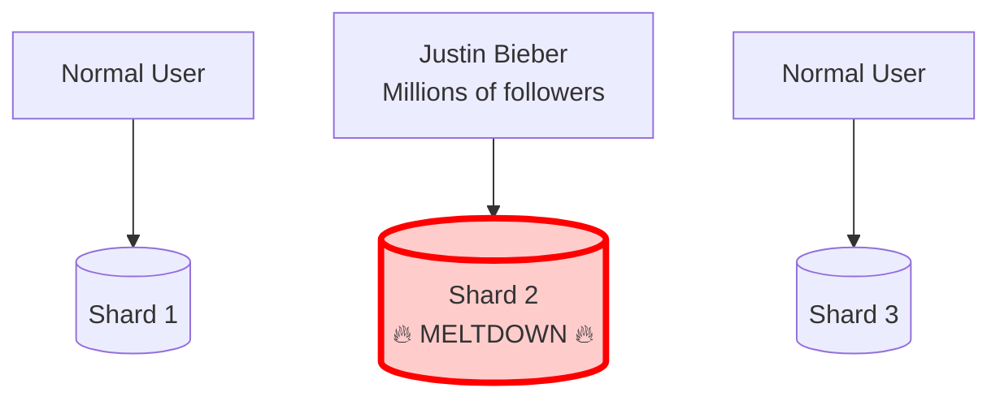
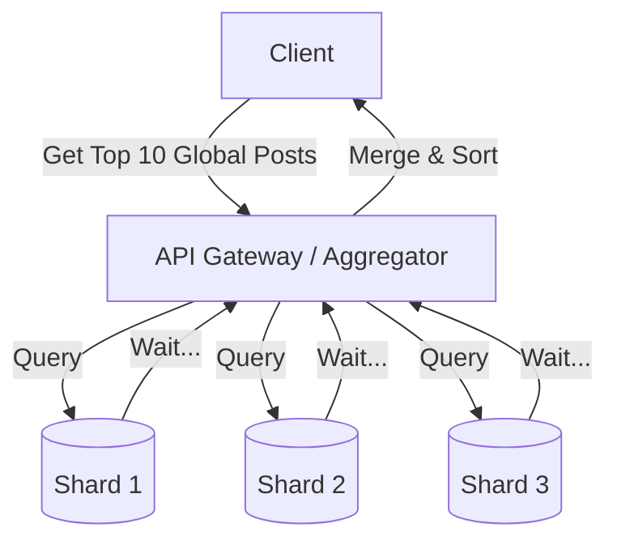
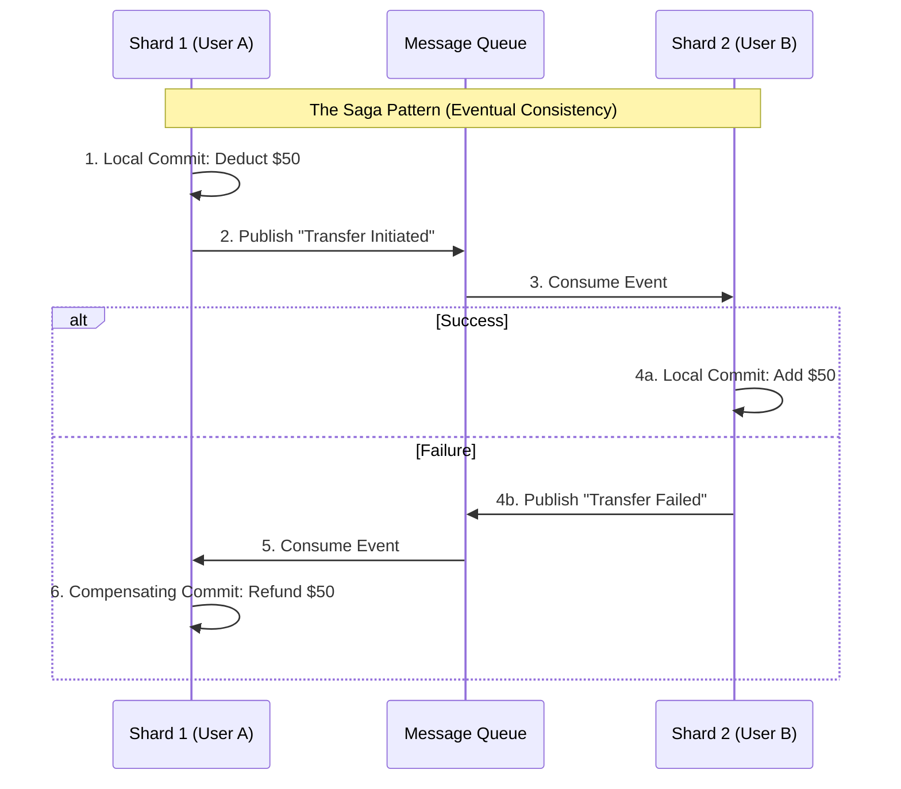

# Database Sharding & Partitioning

**Source:** [Sharding in System Design Interviews w/ Meta Staff Engineer (Hello Interview)](https://www.youtube.com/watch?v=L521gizea4s)

**TL;DR:** When a single database instance (even a massive AWS Aurora instance maxing out at 256 TiB) can no longer handle the storage or throughput, you must physically split the data across multiple machines. This is called **Sharding**. However, sharding introduces massive complexity around hot spots, cross-shard queries, and distributed transactions. In an interview, **never shard prematurely**.

---

## 1. Partitioning vs. Sharding

While often used interchangeably, there is a strict mechanical difference. 

```mermaid
flowchart TD
    subgraph Partitioning (Single Machine)
        DB_P[(Single Database)]
        T1[Table: Orders 2023]
        T2[Table: Orders 2024]
        DB_P --- T1
        DB_P --- T2
    end
    
    subgraph Sharding (Multiple Machines)
        App[Application]
        DB_S1[(Shard 1)]
        DB_S2[(Shard 2)]
        DB_S3[(Shard 3)]
        
        App --> DB_S1
        App --> DB_S2
        App --> DB_S3
    end
```

*   **Partitioning:** Splitting a large table into smaller pieces *inside a single database instance*. It does not add more machines.
*   **Sharding:** Horizontal partitioning *across multiple physical machines*. Each shard is a completely independent, standalone database with its own CPU, Memory, and Disk.

---

## 2. How to Shard (The Two Core Decisions)

When you shard, you must decide exactly **What to shard by (The Shard Key)** and **How to distribute it (The Strategy)**.

### A. Choosing the Shard Key
A bad shard key leads to catastrophic load imbalances. A perfect shard key requires three traits:



1.  **High Cardinality:** Millions of unique values.
2.  **Even Distribution:** Traffic and storage should spread evenly.
3.  **Aligns with Queries:** The most frequent queries should only need to hit a *single* shard.

### B. Sharding Strategies (Distribution Mechanics)



#### 1. Range-Based Sharding
Groups records by a continuous range of values.
*   **Pros:** Extremely efficient for range scans.
*   **Cons:** Naturally creates hot spots if data is sequential (like timestamps).

#### 2. Hash-Based Sharding (The Default)
Uses a deterministic hash function to map keys to shards.
*   **Pros:** Perfectly even distribution of records.
*   **Cons:** Resharding is a nightmare (Requires **Consistent Hashing** to fix).

#### 3. Directory-Based Sharding
Uses a central lookup table to map specific records to shards.
*   **Pros:** Infinite flexibility (e.g., dynamically move a celebrity to a dedicated shard).
*   **Cons:** The Directory Service becomes a Single Point of Failure (SPOF) and adds network latency to *every single query*. **Do not propose this in standard interviews without heavy justification.**

---

## 3. The 3 Major Sharding Pitfalls (Interview Traps)

### Pitfall 1: Hot Spots (The Celebrity Problem)



If Justin Bieber is on Shard 2, millions of fans will instantly overwhelm that single shard's CPU and network bandwidth.
*   **The Fix:** Isolate hot keys to dedicated shards, use Compound Shard Keys `hash(user_id + date)`, or use dynamic chunk splitting (e.g., MongoDB).

### Pitfall 2: Fan-Out Reads (Cross-Shard Operations)



If you shard by `user_id`, a query for "Top 10 Global Posts" forces you to query all shards simultaneously, wait for the slowest one, and merge the results in memory.
*   **The Fix:** 
    1. **Cache it:** Compute the heavy cross-shard query asynchronously and cache it.
    2. **Denormalize:** Duplicate critical data into a separate globally-optimized database (like Elasticsearch).

### Pitfall 3: Distributed Transactions (Cross-Shard Consistency)



You can no longer use standard ACID transactions. 2-Phase Commit (2PC) is fragile and slow.
*   **The Fix:** Avoid cross-shard transactions by picking a better shard key, or use the **Saga Pattern** to break the transaction into independent, local commits with asynchronous compensating actions.

---

## 4. Under the Hood: Sharding in Modern Databases
In an interview, you don't need to reinvent the wheel. Leverage built-in database sharding engines:
*   **Cassandra:** Uses Consistent Hashing natively via virtual nodes (v-nodes).
*   **DynamoDB:** Dynamically splits/merges partitions based on throughput/size under the hood.
*   **MongoDB:** Uses range-based chunks. A background "Balancer" actively migrates chunks between shards.
*   **PostgreSQL / MySQL:** Relational DBs do not natively shard out-of-the-box. You must place a proxy layer like **Vitess** or **Citus** in front of them to route SQL queries.

---

## 5. How to Answer Sharding in an Interview

**Rule #1: NEVER shard prematurely.** 
A well-tuned Postgres database can handle terabytes of data. Prove a bottleneck exists first.

**The 4-Step Framework:**
1.  **Identify the Limit:** *"We expect 50,000 writes per second. A single DB instance will struggle with that IOPS load, so we must shard."*
2.  **Propose the Shard Key:** *"Since queries are user-centric (fetching personal feeds), I will shard by `user_id`."*
3.  **Choose the Strategy:** *"I'll use Hash-Based sharding with Consistent Hashing to ensure an even distribution of users across nodes."*
4.  **Call out the Trade-offs:** *"The downside is that global aggregate queries (like trending posts) become expensive fan-out reads. We will mitigate this by pre-computing trends asynchronously and caching them."*
