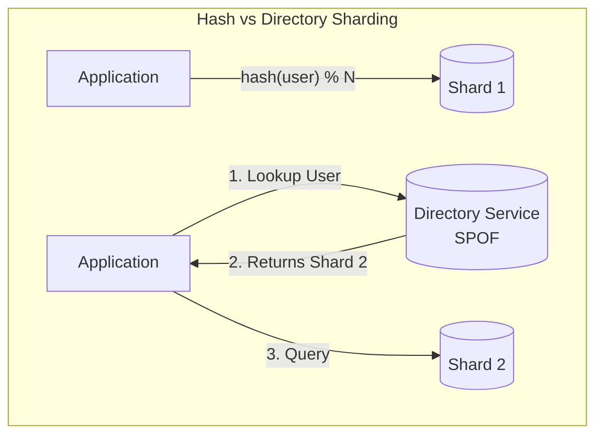
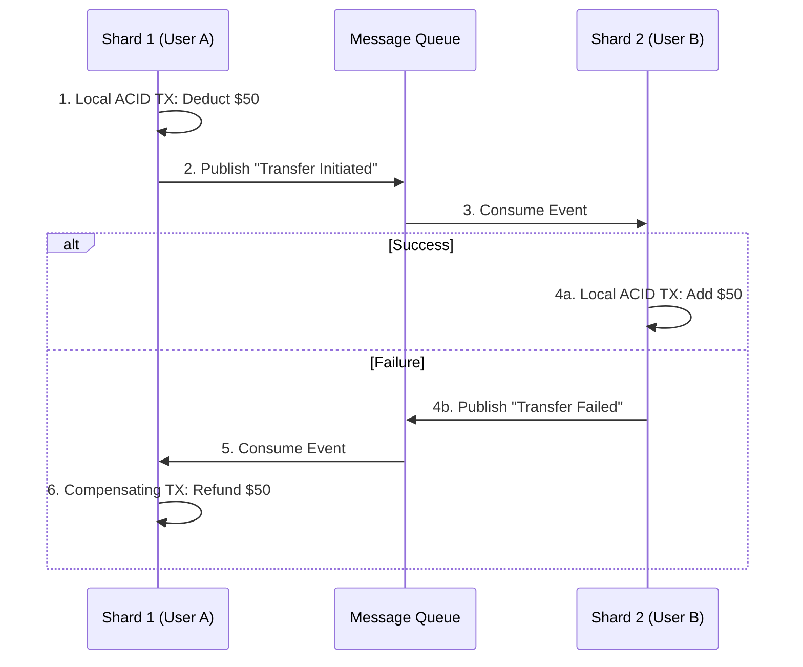

# Database Sharding & Partitioning

**Source:** [Sharding in System Design Interviews w/ Meta Staff Engineer (Hello Interview)](https://www.youtube.com/watch?v=L521gizea4s)

**TL;DR:** When a single database instance (even a massive AWS Aurora instance maxing out at 256 TiB) can no longer handle the storage or throughput, you must physically split the data across multiple machines. This is called **Sharding**. However, sharding introduces massive complexity around hot spots, cross-shard queries, and distributed transactions. In an interview, **never shard prematurely**.

---

## 1. Partitioning vs. Sharding

While often used interchangeably, there is a strict mechanical difference:

*   **Partitioning:** Splitting a large table into smaller pieces *inside a single database instance*. It does not add more machines.
    *   **Horizontal Partitioning:** Splitting rows (e.g., one partition per year of orders).
    *   **Vertical Partitioning:** Splitting columns (e.g., moving large/rarely used text blob columns to a separate partition).
*   **Sharding:** Horizontal partitioning *across multiple physical machines*. Each shard is a completely independent, standalone database with its own CPU, Memory, and Disk.

---

## 2. How to Shard (The Two Core Decisions)

When you shard, you must decide exactly **What to shard by (The Shard Key)** and **How to distribute it (The Strategy)**.

### A. Choosing the Shard Key
A bad shard key leads to catastrophic load imbalances. A perfect shard key requires three traits:
1.  **High Cardinality:** Millions of unique values (e.g., `user_id` is great, `is_premium` boolean is terrible because you'd only have 2 shards).
2.  **Even Distribution:** Traffic and storage should spread evenly. (e.g., `created_at` is terrible because all new writes pile onto the "today" shard, leaving old shards idle).
3.  **Aligns with Queries:** The most frequent queries should only need to hit a *single* shard (e.g., if you shard by `user_id`, a query for "get user's orders" is perfectly isolated to one shard).

### B. Sharding Strategies (Distribution Mechanics)

#### 1. Range-Based Sharding
Groups records by a continuous range of values.
*   **Mechanic:** Shard 1 handles `User ID 1 - 1M`. Shard 2 handles `1M - 2M`.
*   **Pros:** Extremely efficient for range scans.
*   **Cons:** Naturally creates hot spots if data is sequential (like timestamps).
*   **When to use:** Multi-tenant SaaS architectures where each company/tenant is assigned a dedicated range of IDs.

#### 2. Hash-Based Sharding (The Default)
Uses a deterministic hash function (e.g., MurmurHash) to map keys to shards.
*   **Mechanic:** `target_shard = hash(user_id) % num_shards`
*   **Pros:** Perfectly even distribution of records, completely eliminating sequential hot spots.
*   **Cons:** Adding or removing a shard changes the modulo denominator, forcing almost every single record in the entire database to move to a new shard. (Requires **Consistent Hashing** to fix).

#### 3. Directory-Based Sharding
Uses a central lookup table (a routing service) to map specific records to specific shards.
*   **Mechanic:** Before querying the DB, the app queries the Directory Service: "Where does User 42 live?"
*   **Pros:** Infinite flexibility. If a user becomes a massive celebrity, you can dynamically update the directory to move them to their own dedicated, isolated shard.
*   **Cons:** The Directory Service becomes a Single Point of Failure (SPOF) and adds network latency to *every single query*. **Do not propose this in standard interviews without heavy justification.**

---

## 3. The 3 Major Sharding Pitfalls (Interview Traps)

### Pitfall 1: Hot Spots (The Celebrity Problem)
If you shard by `user_id` using Hash Sharding, Taylor Swift is still mathematically hashed to exactly *one* shard. Millions of fans viewing her profile will instantly overwhelm that single shard's CPU and network bandwidth.
*   **Solution 1 (Dedicated Shard):** Use Directory Sharding to isolate her to a massively over-provisioned machine.
*   **Solution 2 (Compound Shard Key):** Instead of sharding by `user_id`, shard by `hash(user_id + date)`. This forces Taylor Swift's traffic to spread across multiple shards depending on the day.
*   **Solution 3 (Dynamic Chunking):** Use a DB like MongoDB that monitors hot chunks and automatically splits and migrates them to colder nodes.

### Pitfall 2: Fan-Out Reads (Cross-Shard Operations)
If you shard by `user_id`, but the product manager asks for a feature to show "The Top 10 Most Popular Posts Globally", you no longer know which shard has the data.
*   **The Trap:** You are forced to query all 64 shards simultaneously, wait for the slowest shard to respond, merge the results in memory on the application server, and sort them. This completely destroys latency and CPU.
*   **The Fix:** 
    1. **Cache it:** Accept eventual consistency, compute the heavy cross-shard query once, and cache the result in Redis for 5 minutes.
    2. **Denormalize:** Duplicate critical data into a separate globally-optimized database (like Elasticsearch) designed specifically for aggregate searches.

### Pitfall 3: Distributed Transactions (Cross-Shard Consistency)
If User A (Shard 1) sends money to User B (Shard 2), you can no longer use a standard ACID database transaction, because the shards do not share memory or locks.
*   **The Trap (2-Phase Commit):** A naive approach uses a coordinator to lock both shards, prepare the write, and commit. If a network partition occurs mid-commit, the locks are stuck forever. **It is fragile and slow.**
*   **The Fix (Saga Pattern):** Break the transaction into independent, local commits with asynchronous compensating actions.
    1. Deduct money locally on Shard 1 (Commit).
    2. Publish an event to Kafka.
    3. Add money locally on Shard 2 (Commit).
    4. *If Shard 2 fails, a compensating event is fired to refund Shard 1.*

---

## 4. Under the Hood: Sharding in Modern Databases
In an interview, you don't need to reinvent the wheel. You should leverage built-in database sharding engines. *Warning: They do not all work the same way.*
*   **Cassandra:** Uses Consistent Hashing natively via `Murmur3Partitioner` and virtual nodes (v-nodes) mapping partition keys to token ranges on a ring.
*   **DynamoDB:** Hashes the partition key to internal storage nodes and dynamically splits/merges partitions based on throughput/size. (It hides the topology from the user).
*   **MongoDB:** Uses range-based chunks. If you specify a hashed shard key, it hashes the value first, then assigns ranges of that hash space to chunks. A background "Balancer" actively migrates chunks between shards to ensure even distribution.
*   **PostgreSQL / MySQL:** Relational databases do not natively shard out-of-the-box. You must place a proxy layer like **Vitess** (MySQL) or **Citus** (Postgres) in front of them to intercept SQL queries and route them to the correct underlying physical shard.

---

## 5. How to Answer Sharding in an Interview

**Rule #1: NEVER shard prematurely.** 
A well-tuned Postgres database can handle terabytes of data. Prove a bottleneck exists first.

**The 4-Step Framework:**
1.  **Identify the Limit:** *"We expect 50,000 writes per second. A single DB instance will struggle with that IOPS load, so we must shard."*
2.  **Propose the Shard Key:** *"Since queries are user-centric (fetching personal feeds), I will shard by `user_id`."*
3.  **Choose the Strategy:** *"I'll use Hash-Based sharding with Consistent Hashing to ensure an even distribution of users across nodes."*
4.  **Call out the Trade-offs:** *"The downside is that global aggregate queries (like trending posts) become expensive fan-out reads. We will mitigate this by pre-computing trends asynchronously and caching them."*

---
### Full Excalidraw Reference

