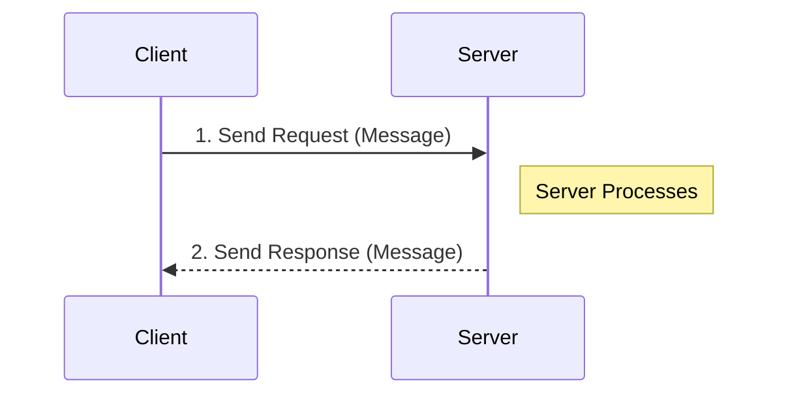
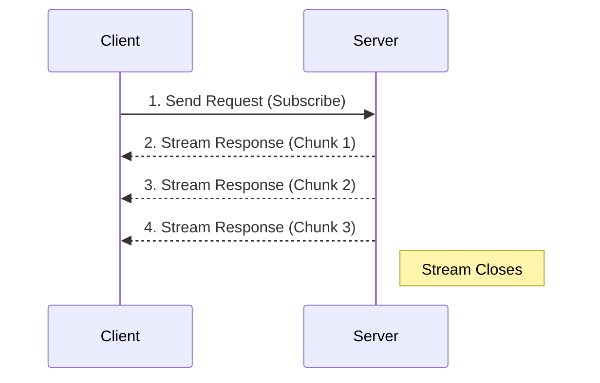
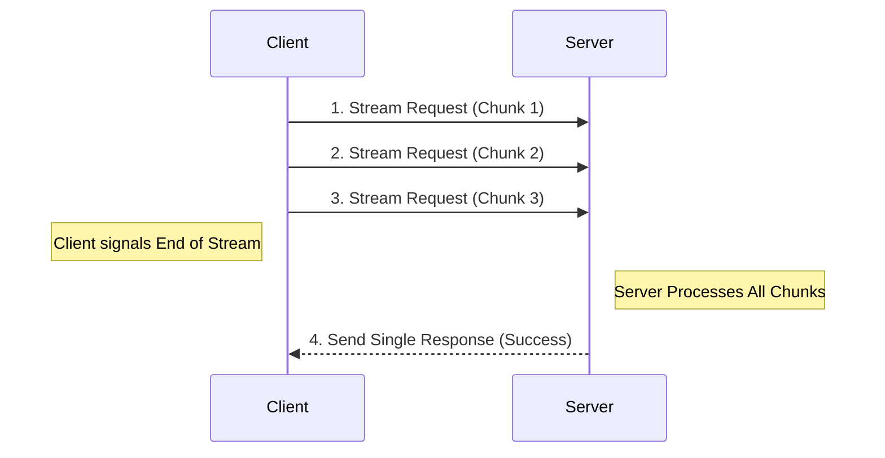
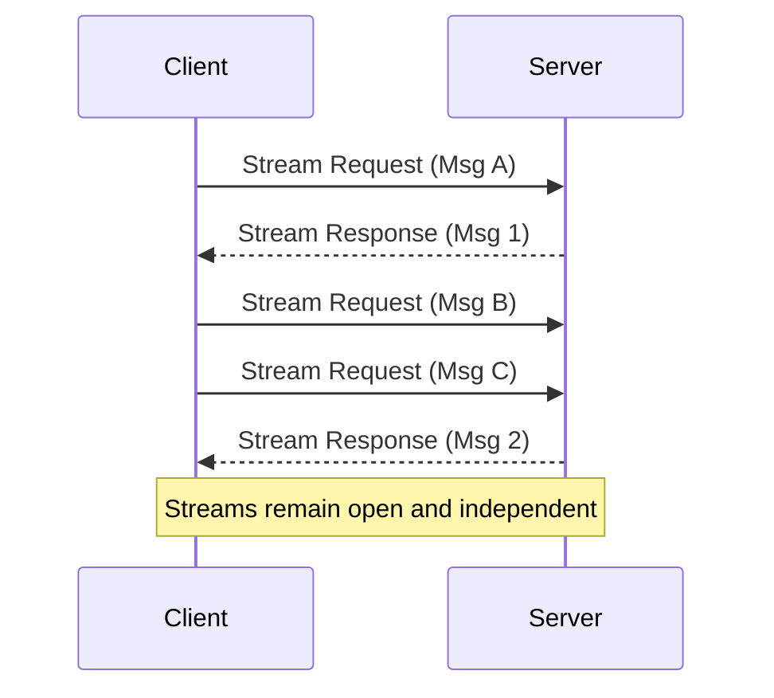

# gRPC (Google Remote Procedure Call)

**Source:** [gRPC Crash Course - Modes, Examples, Pros & Cons](https://www.youtube.com/watch?v=Yw4rkaTc0f8) by *Hussein Nasser*

**TL;DR:** gRPC is a modern, high-performance RPC (Remote Procedure Call) framework created by Google. It replaces standard REST/JSON HTTP APIs by using **HTTP/2** as the transport layer and **Protocol Buffers (Protobuf)** as the data format. It is heavily used for internal microservice-to-microservice communication.

---

## 1. Introduction & Motivation

### What is RPC?
In traditional programming, you execute a function locally (e.g., `calculateSum(a, b)`). A **Remote Procedure Call (RPC)** aims to make executing a function on a *different machine over the network* look exactly like calling a local function.

### The Problem with REST / JSON
While REST over HTTP/1.1 with JSON payloads is the undisputed standard for web APIs, it has limitations at massive scale:
1.  **JSON is slow and bulky:** JSON is a text-based format. Computers must spend CPU cycles parsing text into memory objects. Strings take up a lot of bandwidth.
2.  **HTTP/1.1 is inefficient:** It suffers from Head-of-Line blocking (you have to wait for one request to finish before sending the next on the same TCP connection) and sends bulky, uncompressed text headers with every request.
3.  **Weakly Typed:** In REST, there is no strict contract. A server might expect an `integer` but the client sends a `string`, causing runtime errors.

**The Solution:** gRPC solves these by using **Protocol Buffers** and **HTTP/2**.

---

## 2. Core Technologies Behind gRPC

### Protocol Buffers (Protobuf)
Protobuf is a language-neutral, binary serialization format.
*   **The Contract:** You define your API and data structures in a `.proto` file (a strict schema).
*   **Code Generation:** You compile this `.proto` file. The compiler automatically generates the client and server code in almost any language (Go, Python, Java, Node.js).
*   **Binary format:** Because both the client and server already know the exact schema, the data sent over the wire is purely binary (0s and 1s). No field names (like `"user_id":`) are sent over the network, making the payloads incredibly small and blazingly fast to parse.

### HTTP/2
gRPC forces the use of HTTP/2 under the hood, which brings massive performance wins:
*   **Multiplexing:** You can send thousands of concurrent requests over a **single TCP connection** simultaneously, eliminating the latency of opening new connections.
*   **Header Compression (HPACK):** HTTP/2 compresses headers, saving significant bandwidth.
*   **Binary Framing:** HTTP/2 inherently breaks data down into binary frames rather than plain text.

---

## 3. The 4 Modes of gRPC (Request Flows & Diagrams)

Because gRPC leverages HTTP/2, it isn't restricted to simple Request-Response patterns. It supports four distinct modes of communication. Below are the exact request flows and sequence diagrams for each.

### 1. Unary (Standard)
The traditional model, functionally identical to a standard REST API call.
*   **Request Flow:**
    1. Client initiates a single HTTP/2 request with a binary payload.
    2. Server processes the request.
    3. Server replies with a single binary response.
    4. The stream is closed.

### 2. Server Streaming
The client asks for data once, and the server pushes multiple messages back over time.
*   **Request Flow:**
    1. Client initiates a single HTTP/2 request.
    2. Server processes the request and begins sending multiple binary frames (messages) back to the client over the same connection.
    3. The client reads messages as they arrive.
    4. The server sends a final trailer indicating the stream is finished.
*   **Example Use Case:** You send a request for a large video file, and the server streams the chunks back one by one, or subscribing to a live stock ticker.

### 3. Client Streaming
The client pushes multiple messages to the server, and the server waits until the client is done before replying.
*   **Request Flow:**
    1. Client opens a stream and sends multiple binary frames to the server over time.
    2. The server receives and processes the chunks as they arrive.
    3. The client signals that it has finished sending data.
    4. The server sends a single response back acknowledging the entire batch.
*   **Example Use Case:** Uploading a large file from a mobile app. The client streams the chunks, and the server replies with `{"status": "upload_complete"}`.

### 4. Bidirectional Streaming
Both the client and the server can send a stream of messages to each other simultaneously and independently over the same connection.
*   **Request Flow:**
    1. Client opens an HTTP/2 stream.
    2. Client and Server begin sending binary frames to each other completely asynchronously. The server does not have to wait for the client to finish, and vice-versa.
    3. The connection remains open until either party explicitly closes it.
*   **Example Use Case:** Real-time multiplayer gaming or a chat application where messages are flying in both directions instantly.

---

## 4. Pros & Cons

### Pros ✅
*   **High Performance:** Binary serialization and HTTP/2 make it vastly faster and more CPU/bandwidth efficient than REST/JSON.
*   **Strict Contracts:** The `.proto` file acts as the ultimate source of truth. If the backend changes a data type, the client code will fail to compile, preventing runtime bugs.
*   **Built-in Code Generation:** You never have to manually write HTTP `fetch` requests or parse responses again. The generated SDK handles all networking.
*   **Excellent for Microservices:** Perfect for backend-to-backend communication where speed is critical.

### Cons ❌
*   **Not Browser Friendly:** You cannot natively call a gRPC endpoint from a web browser (JavaScript) because browsers do not expose low-level control over HTTP/2 framing. You must use a translation layer like `gRPC-Web` or an API Gateway (like Envoy) to translate REST to gRPC.
*   **Hard to Debug:** Because the traffic is binary, you cannot just open the Chrome Network Tab or use `curl` to read the payload. You need specialized tools (like `grpcurl` or Postman) that have access to the `.proto` schema to decrypt the binary.
*   **Steep Learning Curve:** Requires managing `.proto` files, compiling them in CI/CD pipelines, and distributing the generated code to different teams.

---

## Summary: When to use it?
*   **Use gRPC:** For backend microservice-to-microservice communication where you control both ends, and latency/bandwidth are top priorities.
*   **Use REST:** For public-facing APIs or communication with web browsers/mobile apps where simplicity and human readability are more important.
