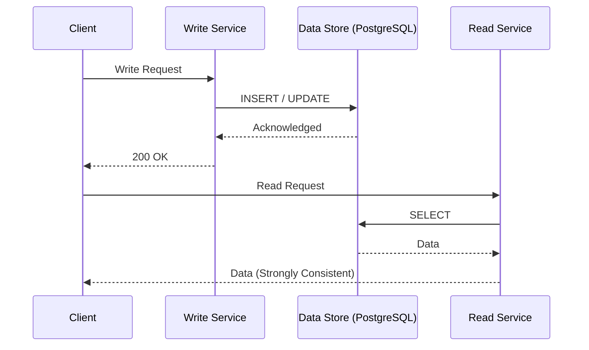
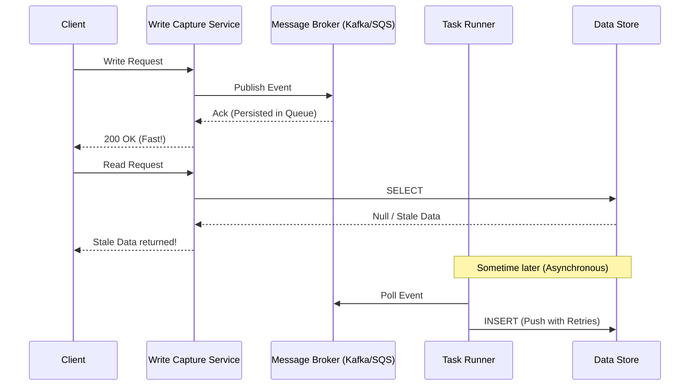

# Message Brokers & Strong Consistency

**Source:** [When NOT to use a message broker? (System Design Fight Club)](https://www.youtube.com/watch?v=eWpOlIBxB_U)

**TL;DR:** While message brokers (Kafka, Kinesis, SQS, RabbitMQ) are fantastic for decoupling systems and increasing availability, they fundamentally **kill strong consistency**. If your system requires immediate, strong consistency (e.g., Financial Trading, Wallets, Payment Gateways), you should *not* place an asynchronous message broker in the critical path between your API and the database.

---

## 1. The Traditional Setup (Strong Consistency)
In a standard CRUD application without a broker, the flow is completely synchronous:

1. **Write Request:** The client sends a write request to the API.
2. **Synchronous Write:** The API (Write Service) pushes the write operation directly to the Data Store (e.g., PostgreSQL, Spanner).
3. **Acknowledgment:** The Data Store confirms the write has been successfully committed.
4. **Response:** The API returns a `200 OK` to the client.

**Mechanical Detail:** Because the write is strictly synchronous, the moment the client receives the `200 OK`, any subsequent Read request is guaranteed to see the newly written data. As long as the underlying database supports strong consistency (like PostgreSQL or Spanner), there are no stale reads. 

## 2. The Message Broker Setup (Eventual Consistency)
When you introduce a message broker (Kafka, Kinesis, SQS) to increase availability and handle traffic spikes, the flow changes drastically:

1. **Write Request:** The client sends a write request.
2. **Broker Persistence:** The Write Capture Service writes the event to the Message Broker. 
3. **Immediate Response:** Once the broker acknowledges ("yep, I've got it stored"), the API *immediately* returns `200 OK` to the client.
4. **Asynchronous Processing:** In the background, a Task Runner (or consumer) asynchronously pulls the event from the broker and writes it to the Data Store.

*(Note: As mentioned in Martin Kleppmann's "Designing Data-Intensive Applications" (DDIA), you can think of message brokers as temporary data stores. In fact, under the hood, AWS Kinesis is essentially implemented on top of DynamoDB.)*

### ⚠️ Trap Warnings: Stale Reads and Lost Writes
Because the API returned `200 OK` before the data actually reached the database, a client might immediately issue a Read request and get **stale data** (or a 404 Not Found). The data is safely persisted in the highly-available message queue, but it is not yet visible to readers.

If the database or task runners experience an outage (which could last for hours or even a whole day), the data will simply queue up in the broker. 
- **Stale Reads:** Readers will receive outdated information until the outage is resolved and the broker drains.
- **Lost Writes (Critical Edge Case):** If the broker does not have an adequate **retention policy** configured (e.g., messages expire after 24 hours but the DB outage lasts 36 hours), those queued writes will be permanently lost!

## 3. Why Use a Broker? (Push vs. Pull Mechanism)
Why trade away consistency? **Availability and shielding the database.**

Databases (like a time-series database) often go down or get overwhelmed under massive load. Message brokers are explicitly designed for extreme high availability. 

By placing a broker in front of a database, you transform a **Push** system (which can overload the DB) into a **Pull** system (where the DB or consumers consume at their own safe pace). 

**Mechanical Detail:** You do not want retry logic on the Write Service API itself. If the DB is struggling, executing retries synchronously before returning a `200 OK` will massively inflate API latency and potentially exhaust connection pools. Instead, you write to the highly available broker. The downstream Task Runners can then "pull" from the broker and "push" to the database, executing retry logic safely in the background without affecting user-facing API latency.

## 4. The CAP Theorem Trade-off
You are actively trading Consistency (C) for Availability (A) under the CAP Theorem.

The theorem states "Consistency, Availability, Partition Tolerance — Pick Two." However, in distributed systems, Partition Tolerance (network partitions) is a reality you cannot opt out of. So the real choice is: **Consistency or Availability — Pick One.**

By throwing a message broker in front, your system stays highly available for writes even if the primary datastore is down. The exact cost of this availability is abandoning strong consistency and embracing eventual consistency.

## 5. System Design Interview Tips

### 💡 Tip 1: Do Not Design for Kafka Going Down
In a system design interview, you *can* and *should* expect data stores to go down. You account for this by throwing a message broker in front of it. 
However, **do not account for the message broker itself going down.** Trying to design a fallback for Kafka or Kinesis going down is like trying to design for AWS itself going down. While it happens in the real world, it is typically out of scope for a standard system design interview. Assume the broker is highly available.

### 💡 Tip 2: When NOT to Use a Broker
Do not use an asynchronous message broker in the critical path if you are designing:
*   **Wallet Services:** As referenced in Alex Xu's System Design Interview (Volume 2), a wallet cannot tolerate a user seeing a stale balance after a deposit.
*   **Stock Exchanges:** Financial trading platforms require strict, immediately consistent views of trades and balances.

For these systems, you must stick to synchronous database writes (and potentially Distributed Transactions if crossing microservices). Yes, you will get lower availability (if the DB is down, the system rejects the write), but every single `200 Success` guarantees absolute correctness and zero stale reads.
